<!--
 1. Задача классификации - распознавание меток классов
 2. Задача регрессии - предсказание значений непрерывной целевой переменной
 3. Обнаружение скрытых структур при помощи обучения без учителя
 4. Выявление подгрупп при помощи кластеризации
 5. Предобработка - приведение данных в приемлемый вид
 6. Тренировка и отбор прогнозной модели. Оценка моделей и прогнозирование на ранее не встречавшихся экземплярах данных.
 7. Искусственные нейроны - итория машинного обучения
 8. Адаптивные линейные нейроны и сходимость обучения
 9. Минимизация функций стоимости методом градиентного спуска
10. Моделирование вероятностей классов логистической регрессии
11. Решение проблемы переобучения при помощи регуляризации
12. Классификация с максимальным зазором на основе метода опорных векторов
13. Решение нелинейных задач ядерным методом SVM
14. Использование ядерного трюка для нахождения разделяющих гиперплоскостей в пространстве высокой размерности
15. Обучение моделей на основе деревьев решений
16. Объединение множества признаков принятия решений с помощью случайных лесов.
17. k ближайших соседей - алгоритм ленивого обучения
18. Приведение признаков к одинаковой шкале
19. Снижение размерности без учителя на основе анализа главных компонент
20. Сжатие данных с учителем путем линейного дискриминантного анализа
21. Реализация ядерного метода анализа главных компонент
22. Ядерный метод анализа главных компонент
23. Использование k-блочной перекрестной проверки для оценки качества модели
24. Решение проблемы переобучения и недообучения при помощи
25. Объединение моделей для методов ансамблевого обучения
26. Бэггинг - сборка ансамбля классификаторов из бутстрап-выборок
27. Прогнозирование значений непрерывной целевой переменной на основе регрессионного. анализа
28. Реализация линейной регрессионной модели методом наименьших квадратов
29. Подгонка стабильной регрессионной модели алгоритмом RANSAC
30. Оценивание качества работы линейных регрессионных моделей
31. Применение регуляризованных методов для регрессии
32. Превращение линейной регрессионной модели в криволинейную - полиномиальная регрессия
33. Работа с немаркированными данными - кластерный анализ
34. Группирование объектов по подобию методом k средних
35. Алгоритм k-средних
36. Использование метода локтя для нахождения оптимального числа кластеров
37. Количественная оценка качества кластеризации методом силуэтных графиков
38. Организация кластеров в виде иерархического дерева
39. Локализация областей высокой плотности алгоритмом DBSCAN
40. Активация нейронной сети методом прямого распространения сигналов
41. Тренировка нейронных сетей методом обратного распространения ошибки
42. Сверточные нейронные сети
43. Рекуррентные нейронные сети
-->

  <h1>Содержание экзамена МИС</h1>
  

<ol>
  <li>✅ <a href="#1"> Задача классификации - распознавание меток классов </a></li>
  <li>✅ <a href="#2"> Задача регрессии - предсказание значений непрерывной целевой переменной </a></li>
  <li>✅ <a href="#3"> Обнаружение скрытых структур при помощи обучения без учителя </a></li>
  <li>❌ <a href="#4"> Выявление подгрупп при помощи кластеризации </a></li>
  <li>❌ <a href="#5"> Предобработка - приведение данных в приемлемый вид </a></li>
  <li>❌ <a href="#6"> Тренировка и отбор прогнозной модели. Оценка моделей и прогнозирование на ранее не встречавшихся экземплярах данных. </a></li>
  <li>❌ <a href="#7"> Искусственные нейроны - итория машинного обучения </a></li>
  <li>❌ <a href="#8"> Адаптивные линейные нейроны и сходимость обучения </a></li>
  <li>❌ <a href="#9"> Минимизация функций стоимости методом градиентного спуска </a></li>
  <li>❌ <a href="#10"> Моделирование вероятностей классов логистической регрессии </a></li>
  <li>❌ <a href="#11"> Решение проблемы переобучения при помощи регуляризации </a></li>
  <li>✅ <a href="#12"> Классификация с максимальным зазором на основе метода опорных векторов </a></li>
  <li>✅ <a href="#13"> Решение нелинейных задач ядерным методом SVM </a></li>
  <li>✅ <a href="#14"> Использование ядерного трюка для нахождения разделяющих гиперплоскостей в пространстве высокой размерности </a></li>
  <li>✅ <a href="#15"> Обучение моделей на основе деревьев решений </a></li>
  <li>❌ <a href="#16"> Объединение множества признаков принятия решений с помощью случайных лесов. </a></li>
  <li>✅ <a href="#17"> k ближайших соседей - алгоритм ленивого обучения </a></li>
  <li>❌ <a href="#18"> Приведение признаков к одинаковой шкале </a></li>
  <li>❌ <a href="#19"> Снижение размерности без учителя на основе анализа главных компонент </a></li>
  <li>❌ <a href="#20"> Сжатие данных с учителем путем линейного дискриминантного анализа </a></li>
  <li>❌ <a href="#21"> Реализация ядерного метода анализа главных компонент </a></li>
  <li>✅ <a href="#22"> Ядерный метод анализа главных компонент </a></li>
  <li>❌ <a href="#23"> Использование k-блочной перекрестной проверки для оценки качества модели </a></li>
  <li>❌ <a href="#24"> Решение проблемы переобучения и недообучения при помощи </a></li>
  <li>✅ <a href="#25"> Объединение моделей для методов ансамблевого обучения </a></li>
  <li>✅ <a href="#26"> Бэггинг - сборка ансамбля классификаторов из бутстрап-выборок </a></li>
  <li>❌ <a href="#27"> Прогнозирование значений непрерывной целевой переменной на основе регрессионного. анализа </a></li>
  <li>❌ <a href="#28"> Реализация линейной регрессионной модели методом наименьших квадратов </a></li>
  <li>✅ <a href="#29"> Подгонка стабильной регрессионной модели алгоритмом RANSAC </a></li>
  <li>❌ <a href="#30"> Оценивание качества работы линейных регрессионных моделей </a></li>
  <li>❌ <a href="#31"> Применение регуляризованных методов для регрессии </a></li>
  <li>❌ <a href="#32"> Превращение линейной регрессионной модели в криволинейную - полиномиальная регрессия </a></li>
  <li>❌ <a href="#33"> Работа с немаркированными данными - кластерный анализ </a></li>
  <li>❌ <a href="#34"> Группирование объектов по подобию методом k средних </a></li>
  <li>✅ <a href="#35"> Алгоритм k-средних </a></li>
  <li>✅ <a href="#36"> Использование метода локтя для нахождения оптимального числа кластеров </a></li>
  <li>❌ <a href="#37"> Количественная оценка качества кластеризации методом силуэтных графиков </a></li>
  <li>✅ <a href="#38"> Организация кластеров в виде иерархического дерева </a></li>
  <li>❌ <a href="#39"> Локализация областей высокой плотности алгоритмом DBSCAN </a></li>
  <li>✅ <a href="#40"> Активация нейронной сети методом прямого распространения сигналов </a></li>
  <li>✅ <a href="#41"> Тренировка нейронных сетей методом обратного распространения ошибки </a></li>
  <li>✅ <a href="#42"> Сверточные нейронные сети </a></li>
  <li>✅ <a href="#43"> Рекуррентные нейронные сети </a></li>
  <!-- <a href="#ggd">Если не знаете ответ на вопрос, то это должно вас выручить</a> -->
</ol>

 

##

<h2 id="1">  1. Задача классификации - распознавание меток классов </h2>
Задача классификации - это подкатегория методов машинного обучения с учителем, суть которой заключается в идентификации категориальных меток классов для новых экземпляров на основе предыдущих наблюдений. Метка класса представляет собой дискретное, неупорядоченное значение, которое может пониматься как принадлежность группе экземпляров. Ранее упомянутый пример с обнаружением почтового спама представляет собой типичный пример задачи бинарной классификации, где алгоритм машинного обучения вычисляет серию правил для различения двух возможных классов: спамных и неспамных почтовых сообщений. 
Однако набор меток классов не обязательно должен иметь двоичную природу. Извлеченная алгоритмом обучения с учителем прогнозная модель может присваивать новому, немаркированному экземпляру любую метку класса, которая была определена в тренировочном наборе данных. Типичным примером задачи многоклассовой (или мультuномиальной) является рукописное распознавание символов. Здесь можно было бы собрать тренировочный набор данных, состоящий из большого числа рукописных образцов каждой буквы алфавита. Теперь если пользователь через устройство ввода данных предоставит новый рукописный символ, то наша прогнозная модель с определенной степенью соответствия сможет распознать правильную букву алфавита. Однако наша система машинного обучения была бы не в состоянии правильно распознать любую из цифр от нуля до девяти, в случае если они не входили в состав нашего тренировочного набора данных. 
Следующий ниже рисунок иллюстрирует принцип работы задачи бинарной классификации при наличии 30 тренировочных образцов : 15 образцов маркированы как отрицательный класс (круги) и другие 15 - как положительный класс. В этом сценарии наш набор данных является двумерным, то есть каждый образец имеет два связанных с ним значения х1 и х2. Можем применить алгоритм машинного обучения с учителем для извлечения правила – граница решения представлена черной пунктирной линией, которое может выделить эти два класса и затем распределить новые данные в каждую из этих двух категорий при наличии значений х1 и х2.

<b>Source:</b> Взято из любимой книги этой замечательной женщины.
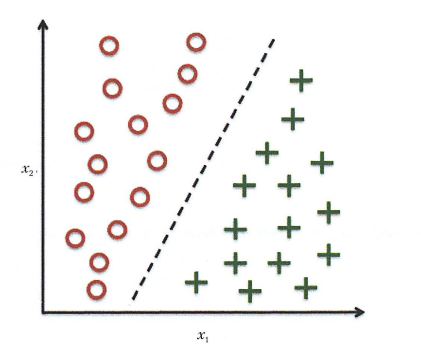 

<a href="#readme-top">К содержанию</a>

##

<h2 id="2">  2. Задача регрессии - предсказание значений непрерывной целевой переменной </h2>
В предыдущем разделе мы узнали, что задача классификации заключается в назначении
экземплярам категориальных, неупорядоченных меток. Второй тип обучения
с учителем представлен предсказанием непрерывных результатов, который еще
именуется регрессионным анализом, или методами восстановления зависимости
между переменными. В регрессионном анализе нам даны несколько объясняющих переменных и непрерывная переменная отклика, и мы пытаемся найти между этими переменными связь, которая позволит нам предсказывать результат.
Например, предположим, что нас интересует предсказание оценок студентов за тест по математике SAT Math1. Если между затраченным на подготовку к тесту временем и итоговыми оценками существует связь, то мы могли бы воспользоваться ею в качестве тренировочных данных для извлечения модели, в которой время учебы используется для предсказания экзаменационных отметок будущих студентов, планирующих пройти этот тест.
Следующий ниже рисунок иллюстрирует основную идею линейной регрессии.
При наличии предикторной переменной х и переменной отклика у мы выполняем
Под эти данные подгонку прямой, которая минимизирует расстояние - обычно
среднеквадратичное - между точками образцов и подогнанной линией. Далее мы
можем воспользоваться полученными из этих данных пересечения оси 1 и наклоном
прямой с неким угловым коэффициентом для прогнозирования результирующей
переменно в новых данных:

<b>Source:</b> Взято из любимой книги этой замечательной женщины.
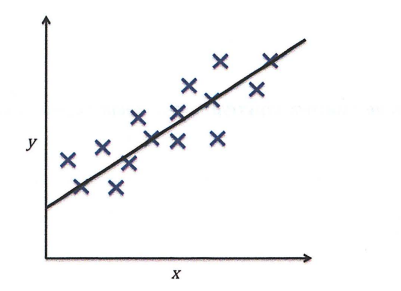 

<a href="#readme-top">К содержанию</a>

##

<h2 id="3">  3. Обнаружение скрытых структур при помощи обучения без учителя </h2>
В обучении с учителем, когда мы тренируем нашу модель, мы знаем правильный ответ
заранее, а в обучении с подкреплением мы определяем меру вознаграждения за
выполненные агентом отдельно взятые действия. С другой стороны, в обучении без
учителя мы имеем дело с немаркированными данными или данными с неизвестной структурой. Используя методы обучения без учителя, мы можем разведать структуру
данных с целью выделения содержательной информации без контроля со стороны
известной результирующей переменной или функции вознаграждения.
При обучении без учителя модель использует неразмеченные данные, из которых алгоритм самостоятельно пытается извлечь признаки и зависимости. Примеры алгоритмов без учителя: кластеризация, к-ближайших соседей(k-means), глубокая сеть доверия, графовые алгоритмы кластеризации.

<b>Source:</b> Взято из любимой книги этой замечательной женщины.

<a href="#readme-top">К содержанию</a>

##

<h2 id="4">  4. Выявление подгрупп при помощи кластеризации </h2>

<a href="#readme-top">К содержанию</a>

##

<h2 id="5">  5. Предобработка - приведение данных в приемлемый вид </h2>

<a href="#readme-top">К содержанию</a>

##

<h2 id="6">  6. Тренировка и отбор прогнозной модели. Оценка моделей и прогнозирование на ранее не встречавшихся экземплярах данных. </h2>

<a href="#readme-top">К содержанию</a>

##

<h2 id="7">  7. Искусственные нейроны - итория машинного обучения </h2>

<a href="#readme-top">К содержанию</a>

##

<h2 id="8">  8. Адаптивные линейные нейроны и сходимость обучения </h2>

<a href="#readme-top">К содержанию</a>

##

<h2 id="9">  9. Минимизация функций стоимости методом градиентного спуска </h2>

<a href="#readme-top">К содержанию</a>

##

<h2 id="10">  10. Моделирование вероятностей классов логистической регрессии </h2>

<a href="#readme-top">К содержанию</a>

##

<h2 id="11">  11. Решение проблемы переобучения при помощи регуляризации </h2>

<a href="#readme-top">К содержанию</a>

##

<h2 id="12">  12. Классификация с максимальным зазором на основе метода опорных векторов </h2>
Еще один мощный и широко используемый алгоритм обучения представлен метод опорных векторов, или сетью опорных векторов (suppoгt vectoг machine, SVM), при чем этот метод можно рассматривать в качестве расширения персептрона. Используя алгоритм персептрона, мы минимизировали ошибки классификации. С другой стороны, в SVM наша задача оптимизации состоит в том, чтобы максимизировать зазор. Зазор определяется как расстояние между разделяющей гиперплоскостью (границей решения) и самыми близкими к этой гиперплоскости тренировочными образцами, так называемыми опорными векторами. Это проиллюстрировано на нижеследующем рисунке:
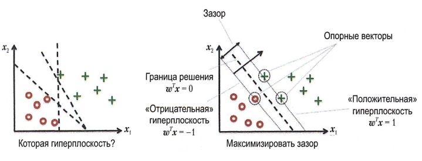 
<b>Source</b>:Взято из любимой книги этой замечательной женщины 

<a href="#readme-top">К содержанию</a>

gh

##

<h2 id="13">  13. Решение нелинейных задач ядерным методом SVM </h2>
SVM обладает высокой популярностью среди практиков машинного обучения, так как SVM можно легко кернелизировать, т. е . модифицировать с использованием ядра, для решения нелинейных задач классификации. 
Например, если сгенерировать свой набор данных, который имеет вид логического исключающего или, то нам не получится хорошо разделить наши данные гиперплоскостью. 
 
Ключевая идея в основе ядерных методов для решения задач с такими линейно неразделимыми данными состоит в том, чтобы создать нелинейные комбинации исходных признаков и функцией отображения ф(.) спроецировать их на пространство более высокой размерности, где они становятся линейно разделимыми. Как показано на нижеследующем рисунке, мы можем трансформировать двумерный набор данных в новое трехмерное пространство признаков, где классы становятся разделимыми, благодаря следующей проекции: 
ф(Х1, Х2) = (Z1, Z2, Z3) = (X1,X2,X1^2 + X2^2). 
Это дает нам возможность разделить эти два показанных на графике класса линейной гиперплоскостью, которая становится нелинейной границей решения, если ее спроецировать назад на исходное пространство признаков:
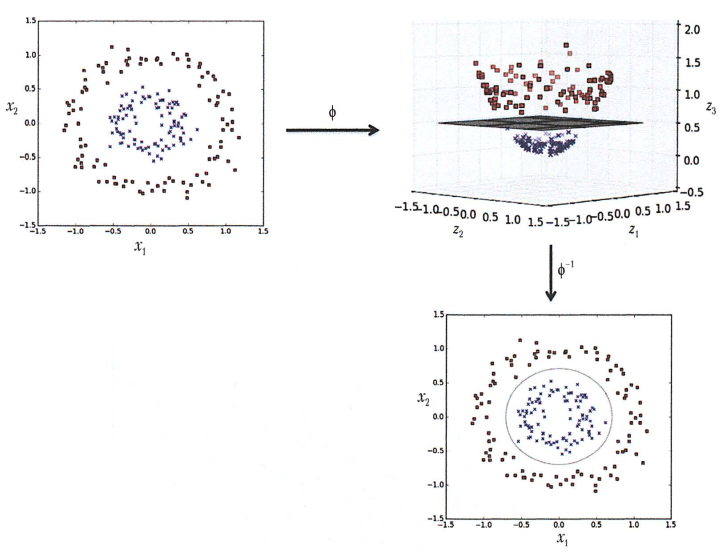 
<b>Source</b>:Взято из любимой книги этой замечательной женщины 

<a href="#readme-top">К содержанию</a>

##

<h2 id="14">  14. Использование ядерного трюка для нахождения разделяющих гиперплоскостей в пространстве высокой размерности </h2>

<b>Ядерный трюк</b> (Kernel Trick, Kernel Function, уловка с ядром) – способ классификации, позволяющий работать в исходном пространстве Признаков (Feature), не вычисляя координаты данных в пространстве более высокой размерности.
Если решать задачи ядерным методом, то когда появляется все больше и больше измерений, вычисления становятся все более дорогими. Вот тут-то и появляется уловка с ядром. Она позволяет нам работать в исходном пространстве функций, не вычисляя координаты данных в пространстве более высокой размерности.
Одна из наиболее широко используемых ядерных функций представлена ядром из функции радиального базиса (ядром RBF), или гауссовым ядром: 
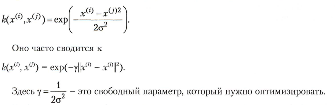 
Грубо говоря, термин ядро можно интерпретировать как функцию подобия между парой образцов. Знак «минус» инвертирует меру расстояния в показатель подобия, и благодаря экспоненциальному члену результирующий показатель подобия попадет в диапазон между 1 (для строго подобных образцов) и 0 (для строго неподобных образцов). 
<b>Source</b>:Взято из любимой книги этой замечательной женщины 

<a href="#readme-top">К содержанию</a>

##

<h2 id="15">  15. Обучение моделей на основе деревьев решений </h2>
Классификаторы на основе деревьев решений, или решающих деревьев, являются привлекательными моделями, в случае если позаботиться об интерпретируемости. Как предполагает название термина ~дерево решений~. эту модель можно представить как разбиение данных на подмножества путем принятия решений, основываясь на постановке серии вопросов. 
Рассмотрим следующий ниже пример, где мы используем дерево решений, чтобы
определиться с видом деятельности в тот или иной конкретный день: 
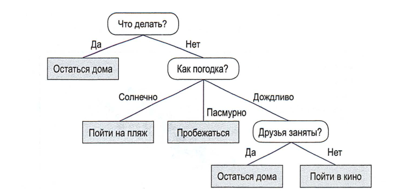 
Опираясь на признаки в нашем тренировочном наборе, модель дерева решений обучается серии вопросов, чтобы сделать выводы о метках классов образцов. Хотя на приведенном выше рисунке проиллюстрирована концепция дерева решений с опорой на категориальные переменные, то же самое применимо, если наши признаки являются вещественными числами, как в наборе данных цветков ириса. Например, можно просто определить величину отсечения вдоль оси признака ширина чашелистика и задать бинарный вопрос ~ширина чашелистика~ 2.8 см?». 
Используя алгоритм выбора решения, мы начинаем в корне дерева и расщепляем данные по признаку, который ведет к самому большому приросту информации. Далее мы повторяем процедуру расщепления в итеративном режиме в каждом дочернем узле, пока не получим однородных листов. То есть все образцы в каждом узле принадлежат одному и тому же классу. На практике в результате такой операции может образоваться очень глубокое дерево со многими узлами, что легко может привести к переобучению. В силу этого дерево обычно подрезается путем установления предела для его максимальной глубины . 
<b>Source</b>:Взято из любимой книги этой замечательной женщины 

<a href="#readme-top">К содержанию</a>

##

<h2 id="16">  16. Объединение множества признаков принятия решений с помощью случайных лесов. </h2>

<a href="#readme-top">К содержанию</a>

##

<h2 id="17">  17. k ближайших соседей - алгоритм ленивого обучения </h2>
<b>KNN</b> является типичным примером ленивого ученика. Его называют ленивым не из-за его очевидной простоты, а потому, что он не извлекает различающую (дискриминантную) функцию из тренировочных данных, а вместо этого запоминает тренировочный набор данных. 
Непосредственно сам алгоритм k ближайших соседей (KNN) Является довольно
прямолинейным и может быть резюмирован следующими шагами: 
1. Выбрать число k и метрику расстояния. 
2. Найти k ближайших соседей образца, который мы хотим классифицировать. 
3. Присвоить метку класса мажоритарным голосованием. 
Следующий ниже рисунок иллюстрирует, как новой точке данных (?) присваивается треугольная метка класса, основываясь на мажоритарном голосовании среди ее пяти ближайших соседей. 
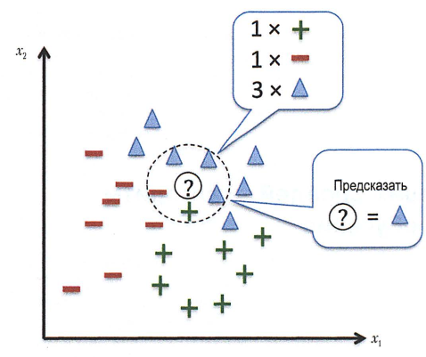 
Основываясь на выбранной метрике расстояния , алгоритм KNN находит в трени­ровочном наборе данных k образцов, которые являются самыми близкими к классифицируемой точке (самыми похожими на нее). Метка класса новой точки данных затем определяется мажоритарным голосованием среди ее k ближайших соседей. 
Основное преимущество такого подхода с запоминанием состоит в том, что классификатор немедленно адаптируется по мере сбора новых тренировочных данных. Однако его оборотная сторона - вычислительная сложность классифицирования новых образцов - растет линейно вместе с числом образцов в тренировочном наборе данных в наихудшем случае, если только в наборе данных не очень много размерностей (признаков) и алгоритм не был реализован с использованием эффективных структур данных, таких как КD-деревья. Кроме того, мы не можем отбросить тренировочные образцы, поскольку никакого тренирующешл шага нет. Вследствие этого, если мы работаем с большими наборами данных, пространство памяти может представлять серьезную проблему. 
Правильный выбор числа k крайне важен для нахождения хорошего равновесия между переобучением и недообучением. Мы также должны убедиться, что выбираем метрику расстояния, подходящую для признаков в наборе данных. Для образцов с вещественными значениями, как, например, в случае с цветками в наборе данных цветков ириса, чьи признаки измеряются в сантиметрах, нередко используется простая евклидова мера расстояния. При этом если мы используем евклидову меру расстояния, также важно данные стандартизировать, благодаря чему каждый признак вносит в расстояние одинаковый вклад. Расстояние Минковского является простым обоб­щением евклидова расстояния и расстояния городских кварталов (манхэттенского) 
<b>Source</b>:Взято из любимой книги этой замечательной женщины 

<a href="#readme-top">К содержанию</a>

##

<h2 id="18">  18. Приведение признаков к одинаковой шкале </h2>

<a href="#readme-top">К содержанию</a>

##

<h2 id="19">  19. Снижение размерности без учителя на основе анализа главных компонент </h2>

<a href="#readme-top">К содержанию</a>

##

<h2 id="20">  20. Сжатие данных с учителем путем линейного дискриминантного анализа </h2>

<a href="#readme-top">К содержанию</a>

##

<h2 id="21">  21. Реализация ядерного метода анализа главных компонент </h2>

<a href="#readme-top">К содержанию</a>

##

<h2 id="22">  22. Ядерный метод анализа главных компонент </h2>
Когда корреляция между признаками выше 2-го
порядка, извлеченные методом PCA признаки не обязательно являются
оптимальными. KPCA – это нелинейный алгоритм, который отображает
исходный вектор в многомерное пространство с помощью функции
отображения и выполняет анализ PCA в многомерном пространстве.   
Данный метод является обобщенной версией метода главных
компонент и применяется в случае, когда условие снижения размерности с
помощью линейного преобразования не выполняется.    
KernelPCA - это расширение PCA, которое обеспечивает снижение нелинейной размерности за счет использования ядер (см. Парные метрики, родство и ядра ). Он имеет множество приложений, включая шумоподавление, сжатие и структурированное прогнозирование (оценка зависимости ядра). KernelPCA поддерживает как transform и inverse_transform.
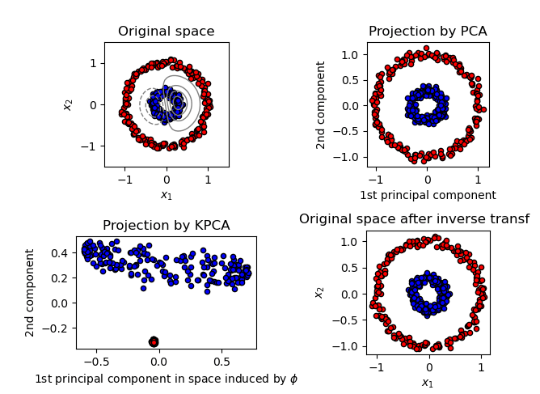 
PCA применяет линейное преобразование, которое является его ограничением.Ядро PCAрасширяет PCA до нелинейности. Сначала он отображает исходные данные в некоторое пространство нелинейных объектов (обычно это более высокое измерение), затем применяет PCA для извлечения основных компонентов в этом пространстве. Это можно понять по рисунку (B). График слева показывает синие и красные точки, которые нельзя разделить с помощью линейного преобразования. Но если все точки проецируются на трехмерное пространство, результат становится линейно разделимым! Затем мы применяем PCA для разделения компонентов.  
Откуда приходит интуиция? Почему разделение компонентов становится легче в пространстве более высокого измерения? Это должно вернуться к теории Vapnik-Chervonenkis (VC). Он говорит, что отображение в пространство более высокого измерения часто обеспечивает большую степень классификации.
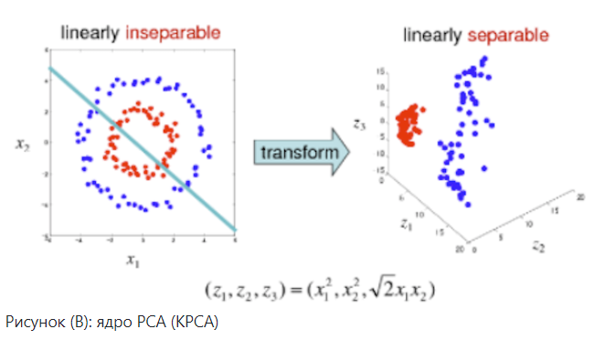 
Следующий код Python создает круговую диаграмму, состоящую из красных и синих точек. Очевидно, что нет возможности разделить красные и синие точки линией (линейное разделение).
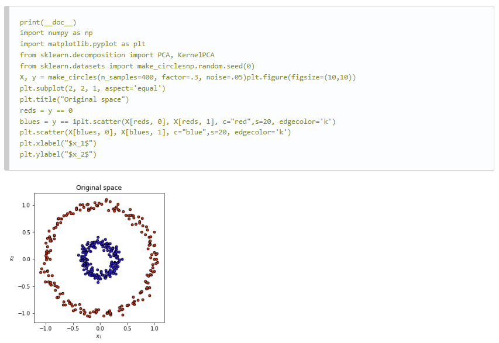 
Тем не менее, когда мы проецируем круг в пространство более высокого измерения и разделяем его с помощью PCA, полученные первый и второй главные компоненты разделяются! Ниже приведен результат построения точек относительно первого и второго основных компонентов. Я рисую линию, чтобы отделить красные и синие точки. В KernelPCA мы указываем kernel = ’rbf’, который является Радиальная базисная функция или Эклидийское расстояние. RBF обычно используются в качестве ядра в методах машинного обучения, таких как Машина опорных векторов (SVM) 
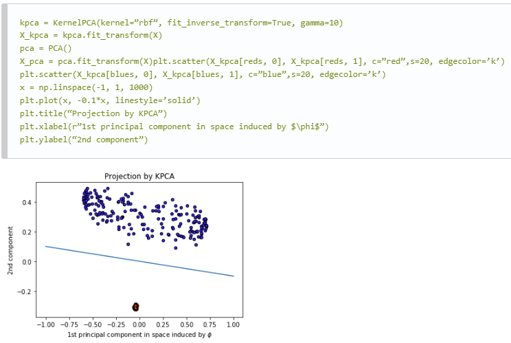 
Если мы указываем ядро ​​как «линейное» в качестве кода ниже (KernelPCA (kernel = «linear»), оно становится стандартным PCA с только линейным преобразованием, а красные и синие точки не разделяются.
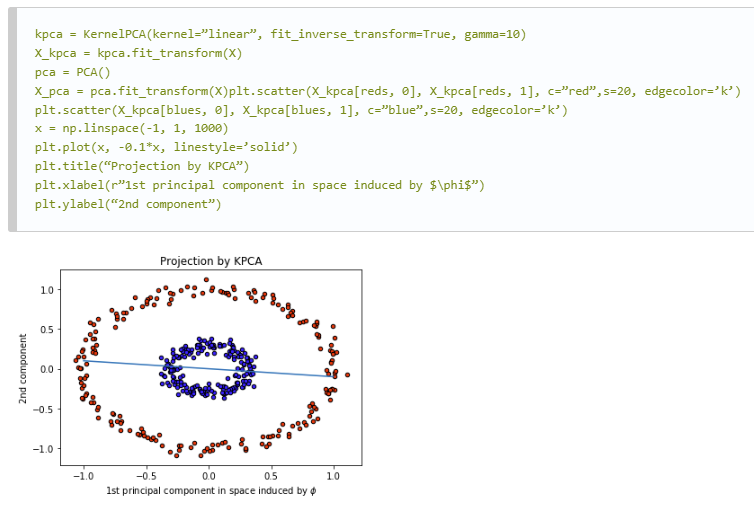 

<a href="#readme-top">К содержанию</a>

##

<h2 id="23">  23. Использование k-блочной перекрестной проверки для оценки качества модели </h2>

<a href="#readme-top">К содержанию</a>

##

<h2 id="24">  24. Решение проблемы переобучения и недообучения при помощи проверочных кривых.</h2>

<a href="#readme-top">К содержанию</a>

##

<h2 id="25">  25. Объединение моделей для методов ансамблевого обучения </h2>

<a href="https://habr.com/ru/post/571296/">source</a>

Что такое ансамбль?
Метод машинного обучения, где несколько моделей обучаются для решения одной и той же проблемы и объединяются для получения лучших результатов называется ансамблевым методом. Основная предпосылка заключается в том, что результат работы нескольких моделей будет более точен, чем результат только одной модели.

Когда говорится об ансамблях, то вводится понятие слабого ученика(обычные модели вроде линейной регрессии или дерева решений). Множество слабых учеников являются строительными блоками для более сложных моделей. Объединение слабых учеников для улучшения качества модели, уменьшения смещения или разброса, называется сильным учеником.

Виды ансамблевых методов
Наиболее популярными ансамблевыми методами являются: стекинг, бэггинг, бустинг.

1. Стекинг. Используется несколько разнородных слабых учеников. Их обучают и объединяют для построения прогноза, основанного на результатах различных слабых моделей.

2. Бэггинг. В этом случае однородные модели обучают на разных наборах данных и объединяют. Получают прогноз путём усреднения. Если использовать в качестве слабого ученика деревья решений, то получится случайный лес RandomForestClassifier / RandomForestRegressor.

3. Бустинг. При использовании данного метода несколько однородных моделей последовательно обучаются, исправляя ошибки друг друга.

<h4>Стекинг</h4>
Работа этого типа ансамблей довольно проста. На вход всех слабых прогнозаторов подаётся обучающий набор, каждый прогноз идёт к финальной модели, которая называется смеситель, мета-ученик или мета-модель, после чего та вырабатывает финальный прогноз.

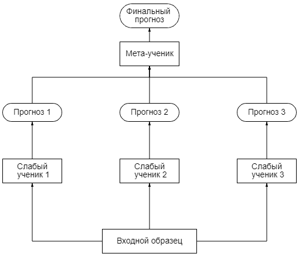
 
 

При обучении мета-модели используется приём удерживаемого набора. Сначала набор разделяется на 2 части. Слабые ученики обучаются на первой половине обучающего набора, затем на второй. Затем создаётся новый обучающий набор на основе прогнозов, сделанных на прогнозах первой и второй части набора. Таким образом, на каждый образец из входного набора приходится столько прогнозов, сколько слабых учеников в ансамбле (в примере на картинке три)(idk where and what is it picture number 3). Мета-модель учится прогнозировать значения на основе нового набора.

<h4>Бэггинг</h4>
Основная идея бэггинга заключается в том, чтобы обучить несколько одинаковых моделей на разных образцах. Распределение выборки неизвестно, поэтому модели получатся разными.

Для начала генерируется несколько бутстрэп-выборок. Бутстрэп - это случайный выбор данных из датасета и представление их в модель, затем данные возвращаются в датасет и процесс повторяется. После модели делают свои прогнозы на основе бутстрэп-выборок. В случае регрессии прогнозы просто усредняются. В случае же классификации применяется голосование.

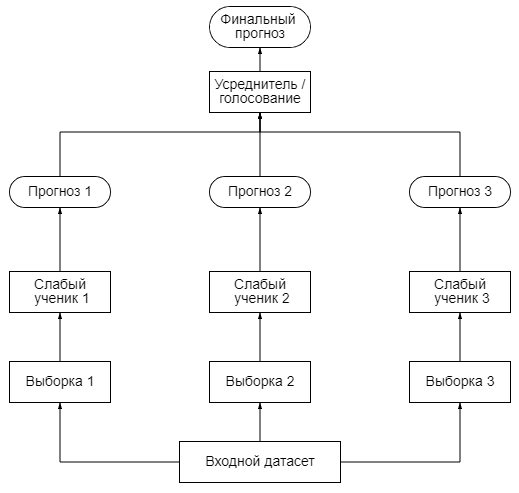
 
 

Если класс предсказывает большинство слабых моделей, то он получает больше голосов и данный класс является результатом предсказывания ансамбля. Это пример жёсткого голосования. При мягком голосовании рассматриваются вероятности предсказывания каждого класса, затем вероятности усредняются и результатом является класс с большой вероятностью.

<h4>Бустинг</h4>
Метод бустинга в чём то схож с методом бэггинга: берётся множество одинаковых моделей и объединяется, чтобы получить сильного ученика. Но разница заключается в том, что модели приспосабливаются к данным последовательно, то есть каждая модель будет исправлять ошибки предыдущей.

Базовые модели для бустинга - это модели с низким разбросом и высоким смещением. Например неглубокие деревья решений. Одна из причин такого выбора моделей - они требуют меньше вычислительных затрат. Ещё бустинг (в отличии от бэггинга) нельзя распараллелить.

Существует два наиболее распространённых алгоритма бустинга - адаптивный бустинг и градиентный бустинг. О них речь пойдёт ниже.

<h5>Адаптивный бустинг (AdaBoost)</h5>

Данный алгоритм сначала обучает первую базовую модель(допустим деревья решений) на тренировочном наборе. Относительный вес некорректно предсказанных значений увеличивается. На вход второй базовой модели подаются обновлённые веса и модель обучается, после чего вырабатываются прогнозы и цикл повторяется.

Результат работы AdaBoost - это средневзвешенная сумма каждой модели. Спрогнозированным значением ансамбля будет тот, который получает большинство взвешенных голосов

Adaboost обновляет веса объектов на каждой итерации. Веса хорошо классифицированных объектов уменьшаются относительно весов неправильно классифицированных объектов. Модели, которые работают лучше, имеют больший вес в окончательной модели ансамбля.

При адаптивном бустинге используется итеративный метод (добавляем слабых учеников одного за другим, просматривая каждую итерацию, чтобы найти наилучшую возможную пару (коэффициент, слабый ученик) для добавления к текущей модели ансамбля) изменения весов. Он работает быстрее, чем аналитический метод.

<h5>Градиентный бустинг</h5>

Градиентный бустинг обучает слабые модели последовательно, исправляя ошибки предыдущих. Результатом градиентного бустинга также является средневзвешенная сумма результатов моделей. Принципиальное отличие от Adaboost это способ изменения весов. Адаптивный бустинг использует итеративный метод оптимизации. Градиентный бустинг оптимизируется с помощью градиентного спуска.

Таким образом градиентный бустинг - обобщение адаптивного бустинга для дифференцируемых функций.

<a href="#readme-top">К содержанию</a>

##

<h2 id="26">  26. Бэггинг - сборка ансамбля классификаторов из бутстрап-выборок </h2>
<b>Бэггинг</b> - это технология классификации, использующая композиции алгоритмов, каждый из которых обучается независимо. Результат классификации определяется путем голосования. Бэггинг позволяет снизить процент ошибки классификации в случае, когда высока дисперсия ошибки базового метода.  
Если вы уже нашли лучшую модель и повысить точность модели больше не можете? В таком случае нужно применить более продвинутые техники машинного обучения, которые можно объединить словом «ансамбли». Ансамбль — это некая совокупность, части которой образуют единое целое.  
В теории машинного обучении — метод построения ансамбля моделей, в котором обучение базовых моделей производится параллельно. При этом каждая модель обучается на отдельной выборке, сформированной из исходного набора данных с помощью алгоритма бутстрапа. Выход ансамбля определяется путем усреднения выходов базовых моделей.  
Bagging (от Bootstrap aggregation) — это один из первых и самых простых видов ансамблей. Он был придуман Ле́о Бре́йманом в 1994 году. Бэггинг основан на статистическом методе бутстрэпа, который позволяет оценивать многие статистики сложных распределений.  
Метод бутстрэпа заключается в следующем. Пусть имеется выборка <b>X</b> размера <b>N</b>. Равномерно возьмем из выборки <b>N</b> объектов с возвращением. Это означает, что мы будем <b>N</b> раз выбирать произвольный объект выборки (считаем, что каждый объект «достается» с одинаковой вероятностью <b>1/N</b>, причем каждый раз мы выбираем из всех исходных <b>N</b> объектов. Можно представить себе мешок, из которого достают шарики: выбранный на каком-то шаге шарик возвращается обратно в мешок, и следующий выбор опять делается равновероятно из того же числа шариков. Отметим, что из-за возвращения среди них окажутся повторы. Обозначим новую выборку через <b>X_1</b>. Повторяя процедуру <b>M</b> раз, сгенерируем <b>M</b> подвыборок <b>X_1,...,X_M</b>. Теперь мы имеем достаточно большое число выборок и можем оценивать различные статистики исходного распределения.
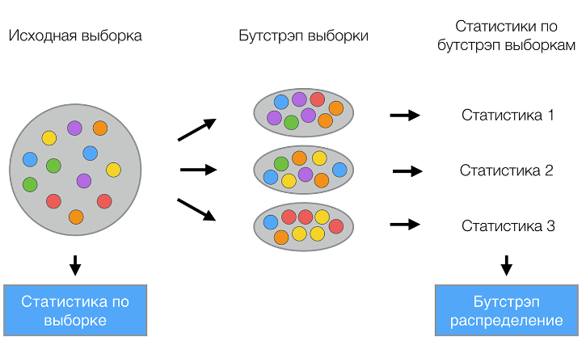
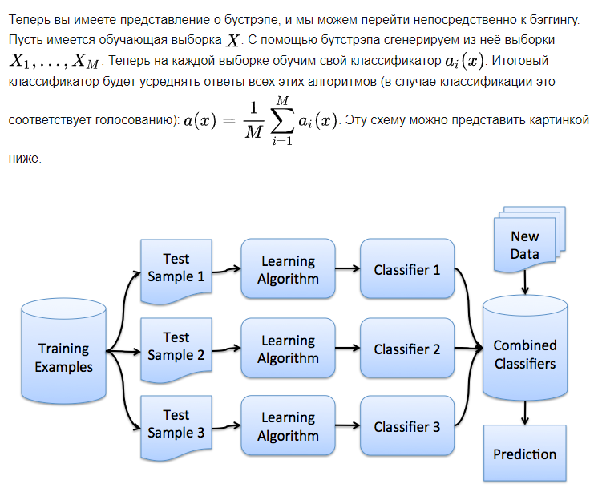
<b>Бэггинг</b>  позволяет снизить дисперсию (variance) обучаемого классификатора, уменьшая величину, на сколько ошибка будет отличаться, если обучать модель на разных наборах данных, или другими словами, предотвращает переобучение. Эффективность бэггинга достигается благодаря тому, что базовые алгоритмы, обученные по различным подвыборкам, получаются достаточно различными, и их ошибки взаимно компенсируются при голосовании, а также за счёт того, что объекты-выбросы могут не попадать в некоторые обучающие подвыборки.  
<b>Бэггинг</b>  эффективен на малых выборках, когда исключение даже малой части обучающих объектов приводит к построению существенно различных базовых классификаторов. В случае больших выборок обычно генерируют подвыборки существенно меньшей длины. <b>Используются в RandomForest</b> 
(Подробнее читать в ресурсах ниже)

<a href="https://habr.com/ru/company/ods/blog/324402/#1-begging">Source 1</a>
<a href="https://wiki.loginom.ru/articles/bootstrap-aggregating.html">Source 2</a>
<a href="http://www.machinelearning.ru/wiki/index.php?title=%D0%91%D1%8D%D0%B3%D0%B3%D0%B8%D0%BD%D0%B3">Source 3</a>

<a href="#readme-top">К содержанию</a>

##

<h2 id="27">  27. Прогнозирование значений непрерывной целевой переменной на основе регрессионного. анализа </h2>

Регрессия – группа Моделей (Model) Контролируемого обучения (Supervised Learning), используемых для прогнозирования непрерывных значений, таких как цены на недвижимость с учетом их характеристик (размер, цена и т.д.).

Выделяют следующие типы регрессионного анализа:

1. Линейная регрессия (Linear Regression)
2. Полиномиальная регрессия (Polynomial Regression)
3. Регрессия опорных векторов (SVR)
4. Регрессия Дерева решений (Decision Tree)
5. Регрессия Случайного леса (Random Forest)
<h4>Линейная регрессия</h4>
Это одна из наиболее распространенных и доступных техник предсказания. Здесь мы прогнозируем Целевую переменную (Target Variable) Y на основе Предиктора (Predictor Variable) X. Между первой и второй должна существовать линейная связь, и поэтому метод получил такое название.

Рассмотрим прогнозирование заработной платы сотрудника в зависимости от его возраста. Допустим, что существует корреляция между возрастом сотрудника и заработной платой (чем больше возраст, тем больше заработная плата). Гипотеза линейной регрессии такова:

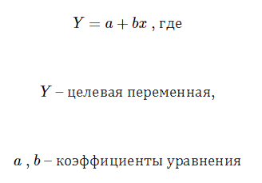

Итак, чтобы предсказать Y (зарплату) с учетом X (возраста), нам нужно знать значения a и b (коэффициенты модели):

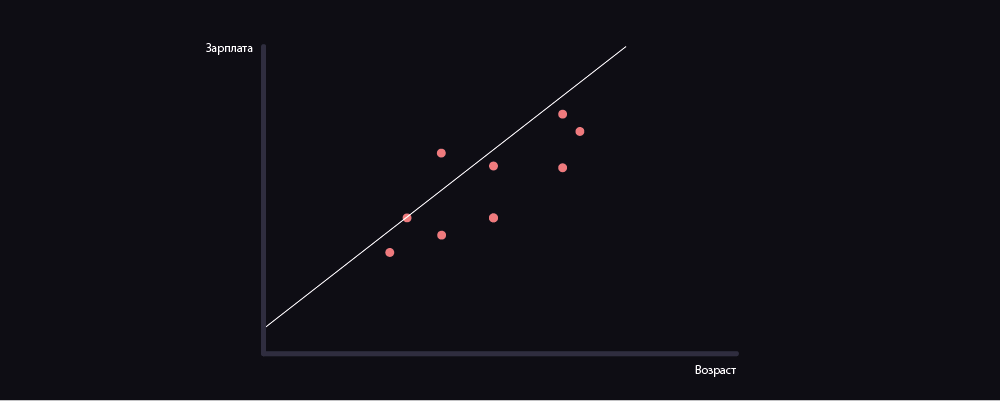

Во время обучения регрессионной модели именно эти коэффициенты изучаются и подгоняются к обучающим данным. Цель тренировки – найти наиболее подходящую линию, минимизирующую Функцию потерь (Loss Function). Последняя помогает измерить ошибку между фактическими и прогнозируемыми значениями.

На рисунке розовые точки – это реальные Наблюдения (Observation) – пары координат "Возраст – Зарплата", а белая линия – прогнозируемые значения оклада в зависимости от возраста. Чтобы сравнить реальное и прогнозируемое значения, точки фактических данных проецируются на линию.

Наша цель – найти такие значения коэффициентов, которые минимизируют функцию стоимости. Наиболее распространенная функция стоимости – это Среднеквадратичная ошибка (MSE), которая равна среднему квадрату разницы между фактическими и прогнозируемыми значениями наблюдения:

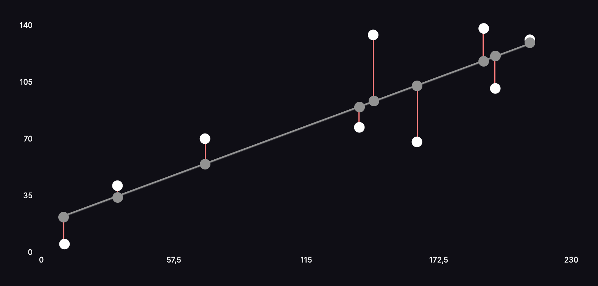

Значения коэффициентов могут быть рассчитаны с использованием подхода Градиентного спуска (Gradient Descent). В градиентном спуске мы начинаем с некоторых случайных значений коэффициентов, вычисляем градиент функции потерь по этим значениям, обновляем коэффициенты и снова вычисляем функцию стоимости. Этот процесс повторяется до тех пор, пока мы не найдем минимальное значение функции стоимости.

<h4>Полиномиальная регрессия</h4>
В полиномиальной регрессии мы преобразуем исходные Признаки (Feature) в полиномиальные заданной степени, а затем применяем к ним линейную регрессию. Рассмотрим преобразованную линейную модель Y = a + bX:

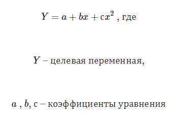

Это все еще линейная модель, но кривая теперь квадратичная, а не прямая:

Если мы увеличим степень до очень высокого значения, до достигнем Переобучения (Overfitting), поскольку модель также "загребает" и Шум (Noise).

<h4>Регрессия опорных векторов</h4>
В SVR мы идентифицируем гиперплоскость с максимальным запасом, так что максимальное количество точек данных находится в пределах этого поля. SVR почти аналогична Методу опорных векторов (SVM):

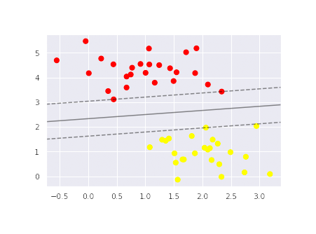

Вместо того, чтобы минимизировать частоту ошибок, как в простой линейной регрессии, мы пытаемся уместить ошибку в пределах определенного порога. Наша цель в SVR состоит в том, чтобы в основном учитывать моменты, которые находятся в пределах допуска. Наша лучшая линия – это гиперплоскость с максимальным количеством точек:

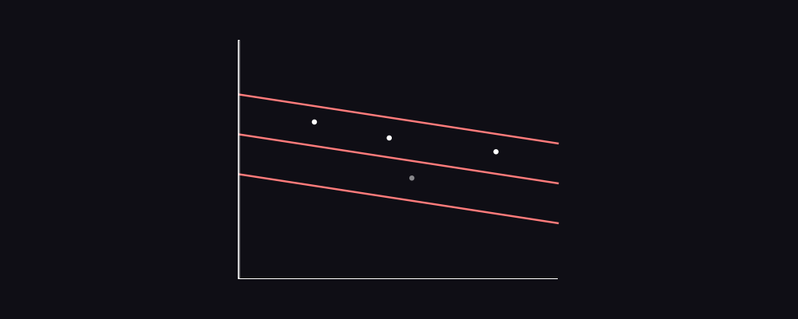

<h4>Регрессия дерева решений</h4>
Деревья решений могут использоваться как для Классификации (Classification), так и для регрессии. В деревьях решений на каждом уровне нам нужно идентифицировать атрибут разделения.

Дерево решений строится путем разделения данных на подмножества, содержащие экземпляры с однородными значениями. Стандартное отклонение (Standard Deviation) используется для расчета однородности числовой Выборки (Sample). Если числовая выборка полностью однородна, ее стандартное отклонение равно нулю.

Шаги по поиску узла расщепления кратко описаны ниже:

Рассчитайте стандартное отклонение целевой переменной
Разделите набор данных на разные атрибуты и вычислите стандартное отклонение для каждой ветви (стандартное отклонение для целевой переменной и предиктора). Это значение вычитается из стандартного отклонения перед разделением. Результатом является уменьшение стандартного отклонения.
В качестве узла разделения выбирается атрибут с наибольшим уменьшением стандартного отклонения.
Набор данных делится на основе значений выбранного атрибута. Этот процесс выполняется рекурсивно.
Чтобы избежать переобучения, используется коэффициент отклонения, который решает, когда прекратить ветвление. Наконец, среднее значение каждой ветви присваивается соответствующему конечному узлу (при регрессии берется среднее значение).

<h4>Регрессия Случайного леса</h4>
Случайный лес – это Ансамблевый (Ensemble) подход, в котором мы учитываем прогнозы нескольких деревьев регрессии:

Выберите K случайных точек
Определите n – количество создаваемых регрессоров дерева решений. Повторите шаги 1 и 2, чтобы создать несколько деревьев регрессии.
Среднее значение каждой ветви назначается конечному узлу в каждом дереве решений.
Чтобы предсказать результат для переменной, учитывается среднее значение всех прогнозов всех деревьев решений.
Случайный лес предотвращает переобучение (что является обычным для деревьев решений) путем создания случайных подмножеств признаков и построения меньших деревьев с использованием этих подмножеств.

<a href="#readme-top">К содержанию</a>

##

<h2 id="28">  28. Реализация линейной регрессионной модели методом наименьших квадратов </h2>

<a href="#readme-top">К содержанию</a>

##

<h2 id="29">  29. Подгонка стабильной регрессионной модели алгоритмом RANSAC </h2>
<b>RANSAC</b>  — стабильный метод оценки параметров модели на основе случайных выборок. Схема RANSAC устойчива к зашумлённости исходных данных. Метод был предложен в 1981 году Фишлером и Боллесом.  Часто возникает задача обработки данных, в которой необходимо определить параметры модели, которая должна удовлетворять исходным данным. Все исходные данные можно разделить на два типа: хорошие точки, удовлетворяющие модели, «не-выбросы» и ложные точки, шумы — случайные включения в исходные данные, «выбросы».  
Присутствие выбросов может сильно повлиять на линейные регрессионные
модели. В некоторых ситуациях очень маленький поднабор данных способен
оказывать большое воздействие на оценочные коэффициенты модели.
Для обнаружения выбросов предусмотрено много статистических проверок,
обсуждение которых выходит за рамки настоящей книги. Однако удаление
выбросов всегда требует нашего суждения как специалистов в науке о данных,
знающих предметную область, с которой мы имеем дело.  
В качестве альтернативы устранению выбросов мы рассмотрим надежный
метод регрессии, применяющий алгоритм RANSAC (Random SAmple
Consensus - соглашение на основе случайных выборок), который подгоняет
модель к поднабору данных, называемых не-выбросами (inlier).  
Итерационный алгоритм RANSAC можно подытожить следующим образом. 
1. Выбрать случайное количество образцов, которые будут служить невыбросами,
и выполнить подгонку модели. 
2. Проверить все остальные точки данных на подогнанной модели и добавить
те точки, которые попадают внутрь предоставленного пользователем
порога не-выбросов. 
3. Повторно подогнать модель, используя все не-выбросы. 
4. Оценить ошибку подогнанной модели относительно не-выбросов. 
5. Закончить алгоритм, если эффективность достигла определенного
пользователем порога или прошло фиксированное число итераций; в
противном случае вернуться к шагу 1. 
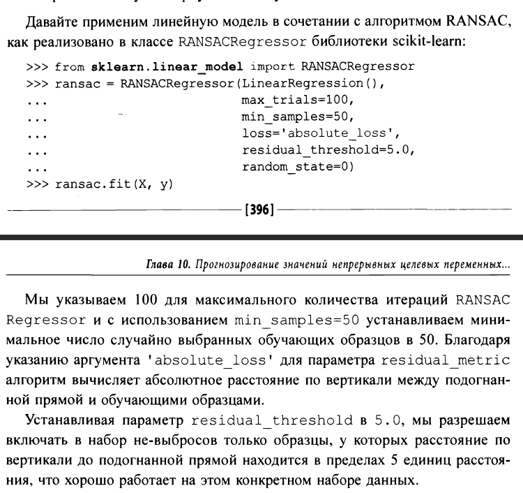
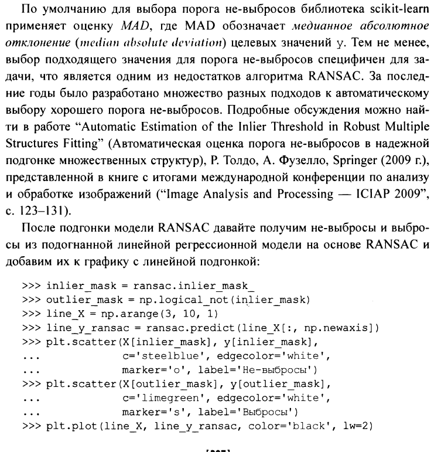
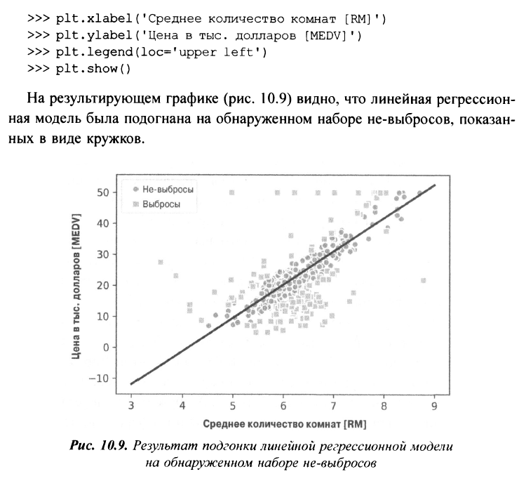 
За счет применения RANSAC удалось уменьшить потенциальное влияние
выбросов в этом наборе данных , но мы не знаем, покажет ли продемонстрированный
подход положительный результат на не встречавшихся ранее данных.

<a href="#readme-top">К содержанию</a>

##

<h2 id="30">  30. Оценивание качества работы линейных регрессионных моделей </h2>

<a href="#readme-top">К содержанию</a>

##

<h2 id="31">  31. Применение регуляризованных методов для регрессии </h2>

<a href="#readme-top">К содержанию</a>

##

<h2 id="32">  32. Превращение линейной регрессионной модели в криволинейную - полиномиальная регрессия </h2>

<a href="#readme-top">К содержанию</a>

##

<h2 id="33">  33. Работа с немаркированными данными - кластерный анализ </h2>

<a href="#readme-top">К содержанию</a>

##

<h2 id="34">  34. Группирование объектов по подобию методом k средних </h2>

<a href="#readme-top">К содержанию</a>

##

<h2 id="35">  35. Алгоритм k-средних </h2>
<i>Внизу там реализация есть:</i>
<a href="https://www.helenkapatsa.ru/mietod-k-sriednikh/">source</a>

Метод k-средних (k-Means Clustering) – это очень известный и мощный алгоритм Обучения без учителя (Unsupervised Learning), который группирует похожие элементы в k кластеров. Он используется для решения многих сложных задач Машинного обучения (ML).

<b>Пример</b>. Предположим, мы пошли в магазин за овощами и увидели, что они будут расположены на полках по типу. Вся морковь хранится в одном месте, картошка – в другом.

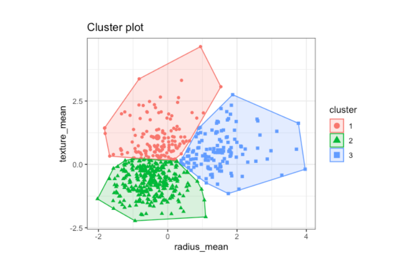
 
 

До применения кластеризации (появления окрашенных зон и обозначения записей разными иконками) перепутать категорию довольно легко. Неопытные мерчендайзеры до сих пор кладут арбузы в отдел ягод, хоть и правы с научной точки зрения.

Метод k-средних пытается сгруппировать похожие элементы в три этапа:

Выберем значение k

1. Инициализируем центроиды (разделительные линии)
2. Выберем группу и найдем среднее значение расстояния между точками.
3. Давайте разберемся в вышеуказанных шагах с помощью иллюстраций.

Допустим, мы на глаз кластеризовали наблюдения, причислив половину к белой категории, оставшуюся часть – к розовой.

Шаг 1. Мы случайным образом выбираем значение K, равное 2:

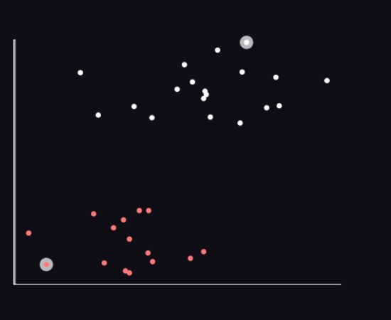
 
 
Существуют различные методы, с помощью которых мы можем выбрать правильные значения параметра k. Об этом позже.
 
 
Шаг 2. Соединим две выбранные максимально удаленные точки, обозначенные белой полупрозрачной обводкой. Теперь, чтобы определить центроид, мы построим перпендикуляр к этой линии:
  
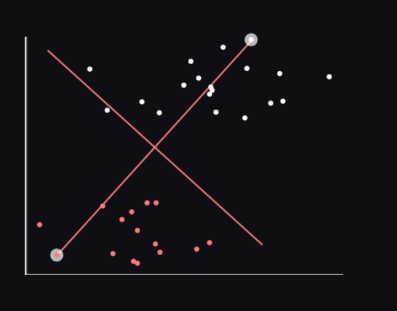
 
 
Если вы заметили, одна белая точка попала в группу розовых, и теперь относится к другой группе, чем предположено изначально.
 
 
Шаг 3. Мы соединим две другие удаленные точки, проведем к ним перпендикулярную линию и найдем центроид. Теперь некоторые белые точки преобразуются в розовые:
  
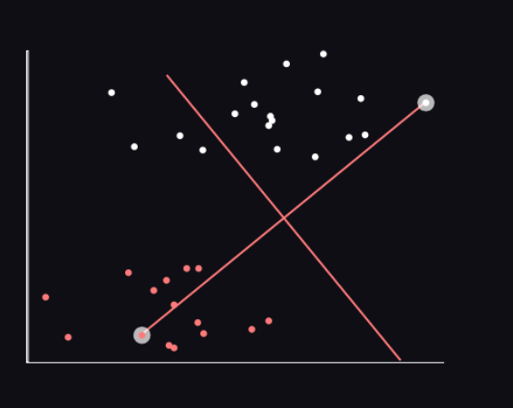
 
 
Этот процесс будет продолжаться до тех пор, пока мы не переберем все возможные сочетания пар дистанцированных точек и не уточним границы кластеров. Стабильность центроидов определяется путем сравнения абсолютного значения изменения среднего Евклидова расстояния (Euclidian Distance) между наблюдениями и их соответствующими центроидами с пороговым значением.
 
 
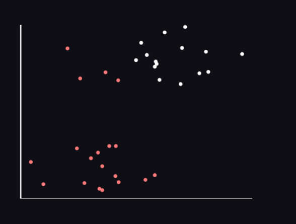
 
 

Как выбрать значение k?
Одна из самых сложных задач в этом алгоритме кластеризации – выбрать правильные значения k. Существует два метода.

Метод локтя
Метод локтя (Elbow Rule) – один из самых известных методов, с помощью которого вы можете выбрать правильное значение k и повысить производительность Модели (Model). Этот эмпирический метод вычисляет сумму квадратов расстояний между точками и вычисляет Среднее значение (Mean).

Когда значение k равно 1, сумма квадрата внутри кластера будет большой. По мере увеличения значения k сумма квадратов расстояний внутри кластера будет уменьшаться.

Наконец, мы построим график между значениями k и суммой квадрата внутри кластера, чтобы получить значение k. Мы внимательно рассмотрим график. В какой-то момент значение по оси x резко уменьшится. Эта точка будет считаться оптимальным значением k:

 
 
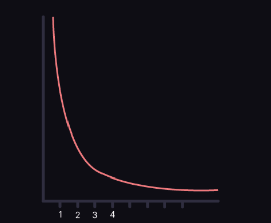
 
 

Метод силуэта
Метод силуэта (Silhouette Method) вычисляет среднее расстояние между точками в своем кластере ai и среднее расстояние от точек до следующего ближайшего кластера, называемого bi.

 
 
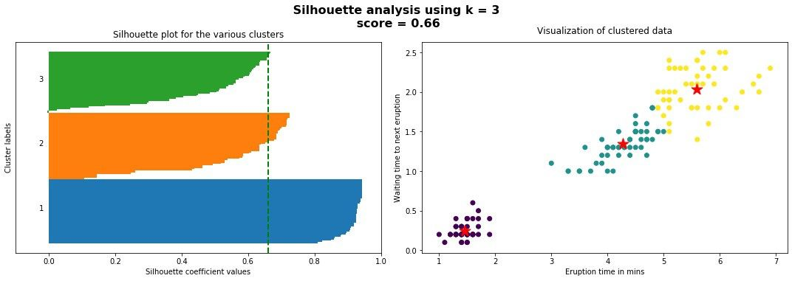
 
 

Чем меньше коэффициент силуэта (длина фигуры справа), тем оптимальнее выбран k
Теперь мы можем вычислить коэффициент силуэта всех точек в кластерах и построить график. Последний также поможет в обнаружении Выбросов (Outlier). Значение метрики силуэта находится в диапазоне от -1 до 1. Обратите внимание, что коэффициент силуэта, равный –1 – это наихудший сценарий. Для картинки выше система вычислила расстояния между всеми точками при различных допущениях о числе кластеров и построила соответствующие горизонтальные гистограммы. Мы выбираем k, равный 3, потому что зеленая гистограмма меньше, хотя стоит, возможно, проверить и бо́льшие значения.

<h4>Преимущества K-Means</h4>
1. Простота реализации
2. Масштабируемость до огромных наборов данных
3. Метод очень быстро обучается на новых примерах
4. Поддержка сложных форм и размеров.

<h4>Недостатки K-Means</h4>

1. Чувствительность к выбросам
2. Трудоемкость выбора k
3. Уменьшение масштабируемости.

<a href="#readme-top">К содержанию</a>

##

<h2 id="36">  36. Использование метода локтя для нахождения оптимального числа кластеров </h2>

Метод локтя – один из самых известных методов, с помощью которого вы можете выбрать правильное значение k и повысить производительность Модели (Model). Этот эмпирический метод вычисляет сумму квадратов расстояний между точками и вычисляет Среднее значение (Mean).

<b>Пример</b>. Предположим, мы пошли в магазин за овощами и увидели, что они будут расположены на полках по типу. Вся морковь хранится в одном месте, картошка – в другом.

 
 

До применения кластеризации (появления окрашенных зон и обозначения записей разными иконками) перепутать категорию довольно легко. Неопытные мерчендайзеры до сих пор кладут арбузы в отдел ягод, хоть и правы с научной точки зрения.

Метод k-средних пытается сгруппировать похожие элементы в три этапа:

Выберем значение k

1. Инициализируем центроиды (разделительные линии)
2. Выберем группу и найдем среднее значение расстояния между точками.
3. Давайте разберемся в вышеуказанных шагах с помощью иллюстраций.

Допустим, мы на глаз кластеризовали наблюдения, причислив половину к белой категории, оставшуюся часть – к розовой.

Шаг 1. Мы случайным образом выбираем значение K, равное 2:

 
 
Существуют различные методы, с помощью которых мы можем выбрать правильные значения параметра k. Об этом позже.
 
 
Шаг 2. Соединим две выбранные максимально удаленные точки, обозначенные белой полупрозрачной обводкой. Теперь, чтобы определить центроид, мы построим перпендикуляр к этой линии:
  

 
 
Если вы заметили, одна белая точка попала в группу розовых, и теперь относится к другой группе, чем предположено изначально.
 
 
Шаг 3. Мы соединим две другие удаленные точки, проведем к ним перпендикулярную линию и найдем центроид. Теперь некоторые белые точки преобразуются в розовые:
  

 
 
Этот процесс будет продолжаться до тех пор, пока мы не переберем все возможные сочетания пар дистанцированных точек и не уточним границы кластеров. Стабильность центроидов определяется путем сравнения абсолютного значения изменения среднего Евклидова расстояния (Euclidian Distance) между наблюдениями и их соответствующими центроидами с пороговым значением.
 
 

 
 
Рассмотрим "локтевой" способ. Когда значение k равно 1, сумма квадрата внутри кластера будет большой. По мере увеличения значения k сумма квадратов расстояний внутри кластера будет уменьшаться.
 
 
Наконец, мы построим график между значениями k и суммой квадрата внутри кластера, чтобы получить значение k. Мы внимательно рассмотрим график. В какой-то момент значение по оси x резко уменьшится. Эта точка будет считаться оптимальным значением k:  
 

<a href="#readme-top">К содержанию</a>

##

<h2 id="37">  37. Количественная оценка качества кластеризации методом силуэтных графиков </h2>

<a href="#readme-top">К содержанию</a>

##

<h2 id="38">  38. Организация кластеров в виде иерархического дерева </h2>

<i>Тут даже пример кода есть:</i>
<a href="https://neerc.ifmo.ru/wiki/index.php?title=%D0%98%D0%B5%D1%80%D0%B0%D1%80%D1%85%D0%B8%D1%87%D0%B5%D1%81%D0%BA%D0%B0%D1%8F_%D0%BA%D0%BB%D0%B0%D1%81%D1%82%D0%B5%D1%80%D0%B8%D0%B7%D0%B0%D1%86%D0%B8%D1%8F">source</a>

Иерархическая кластеризация — множество алгоритмов кластеризации, направленных на создание иерархии вложенных разбиений исходного множества объектов.

Иерархические алгоритмы кластеризации часто называют <b>алгоритмами таксономии</b>. Для визуального представления результатов кластеризации используется дендрограмма — дерево, построенное по матрице мер близости между кластерами. В узлах дерева находятся подмножества объектов из обучающей выборки. При этом на каждом ярусе дерева множество объектов из всех узлов составляет исходное множество объектов. Объединение узлов между ярусами соответствует слиянию двух кластеров. При этом длина ребра соответствует расстоянию между кластерами.

<h4>Алгоритм иерархической кластеризации</h4>

Дерево строится от листьев к корню. В начальный момент времени каждый объект содержится в собственном кластере. Далее происходит итеративный процесс слияния двух ближайших кластеров до тех пор, пока все кластеры не объединятся в один или не будет найдено необходимое число кластеров. На каждом шаге необходимо уметь вычислять расстояние между кластерами и пересчитывать расстояние между новыми кластерами. Расстояние между одноэлементными кластерами определяется через расстояние между объектами. Для вычисления расстояния между кластерами на практике используются различные функции в зависимости от специфики задачи.

<a href="#readme-top">К содержанию</a>

##

<h2 id="39">  39. Локализация областей высокой плотности алгоритмом DBSCAN </h2>

<a href="#readme-top">К содержанию</a>

##

<h2 id="40">  40. Активация нейронной сети методом прямого распространения сигналов </h2>
<b>Возможно тут кринж, взял с учебника + инет</b>  
Многослойный персептрон (MLP) - типичный пример нейронной сети прямого распростронения. Термин "прямое распространение" относится к тому факту, что каждый слой служит входом в слелующий слой без циклов п оконтрасту с рекурерентными нейронными сетями.  
<b>Прямое распространение</b> – это процесс передачи входных значений в нейронную сеть и получения выходных данных, которые называются прогнозируемым значением. Когда входные значения передаются в первый слой нейронной сети, процесс проходит без каких-либо операций. Второй уровень сети принимает значения первого уровня, а после операций по умножению и активации передает значения далее. Тот же процесс происходит на более глубоких слоях. 
<b>Функция активации</b> используется для того, чтобы ввести нелинейность в нейронную сеть. Она определяет выходное значение нейрона, которое будет зависеть от суммарного значения входов и порогового значения. 
 
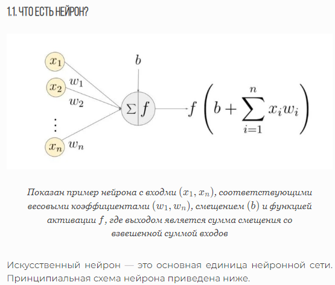 
Как видно выше, он работает в два этапа: вычисляет взвешенную сумму своих входных данных, а затем применяет функцию активации для нормализации суммы. Функции активации могут быть линейными или нелинейными. Также, есть веса, связанные с каждым входом нейрона. Это параметры, которые сеть должна приобрести на этапе обучения. 
<b>Функция активации</b> используется как орган принятия решений на выходе нейрона. Нейрон изучает линейные или нелинейные границы принятия решений на основе функции активации. Он также оказывает нормализующее влияние на выход нейронов, что предотвращает выход нейронов после нескольких слоев, чтобы стать очень большим, за счет каскадного эффекта. Есть три наиболее часто используемых функции активации.
 
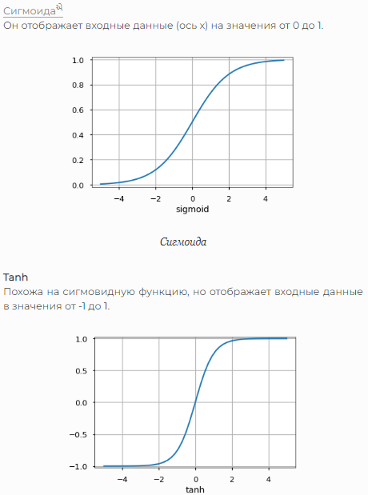 
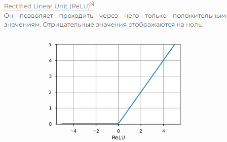 
 
Функция активации может быть другой, например, функция Unit Step, leaky ReLU, Noisy ReLU, Exponential LU и т.д., которые имеют свои плюсы и минусы.
  
Сети прямого распространения (англ. Feedforward neural network) (feedforward сети) — искусственные нейронные сети, в которых сигнал распространяется строго от входного слоя к выходному. 
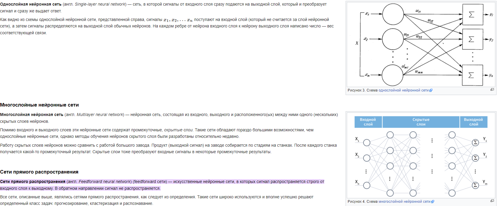
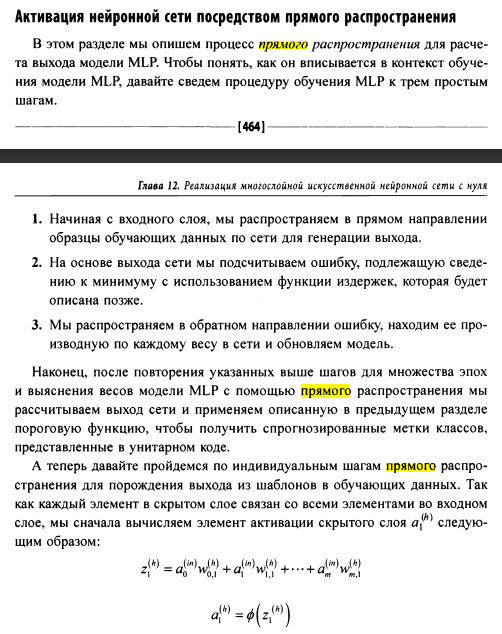
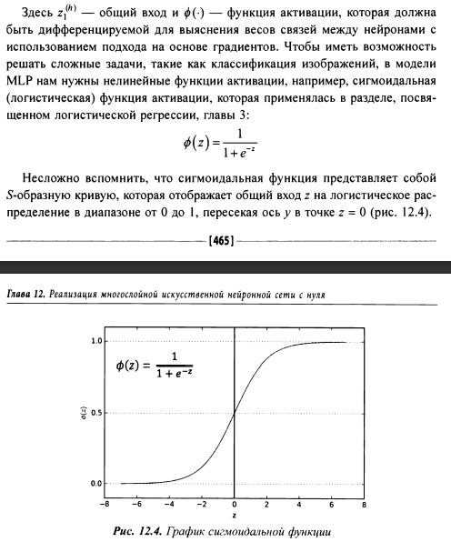
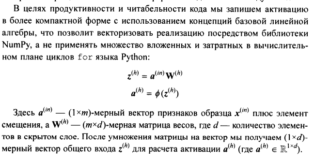
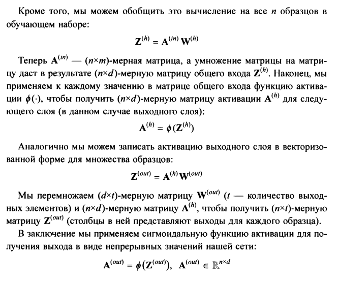
<a href="https://waksoft.susu.ru/2021/11/01/chto-takoe-nejronnye-seti-s-pryamoj-svyazyu/">Source</a>

<a href="#readme-top">К содержанию</a>

##

<h2 id="41">  41. Тренировка нейронных сетей методом обратного распространения ошибки </h2>

<i>лучше прочитать вот тута:</i>
<a href="https://habr.com/ru/post/198268/">source</a>

Обучение сети методом обратного распространения ошибки включает в себя три этапа:

1. подачу на вход данных, с последующим распространением данных в направлении выходов
2. вычисление и обратное распространение соответствующей ошибки
3. корректировка весов.

После обучения предполагается лишь подача на вход сети данных и распространение их в направлении выходов. При этом, если обучение сети может являться довольно длительным процессом, то непосредственное вычисление результатов обученной сетью происходит очень быстро. Кроме того, существуют многочисленные вариации метода обратного распространения ошибки, разработанные с целью увеличения скорости протекания процесса обучения.

Также стоит отметить, что однослойная нейронная сеть существенно ограничена в том, обучению каким шаблонам входных данных она подлежит, в то время, как многослойная сеть ( с одним или более скрытым слоем ) не имеет такого недостатка. Далее будет дано описание стандартной нейронной сети с обратным распространением ошибки.

<b>ДАЛЬШЕ ВООБЩЕ ПИЗДЕЦ СОЧУВСТВУЮ</b>

Алгоритм, представленный далее, применим к нейронной сети с одним скрытым слоем, что является допустимой и адекватной ситуацией для большинства приложений.

Как уже было сказано ранее, обучение сети включает в себя три стадии:

- подача на входы сети обучающих данных
- обратное распространение ошибки
- корректировка весов.

1. В ходе первого этапа каждый входной нейрон получает сигнал и широковещательно транслирует его каждому из скрытых нейронов. Каждый скрытый нейрон затем вычисляет результат его активационной функции ( сетевой функции ) и рассылает свой сигнал всем выходным нейронам. Каждый выходной нейрон, в свою очередь, вычисляет результат своей активационной функции, который представляет собой ничто иное, как выходной сигнал данного нейрона для соответствующих входных данных. В процессе обучения, каждый нейрон на выходе сети сравнивает вычисленное значение с предоставленным учителем ( целевым значением ), определяя соответствующее значение ошибки для данного входного шаблона.
2. На основании этой ошибки вычисляется <u>Составляющая корректировки весов связей</u>, которая используется при распространении ошибки до всех элементов сети предыдущего слоя ( скрытых нейронов), а также позже при изменении весов связей между выходными нейронами и скрытыми. Аналогичным образом вычисляется для каждого скрытого нейрона. Несмотря на то, что распространять ошибку до входного слоя необходимости нет, используется для изменения весов связей между нейронами скрытого слоя и входными нейронами.
3. После того как все были определены, происходит одновременная корректировка весов всех связей.

<h4>Недостатки алгоритма</h4>
Несмотря на многочисленные успешные применения обратного распространения, оно не является универсальным решением. Больше всего неприятностей приносит неопределённо долгий процесс обучения. В сложных задачах для обучения сети могут потребоваться дни или даже недели, она может и вообще не обучиться. Причиной может быть одна из описанных ниже.

<h5>Паралич сети</h5>

В процессе обучения сети значения весов могут в результате коррекции стать очень большими величинами. Это может привести к тому, что все или большинство нейронов будут функционировать при очень больших значениях OUT, в области, где производная сжимающей функции очень мала. Так как посылаемая обратно в процессе обучения ошибка пропорциональна этой производной, то процесс обучения может практически замереть. В теоретическом отношении эта проблема плохо изучена. Обычно этого избегают уменьшением размера шага η, но это увеличивает время обучения. Различные эвристики использовались для предохранения от паралича или для восстановления после него, но пока что они могут рассматриваться лишь как экспериментальные.

<h5>Локальные минимумы</h5>

Обратное распространение использует разновидность градиентного спуска, то есть осуществляет спуск вниз по поверхности ошибки, непрерывно подстраивая веса в направлении к минимуму. Поверхность ошибки сложной сети сильно изрезана и состоит из холмов, долин, складок и оврагов в пространстве высокой размерности. Сеть может попасть в локальный минимум (неглубокую долину), когда рядом имеется гораздо более глубокий минимум. В точке локального минимума все направления ведут вверх, и сеть не способна из него выбраться. Основную трудность при обучении нейронных сетей составляют как раз методы выхода из локальных минимумов: каждый раз выходя из локального минимума снова ищется следующий локальный минимум тем же методом обратного распространения ошибки до тех пор, пока найти из него выход уже не удаётся.

<h5>Размер шага</h5>

Если размер шага фиксирован и очень мал, то сходимость слишком медленная, если же он фиксирован и слишком велик, то может возникнуть паралич или постоянная неустойчивость. Эффективно увеличивать шаг до тех пор, пока не прекратится улучшение оценки в данном направлении антиградиента и уменьшать, если такого улучшения не происходит.

<a href="#readme-top">К содержанию</a>

##

<h2 id="42">  42. Сверточные нейронные сети </h2>

<b>Свёрточная нейронная сеть</b> (СНС) — специальная архитектура искусственных нейронных сетей, нацеленная на эффективное распознавание образов, входит в состав технологий глубокого обучения.

<h4>Структура сверточной нейронной сети</h4>

В обычном перцептроне, который представляет собой полносвязную нейронную сеть, каждый нейрон связан со всеми нейронами предыдущего слоя, причём каждая связь имеет свой персональный весовой коэффициент. В свёрточной нейронной сети в <u>операции свёртки</u> используется лишь ограниченная матрица весов небольшого размера, которую «двигают» по всему обрабатываемому слою (в самом начале — непосредственно по входному изображению), формируя после каждого сдвига сигнал активации для нейрона следующего слоя с аналогичной позицией. То есть для различных нейронов выходного слоя используются одна и та же матрица весов, которую также называют <u>ядром свёртки</u>. Её интерпретируют как графическое кодирование какого-либо признака, например, наличие наклонной линии под определённым углом. Тогда следующий слой, получившийся в результате операции свёртки такой матрицей весов, показывает наличие данного признака в обрабатываемом слое и её координаты, формируя так называемую <u>карту признаков</u> (англ. feature map). Естественно, в свёрточной нейронной сети набор весов не один, а целая гамма, кодирующая элементы изображения (например линии и дуги под разными углами). При этом такие ядра свёртки не закладываются исследователем заранее, а формируются самостоятельно путём обучения сети классическим <u>методом обратного распространения ошибки</u>. Проход каждым набором весов формирует свой собственный экземпляр карты признаков, делая нейронную сеть многоканальной (много независимых карт признаков на одном слое). Также следует отметить, что при переборе слоя матрицей весов её передвигают обычно не на полный шаг (размер этой матрицы), а на небольшое расстояние. Так, например, при размерности матрицы весов 5×5 её сдвигают на один или два нейрона (пикселя) вместо пяти, чтобы не «перешагнуть» искомый признак.

Операция субдискретизации (операция подвыборки), выполняет уменьшение размерности сформированных карт признаков. В данной архитектуре сети считается, что информация о факте наличия искомого признака важнее точного знания его координат, поэтому из нескольких соседних нейронов карты признаков выбирается максимальный и принимается за один нейрон уплотнённой карты признаков меньшей размерности. <b>За счёт данной операции, помимо ускорения дальнейших вычислений, сеть становится более инвариантной к масштабу входного изображения.</b>

Рассмотрим типовую структуру свёрточной нейронной сети более подробно.

- Сеть состоит из большого количества слоёв.
- После начального слоя (входного изображения) сигнал проходит серию свёрточных слоёв, в которых чередуется собственно свёртка и субдискретизация (пулинг).
- Чередование слоёв позволяет составлять «карты признаков» из карт признаков, на каждом следующем слое карта уменьшается в размере, но увеличивается количество каналов.  
  На практике это означает способность распознавания сложных иерархий признаков. Обычно после прохождения нескольких слоёв карта признаков вырождается в вектор или даже скаляр, но таких карт признаков становятся сотни. На выходе свёрточных слоёв сети дополнительно устанавливают несколько слоёв полносвязной нейронной сети (перцептрон), на вход которому подаются оконечные карты признаков.

<h4>1. Слой свёртки</h4>

Слой свёртки (англ. convolutional layer) — это основной блок свёрточной нейронной сети. Слой свёртки включает в себя для каждого канала свой фильтр, ядро свёртки которого обрабатывает предыдущий слой по фрагментам (суммируя результаты поэлементного произведения для каждого фрагмента). Весовые коэффициенты ядра свёртки (небольшой матрицы) неизвестны и устанавливаются в процессе обучения.

Особенностью свёрточного слоя является сравнительно небольшое количество параметров, устанавливаемое при обучении. Так например, если исходное изображение имеет размерность 100×100 пикселей по трём каналам (это значит 30 000 входных нейронов), а свёрточный слой использует фильтры c ядром 3×3 пикселя с выходом на 6 каналов, тогда в процессе обучения определяется только 9 весов ядра, однако по всем сочетаниям каналов, то есть 9×3×6=162, в таком случае данный слой требует нахождения только 162 параметров, что существенно меньше количества искомых параметров полносвязной нейронной сети.

<h4>2. Слой активации</h4>

Скалярный результат каждой свёртки попадает на <u>функцию активации</u>(определяет выходной сигнал, который определяется входным сигналом или набором входных сигналов), которая представляет собой некую нелинейную функцию. Слой активации обычно логически объединяют со слоем свёртки (считают, что функция активации встроена в слой свёртки).
То есть по сути это операция отсечения отрицательной части скалярной величины (?)

<h4>3. Пулинг или слой субдискретизации</h4>

Слой пулинга (иначе подвыборки, субдискретизации) представляет собой нелинейное уплотнение карты признаков, при этом группа пикселей (обычно размера 2×2) уплотняется до одного пикселя, проходя нелинейное преобразование. Преобразования затрагивают непересекающиеся прямоугольники или квадраты, каждый из которых ужимается в один пиксель, при этом выбирается пиксель, имеющий максимальное значение. <u>Операция пулинга позволяет существенно уменьшить пространственный объём изображения</u>.  
<b>Пулинг интерпретируется так:</b> если на предыдущей операции свёртки уже были выявлены некоторые признаки, то для дальнейшей обработки настолько подробное изображение уже не нужно, и оно уплотняется до менее подробного. К тому же фильтрация уже ненужных деталей помогает не переобучаться. Слой пулинга, как правило, вставляется после слоя свёртки перед слоем следующей свёртки.

<h4>4. Полносвязная нейронная сеть</h4>

После нескольких прохождений свёртки изображения и уплотнения с помощью пулинга система перестраивается от конкретной сетки пикселей с высоким разрешением к более абстрактным картам признаков, как правило, на каждом следующем слое увеличивается число каналов и уменьшается размерность изображения в каждом канале. В конце концов, остаётся большой набор каналов, хранящих небольшое число данных (даже один параметр), которые интерпретируются как самые абстрактные понятия, выявленные из исходного изображения.

Эти данные объединяются и передаются на обычную полносвязную нейронную сеть, которая тоже может состоять из нескольких слоёв. При этом полносвязные слои уже утрачивают пространственную структуру пикселей и обладают сравнительно небольшой размерностью (по отношению к количеству пикселей исходного изображения).

<a href="#readme-top">К содержанию</a>

##

<h2 id="43">  43. Рекуррентные нейронные сети </h2>

Рекуррентная нейронная сеть (англ. recurrent neural network, RNN) — вид нейронных сетей, где связи между элементами образуют направленную последовательность.

<h4>Области и примеры применения:</h4>
  Используются, когда важно соблюдать последовательность, когда важен порядок поступающих объектов.

<h5>1. Обработка текста на естественном языке:</h5>

- Анализ текста;
- Автоматический перевод;
<h5>2. Обработка аудио:</h5>

- Автоматическое распознавание речи;
<h5>3. Обработка видео:</h5>

- Прогнозирование следующего кадра на основе предыдущих;
- Распознавание эмоций;
<h5>4. Обработка изображений:</h5>

- Прогнозирование следующего пикселя на основе окружения;
- Генерация описания изображений.

<h4>Виды RNN:</h4>

1. 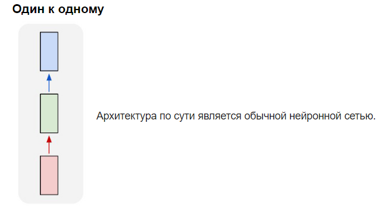
    
    

2. 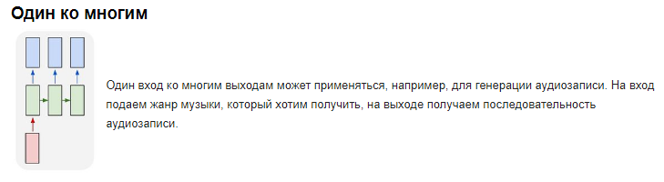
    
    

3. 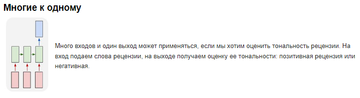
    
    

4. 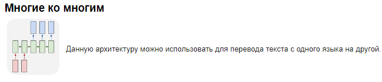
    
    

<h4>Архитектуры</h4>

- <h5>Полностью рекуррентная сеть</h5>
  Это базовая архитектура, разработанная в 1980-х. Сеть строится из узлов, каждый из которых соединён со всеми другими узлами. У каждого нейрона порог активации меняется со временем и является вещественным числом. Каждое соединение имеет переменный вещественный вес. Узлы разделяются на входные, выходные и скрытые.

- <h5>Рекурсивная сеть</h5>
  Рекурсивные нейронные сети (англ. Recurrent neural networks) представляют собой более общий случай рекуррентных сетей, когда сигнал в сети проходит через структуру в виде дерева (обычно бинарные деревья). Те же самые матрицы весов используются рекурсивно по всему графу в соответствии с его топологией.

- <h5>Нейронная сеть Хопфилда</h5>
  Тип рекуррентной сети, когда все соединения симметричны. Изобретена Джоном Хопфилдом в 1982 году и гарантируется, что динамика такой сети сходится к одному из положений равновесия.

- <h5>Двунаправленная ассоциативная память (BAM)</h5>
  Вариацией сети Хопфилда является двунаправленная ассоциативная память (BAM). BAM имеет два слоя, каждый из которых может выступать в качестве входного, находить (вспоминать) ассоциацию и генерировать результат для другого слоя.

- <h5>Сети долго-краткосрочной памяти</h5>
  Сеть долго-краткосрочной памяти (англ. Long short-term memory, LSTM :)) является самой популярной архитектурой рекуррентной нейронной сети на текущий момент, такая архитектура способна запоминать данные на долгое время.

<i>За полным списокм и примером кода на питоне вам сюда:</i>
<a href="https://neerc.ifmo.ru/wiki/index.php?title=%D0%A0%D0%B5%D0%BA%D1%83%D1%80%D1%80%D0%B5%D0%BD%D1%82%D0%BD%D1%8B%D0%B5_%D0%BD%D0%B5%D0%B9%D1%80%D0%BE%D0%BD%D0%BD%D1%8B%D0%B5_%D1%81%D0%B5%D1%82%D0%B8">Source</a>

<a href="#readme-top">К содержанию</a>

