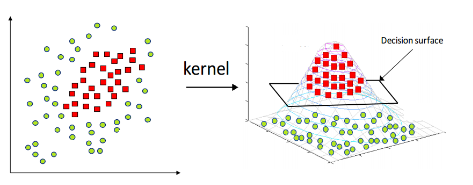
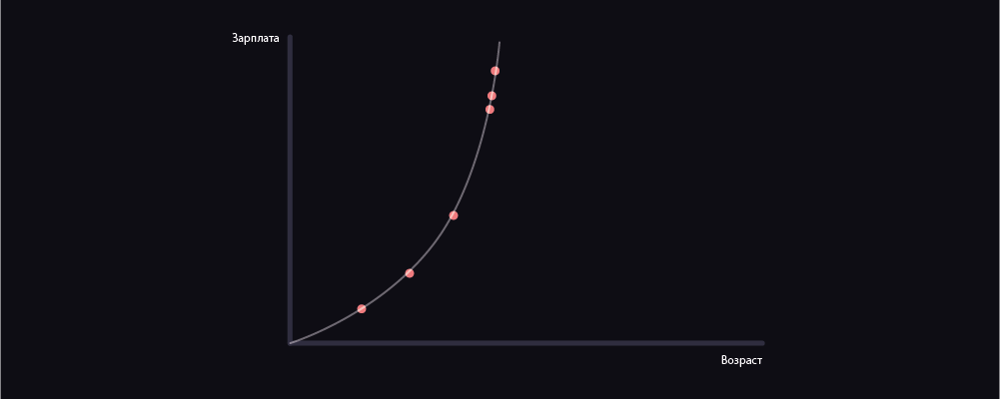
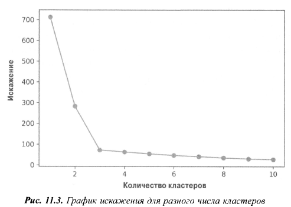

  <h1>Содержание экзамена МИС</h1>
  

✅ - Вопрос с готовым ответом
❌ - На вопрос нет ответа
⚠️ - Правильность ответа под крайнем сомнением

<ol>
  <li>✅ <a href="#1"> Задача классификации - распознавание меток классов </a></li>
  <li>✅ <a href="#2"> Задача регрессии - предсказание значений непрерывной целевой переменной </a></li>
  <li>✅ <a href="#3"> Обнаружение скрытых структур при помощи обучения без учителя </a></li>
  <li>✅ <a href="#4"> Выявление подгрупп при помощи кластеризации </a></li>
  <li>✅ <a href="#5"> Предобработка - приведение данных в приемлемый вид </a></li>
  <li>✅ <a href="#6"> Тренировка и отбор прогнозной модели. Оценка моделей и прогнозирование на ранее не встречавшихся экземплярах данных. </a></li>
  <li>✅⚠️ <a href="#7"> Искусственные нейроны - итория машинного обучения </a></li>
  <li>✅ <a href="#8"> Адаптивные линейные нейроны и сходимость обучения </a></li>
  <li>✅⚠️ <a href="#9"> Минимизация функций стоимости методом градиентного спуска </a></li>
  <li>✅⚠️ <a href="#10"> Моделирование вероятностей классов логистической регрессии </a></li>
  <li>✅ <a href="#11"> Решение проблемы переобучения при помощи регуляризации </a></li>
  <li>✅ <a href="#12"> Классификация с максимальным зазором на основе метода опорных векторов </a></li>
  <li>✅ <a href="#13"> Решение нелинейных задач ядерным методом SVM </a></li>
  <li>✅ <a href="#14"> Использование ядерного трюка для нахождения разделяющих гиперплоскостей в пространстве высокой размерности </a></li>
  <li>✅ <a href="#15"> Обучение моделей на основе деревьев решений </a></li>
  <li>❌ <a href="#16"> Объединение множества признаков принятия решений с помощью случайных лесов. </a></li>
  <li>✅ <a href="#17"> k ближайших соседей - алгоритм ленивого обучения </a></li>
  <li>✅ <a href="#18"> Приведение признаков к одинаковой шкале </a></li>
  <li>❌ <a href="#19"> Снижение размерности без учителя на основе анализа главных компонент </a></li>
  <li>✅ <a href="#20"> Сжатие данных с учителем путем линейного дискриминантного анализа </a></li>
  <li>❌ <a href="#21"> Реализация ядерного метода анализа главных компонент </a></li>
  <li>✅ <a href="#22"> Ядерный метод анализа главных компонент </a></li>
  <li>✅ <a href="#23"> Использование k-блочной перекрестной проверки для оценки качества модели </a></li>
  <li>✅⚠️ <a href="#24"> Решение проблемы переобучения и недообучения при помощи проверочных кривых</a></li>
  <li>✅ <a href="#25"> Объединение моделей для методов ансамблевого обучения </a></li>
  <li>✅ <a href="#26"> Бэггинг - сборка ансамбля классификаторов из бутстрап-выборок </a></li>
  <li>✅ <a href="#27"> Прогнозирование значений непрерывной целевой переменной на основе регрессионного. анализа </a></li>
  <a href="#28.0"> Регрессия и линейная регресия</a>
  <li>✅⚠️ <a href="#28"> Реализация линейной регрессионной модели методом наименьших квадратов </a></li>
  <li>✅ <a href="#29"> Подгонка стабильной регрессионной модели алгоритмом RANSAC </a></li>
  <li>✅⚠️ <a href="#30"> Оценивание качества работы линейных регрессионных моделей </a></li>
  <li>✅ <a href="#31"> Применение регуляризованных методов для регрессии </a></li>
  <li>✅ <a href="#32"> Превращение линейной регрессионной модели в криволинейную - полиномиальная регрессия </a></li>
  <li>✅ <a href="#33"> Работа с немаркированными данными - кластерный анализ </a></li>
  <li>✅⚠️ <a href="#34"> Группирование объектов по подобию методом k средних </a></li>
  <li>✅ <a href="#35"> Алгоритм k-средних </a></li>
  <li>✅ <a href="#36"> Использование метода локтя для нахождения оптимального числа кластеров </a></li>
  <li>✅ <a href="#37"> Количественная оценка качества кластеризации методом силуэтных графиков </a></li>
  <li>✅ <a href="#38"> Организация кластеров в виде иерархического дерева </a></li>
  <li>✅ <a href="#39"> Локализация областей высокой плотности алгоритмом DBSCAN </a></li>
  <li>✅ <a href="#40"> Активация нейронной сети методом прямого распространения сигналов </a></li>
  <li>✅ <a href="#41"> Тренировка нейронных сетей методом обратного распространения ошибки </a></li>
  <li>✅ <a href="#42"> Сверточные нейронные сети </a></li>
  <li>✅ <a href="#43"> Рекуррентные нейронные сети </a></li>
  <!-- <a href="#ggd">Если не знаете ответ на вопрос, то это должно вас выручить</a> -->
</ol>

 

##

<h2 id="1">  1. Задача классификации - распознавание меток классов </h2>
Задача классификации - это подкатегория методов машинного обучения с учителем, суть которой заключается в идентификации категориальных меток классов для новых экземпляров на основе предыдущих наблюдений. Метка класса представляет собой дискретное, неупорядоченное значение, которое может пониматься как принадлежность группе экземпляров. Ранее упомянутый пример с обнаружением почтового спама представляет собой типичный пример задачи бинарной классификации, где алгоритм машинного обучения вычисляет серию правил для различения двух возможных классов: спамных и неспамных почтовых сообщений. 
Однако набор меток классов не обязательно должен иметь двоичную природу. Извлеченная алгоритмом обучения с учителем прогнозная модель может присваивать новому, немаркированному экземпляру любую метку класса, которая была определена в тренировочном наборе данных. Типичным примером задачи многоклассовой (или мультuномиальной) является рукописное распознавание символов. Здесь можно было бы собрать тренировочный набор данных, состоящий из большого числа рукописных образцов каждой буквы алфавита. Теперь если пользователь через устройство ввода данных предоставит новый рукописный символ, то наша прогнозная модель с определенной степенью соответствия сможет распознать правильную букву алфавита. Однако наша система машинного обучения была бы не в состоянии правильно распознать любую из цифр от нуля до девяти, в случае если они не входили в состав нашего тренировочного набора данных. 
Следующий ниже рисунок иллюстрирует принцип работы задачи бинарной классификации при наличии 30 тренировочных образцов : 15 образцов маркированы как отрицательный класс (круги) и другие 15 - как положительный класс. В этом сценарии наш набор данных является двумерным, то есть каждый образец имеет два связанных с ним значения х1 и х2. Можем применить алгоритм машинного обучения с учителем для извлечения правила – граница решения представлена черной пунктирной линией, которое может выделить эти два класса и затем распределить новые данные в каждую из этих двух категорий при наличии значений х1 и х2.

<b>Source:</b> Взято из любимой книги этой замечательной женщины.
 

<a href="#readme-top">К содержанию</a>

##

<h2 id="2">  2. Задача регрессии - предсказание значений непрерывной целевой переменной </h2>
В предыдущем разделе мы узнали, что задача классификации заключается в назначении
экземплярам категориальных, неупорядоченных меток. Второй тип обучения
с учителем представлен предсказанием непрерывных результатов, который еще
именуется регрессионным анализом, или методами восстановления зависимости
между переменными. В регрессионном анализе нам даны несколько объясняющих переменных и непрерывная переменная отклика, и мы пытаемся найти между этими переменными связь, которая позволит нам предсказывать результат.
Например, предположим, что нас интересует предсказание оценок студентов за тест по математике SAT Math1. Если между затраченным на подготовку к тесту временем и итоговыми оценками существует связь, то мы могли бы воспользоваться ею в качестве тренировочных данных для извлечения модели, в которой время учебы используется для предсказания экзаменационных отметок будущих студентов, планирующих пройти этот тест.
Следующий ниже рисунок иллюстрирует основную идею линейной регрессии.
При наличии предикторной переменной х и переменной отклика у мы выполняем
Под эти данные подгонку прямой, которая минимизирует расстояние - обычно
среднеквадратичное - между точками образцов и подогнанной линией. Далее мы
можем воспользоваться полученными из этих данных пересечения оси 1 и наклоном
прямой с неким угловым коэффициентом для прогнозирования результирующей
переменно в новых данных:

<b>Source:</b> Взято из любимой книги этой замечательной женщины.
 

<a href="#readme-top">К содержанию</a>

##

<h2 id="3">  3. Обнаружение скрытых структур при помощи обучения без учителя </h2>
В обучении с учителем, когда мы тренируем нашу модель, мы знаем правильный ответ
заранее, а в обучении с подкреплением мы определяем меру вознаграждения за
выполненные агентом отдельно взятые действия. С другой стороны, в обучении без
учителя мы имеем дело с немаркированными данными или данными с неизвестной структурой. Используя методы обучения без учителя, мы можем разведать структуру
данных с целью выделения содержательной информации без контроля со стороны
известной результирующей переменной или функции вознаграждения.
При обучении без учителя модель использует неразмеченные данные, из которых алгоритм самостоятельно пытается извлечь признаки и зависимости. Примеры алгоритмов без учителя: кластеризация, к-ближайших соседей(k-means), глубокая сеть доверия, графовые алгоритмы кластеризации.

<b>Source:</b> Взято из любимой книги этой замечательной женщины.

<a href="#readme-top">К содержанию</a>

##

<h2 id="4">  4. Выявление подгрупп при помощи кластеризации </h2>
<b>Кластеризация</b> - это метод разведочного анализа данных, который позволяет организовать груду информации в содержательные подгруппы (кластеры), не имея никаких предварительных сведений о принадлежности группе. Каждый кластер, который может появиться во время анализа, обозначает группу объектов, которые обладают определенной степенью подобия и одновременно больше отличаются от объектов в других кластерах, поэтому кластеризацию также иногда называют «классификацией без учителя». 
Kластеризация незаменима для структурирования информации и получения содержательных связей внутри данных. Например, этот метод позволяет специалистам по маркетингу обнаруживать группы потребителей на основе их интересов с целью разработки конкретных маркетинговых программ.  
Приведенный ниже рисунок иллюстрирует применение кластеризации для размещения немаркированных данных в три разные группы на основе подобия их признаков х1 и х2: 
 

<a href="#readme-top">К содержанию</a>

##

<h2 id="5">  5. Предобработка - приведение данных в приемлемый вид </h2>
Исходные (необработанные) данные редко поступают в том виде и в той форме, которые
Необходимы для оптимальной работы алгоритма обучения. Поэтому предобработка
данных является одним из самых важных этапов в любом приложении с использованием
машинного обучения. Если в качестве примера взять набор данных
цветков ириса из предыдущего раздела, то исходные данные можно представить как
серию снимков цветков, из которых мы хотим выделить содержательные признаки.
Полезными признаками могут быть цвет, оттенок, интенсивность цвета цветков, их
высота, длина и ширина. Многие алгоритмы машинного обучения также требуют,
чтобы отобранные признаки в целях оптимального качества работы находились
в одной и той же шкале, что часто достигается путем приведения признаков к диапазону
[0, 1] или стандартному нормальному распределению с нулевым средним значением
И единичной дисперсией, как мы убедимся в более поздних главах.
Некоторые отобранные признаки могут высоко коррелироваться и поэтому быть
до известной степени избыточными. В этих случаях целесообразно использовать
методы снижения размерности в целях сжатия признаков в подпространство более
низкой размерности. Преимущество снижения размерности нашего пространства
признаков заключается в том, что требуется меньший объем памяти, в результате
чего алгоритм обучения может выполняться намного быстрее.
Чтобы подтвердить, что наш алгоритм машинного обучения не только хорошо
работает на тренировочном наборе, но и хорошо обобщается на новые данные, нам
также понадобится случайным образом подразделить набор данных на два отдельных
подмножества:  тренировочный и тестовый наборы. Мы используем тренировочный набор, чтобы натренировать и оптимизировать нашу машиннообучаемую
модель, в то время как тестовый набор мы храним до самого конца с целью выполнить
оценку окончательной модели.

<a href="#readme-top">К содержанию</a>

##

<h2 id="6">  6. Тренировка и отбор прогнозной модели. Оценка моделей и прогнозирование на ранее не встречавшихся экземплярах данных. </h2>
Для решения различных практических задач было разработано большое количество разных алгоритмов машинного обучения, но мы не можем осуществлять машинное обучение «бесплатно», т.е. не каждый алгоритм будет выгодно использовать.  
Kаждый алгоритм классификации имеет присущие им смещения, и никакая модель классификации не обладает превосходством перед другими, при условии что мы не делаем допущений в отношении задачи. Поэтому на практике важно сравнить, по крайней мере, несколько различных алгоритмов, чтобы натренировать и отобрать самую качественную модель. Но прежде чем мы сможем сопоставить различные модели, мы сначала должны принять решение относительно метрики для измерения их качества . Одна из самых распространенных метрик - это верность (ассuгасу), иногда именуемая правильностью, которая определяется как доля правильно классифицированных экземпляров от общего числа предсказаний  
Здесь возникает законный вопрос: <b>а как узнать, какал модель работает хорошо на окоичательном тестовом наборе данных и реальных данных, если мы не используем этот тестовый набор для отбора модели и держим его для окончательной оценки модели?</b>  
Для решения заложенной в этот вопрос проблемы можно воспользоваться различными методами перекрестной проверки, или кросс-валидации, где тренировочный набор данных далее подразделяется на тренировочное и проверочное подмножества для оценки обобщающей способности модели • Наконец, мы не можем ожидать, что параметры различных алгоритмов обучения, предоставляемых программными библиотеками по умолчанию, оптимальны для нашей конкретной практической задачи. Поэтому в более поздних главах мы часто будем использовать методы гиперпараметрической оптимизации, которые помогут выполнить тонкую настройку качества нашей модели. Интуитивно гиперпараметры можно представить как параметры, которые не были извлечены из данных и являются рычагами управления моделью, которые можно изменять с целью улучшения ее качества работы.  

<b>Оценка моделей и прогнозирование на ранее не встречавшихся экземплярах данных</b>

После того как мы отобрали модель, подогнанную под тренировочный набор данных, мы можем воспользоваться тестовым набором данных и оценить, насколько хорошо она работает на этих ранее не встречавшихся ей данных, чтобы вычислить ошибку обобщения . Если мы удовлетворены качеством модели, то теперь мы можем использовать ее для прогнозирования новых будущих данных. Важно отметить, что параметры для таких ранее упомянутых процедур, как масштабирование признаков и снижение размерности, получают исключительно из тренировочного набора данных, и те же самые параметры позже применяют повторно для трансформирования тестового набора данных, а также любых новых образцов данных - в противном случае измеренное на тестовых данных качество модели может оказаться сверхоптимистичной.

 
Внимание анекдот:

Мама собирает сыну обед в школу: 
— Вот, положила тебе в ранец хлеб, колбасу и гвозди. 
— Мам, нафига?? 
— Ну как же, берешь хлеб, кладешь на него колбасу и ешь. 
— А гвозди? 
— Так вот же они! 

<a href="#readme-top">К содержанию</a>

##

<h2 id="7">  7. Искусственные нейроны - итория машинного обучения </h2>
Стараясь понять, каким образом работает биологический мозг, с целью разработки искусственного интеллекта Уоррен Маккалок и Уолтер Питтс в 1943 г. впервые опубликовали концепцию упрощенной клетки головного мозга (МСР). 
Маккалок и Питтс описали такую нервную клетку в виде простого логического элемента с бинарными выходами; множественные входные сигналы поступают в дендриты, затем интегрируются в клеточное тело, и если накопленный сигнал превышает определенный порог, то генерируется выходной сигнал, который аксоном передается дальше. 
Всего несколько лет спустя Фрэнк Розенблатт представил научному сообществу концепцию правила обучения персептрона, опираясь на модель нейрона МСР. 
Вместе с правилом персептрона Розенблатт предложил алгоритм, который автоматически обучался оптимальным весовым коэффициентам, которые затем перемножались с входными признаками для принятия решения о том, активировать нейрон или нет. В контексте обучения с учителем и задачи классификации такой алгоритм можно использовать для распознавания принадлежности образца к тому или иному классу. 
Весь смысл идеи, лежащей в основе нейрона МСР и персептронной модели Розенблатта с порогом, состоит в том, чтобы использовать редукционистский подход для имитации работы отдельного нейрона головного мозга: он либо активируется, либо нет. Таким образом, первоначальное правило обучения персептрона Розенблатта, т. е. правило обновления весов в персептроне, было довольно простым и может быть резюмировано следующими шагами: 
- Инициализировать веса нулями либо малыми случайными числами. 
Для каждого тренировочного образца x(I) выполнить следующие шаги: 
- вычислить выходное значение y; 
- обновить веса. 
Сходимость персептрона, т. е. достижение устойчивого со стояния, гарантируется, только если эти два класса линейно разделимы и темп обучения достаточно небольшой. Если эти два класса не могут быть разделены линейной границей решения, то мы можем установить максимальное число проходов по тренировочному набору данных (эпох) и/или порог на допустимое число случаев ошибочной классификации (число мисклассификаций) - иначе персептрон никогда не прекратит обновлять веса 

<a href="#readme-top">К содержанию</a>

##

<h2 id="8">  8. Адаптивные линейные нейроны и сходимость обучения </h2>
В этом разделе мы рассмотрим другой тип однослойной нейронной сети: ADALINE
(ADAptive Llnear NEuron, адаптивный линейный нейрон). Концепция ADALINE
была опубликована Берндардом Видроу и его докторантом Тэддом Хоффом спустя
всего несколько лет после алгоритма персептрона Фрэнка Розенблатта, который
можно рассматривать развитием последнего (Б. Видроу и др . , Adaptive «Adalineineuгon
using chemical «me mistoгsi- («Адаптивный нейрон "Adaliпe" с использованием
химических "мемисторов"~- ). Numbeг Technical Repoгt Stanfoгd Electгon . Labs, Стэнфорд,
Калифорния, октябрь 1960). Алгоритм обучения особенно интересен тем, что
он иллюстрирует ключевой принцип определения и минимизации функций стоимости, который закладывает основу для понимания более продвинутых алгоритмов
машинного обучения для задач классификации, таких как логистическая регрессия
и метод опорных векторов, а также регрессионных моделей.
Основное отличие правила обучения ADALINE (также известного как правило
Уидроу-Хопфа, или дельта- правило) от правила обучения персептрона Розенблатта
в том, что в нем для обновления весов используется линейная функция активации,
а не единичная ступенчатая , как в персептроне. В ADALINE эта функция активации
ф(z) представляет собой просто тождественное отображение чистого входа, в результате
чего ф(и/х) = wтх.
Помимо линейной функции активации, которая используется для извлечения
весов, далее с целью распознавания меток классов используется квантизатор, аналогичный
встречавшейся ранее единичной ступенчатой функции, как проиллюстрировано
на нижеследующем рисунке:

 

Если сравнить приведенный выше рисунок с иллюстрацией алгоритма обучения
персептрона, который мы видели ранее, то ADALINE отличается тем , что вместо
бинарных меток классов теперь для вычисления ошибки модели и для обновления
весов используется непрерывнозначный выход из линейной функции активации.

<a href="#readme-top">К содержанию</a>

##

<h2 id="9">  9. Минимизация функций стоимости методом градиентного спуска </h2>

<b>Градиентный спуск</b> — метод нахождения минимального значения функции потерь (существует множество видов этой функции). Минимизация любой функции означает поиск самой глубокой впадины в этой функции. Имейте в виду, что функция используется, чтобы контролировать ошибку в прогнозах модели машинного обучения. Поиск минимума означает получение наименьшей возможной ошибки или повышение точности модели. Мы увеличиваем точность, перебирая набор учебных данных при настройке параметров нашей модели (весов и смещений). 
Итак, градиентный спуск нужен для минимизации функции потерь. 
Суть алгоритма – процесс получения наименьшего значения ошибки. Аналогично это можно рассматривать как спуск во впадину в попытке найти золото на дне ущелья (самое низкое значение ошибки). 
 
В дальнейшем, чтобы найти самую низкую ошибку (глубочайшую впадину) в функции потерь (по отношению к одному весу), нужно настроить параметры модели. Как мы их настраиваем? В этом поможет математический анализ. Благодаря анализу мы знаем, что наклон графика функции – производная от функции по переменной. Это наклон всегда указывает на ближайшую впадину! 
На рисунке мы видим график функции потерь (названный «Ошибка» с символом «J») с одним весом. Теперь, если мы вычислим наклон (обозначим это dJ/dw) функции потерь относительно одного веса, то получим направление, в котором нужно двигаться, чтобы достичь локальных минимумов. Давайте пока представим, что наша модель имеет только один вес. 
 
<b>Также обратите внимание</b>: Функция потерь предназначена для отслеживания ошибки с каждым примером обучениям, в то время как производная функции относительного одного веса – это то, куда нужно сместить вес, чтобы минимизировать ее для этого примера обучения. Вы можете создавать модели даже без применения функции потерь. Но вам придется использовать производную относительно каждого веса (dJ/dw). 
Теперь, когда мы определили направление, в котором нужно подтолкнуть вес, нам нужно понять, как это сделать. Тут мы используем коэффициент скорости обучения, его называют гипер-параметром. Гипер-параметр – значение, требуемое вашей моделью, о котором мы действительно имеем очень смутное представление. Обычно эти значения могут быть изучены методом проб и ошибок. Здесь не так: одно подходит для всех гипер-параметров. Коэффициент скорости обучения можно рассматривать как «шаг в правильном направлении», где направление происходит от dJ/dw. 
Это была функция потерь построенная на один вес. В реальной модели мы делаем всё перечисленное выше для всех весов, перебирая все примеры обучения. Даже в относительно небольшой модели машинного обучения у вас будет более чем 1 или 2 веса. Это затрудняет визуализацию, поскольку график будет обладать размерами, которые разум не может себе представить. 
Полная версия тут: https://neurohive.io/ru/osnovy-data-science/gradient-descent/

<a href="#readme-top">К содержанию</a>

##

<h2 id="10">  10. Моделирование вероятностей классов логистической регрессии </h2>
Основная идея логистической регрессии заключается в том, что пространство исходных значений может быть разделено линейной границей (т.е. прямой) на две соответствующих классам области. В случае двух измерений — это просто прямая линия без изгибов. В случае трех — плоскость, и так далее. Эта граница задается в зависимости от имеющихся исходных данных и обучающего алгоритма. Чтобы все работало, точки исходных данных должны разделяться линейной границей на две вышеупомянутых области. Если точки исходных данных удовлетворяют этому требованию, то их можно назвать линейно разделяемыми. 
 
 

 
 

    Если невозможно произвести линейное разделение точек в исходном пространстве,
    стоит попробовать преобразовать векторы признаков в пространство с большим количеством измерений,
    добавив дополнительные эффекты взаимодействия, члены более высокой степени и т.д.
    Использование линейного алгоритма в таком пространстве дает определенные преимущества для обучения
    нелинейной функции, поскольку граница становится нелинейной при возврате в исходное пространство.

Подобно персептрону и ADALINE, логистическая регрессионная модель в этой главе представляет собой линейную модель бинарной классификации, которую методом OvR можно тоже расширить на многоклассовую классификацию. 
Для того чтобы объяснить лежащую в основе логистической регрессии идею как вероятностную модель, сначала введем формулу отношения шансов, то есть шансов в пользу отдельно взятого события. Отношение шансов можно записать как р/(1-р), где р обозначает вероятность положительного события. Термин положительное событие не обязательно обозначает хорошее событие, оно относится к событиям, которые мы хотим предсказать. Далее мы можем определить функцию логит (logit), или просто логарифм отношения шансов (или логарифм перевесов) 
Функция логит принимает входные значения в диапазоне от 0 до 1 и трансформирует их в значения по всему диапазону вещественного числа, которые можно использовать для выражения линейной связи между значениями признаков и логарифмами отношения шансов. 
Далее нас на самом деле интересует предсказание вероятности, что определенный образец принадлежит отдельно взятому классу, т. е. обратная форма функции логит. Ее также называют логистической функцией, иногда просто сокращенно сигмоидой, или сигмоидальной функцией, из-за ее характерной формы в виде латинской буквы S. 
Выход из сигмоидальной функции интерпретируется как вероятность принадлежности отдельно взятого образца некоторому классу, при наличии его признаков, параметризованных некоторыми весами 
На деле во многих приложениях нас интересует не только идентификация меток классов, но и оценка вероятности принадлежности классу, что в некоторых случаях бывает особенно целесообразным. К примеру, логистическая регрессия используется в погодном прогнозировании, чтобы не только предсказывать, будет ли идти дождь в отдельно взятый день, но и сообщать о шансе дождя. 

<i>все что до картинки взято отсюда:</i>
<a href="https://habr.com/ru/company/io/blog/265007/">source</a>

<a href="#readme-top">К содержанию</a>

##

<h2 id="11">  11. Решение проблемы переобучения при помощи регуляризации </h2>
<b>Регуляризация</b> - очень полезный метод для обработки коллинеарности (высокой корреляции среди признаков), фильтрации шума из данных и в конечном счете предотвращения переобучения. В основе регуляризации лежит идея внесения дополнительной информации (смещения) для наложения штрафа на экстремальные веса параметров. Самой стандартной формой регуляризации является так называемая L2 регуляризация (иногда также именуемая L2 стягиванием, или сокращением (затуханием), весов. 
Регуляризация является еще одним аргументом в пользу важности масштабирования признаков, такого как, например, стандартизация. Чтобы регуляризация работала должным образом, мы должны обеспечить, чтобы все наши признаки находились в сопоставимых весах. 
Для того чтобы применить регуляризацию, нужно в формулу функции стоимости, которую мы определили для логистической регрессии, просто добавить еще одно слагаемое - член регуляризации, который стягивает веса. 
Благодаря параметру регуляризации λ мы получаем возможность управлять качеством выполняемой подгонки под тренировочные данные, путем удержания весов в малых значениях. Повышая величину λ, мы увеличиваем силу регуляризации. 

<a href="#readme-top">К содержанию</a>

##

<h2 id="12">  12. Классификация с максимальным зазором на основе метода опорных векторов </h2>
Еще один мощный и широко используемый алгоритм обучения представлен метод опорных векторов, или сетью опорных векторов (suppoгt vectoг machine, SVM), при чем этот метод можно рассматривать в качестве расширения персептрона. Используя алгоритм персептрона, мы минимизировали ошибки классификации. С другой стороны, в SVM наша задача оптимизации состоит в том, чтобы максимизировать зазор. Зазор определяется как расстояние между разделяющей гиперплоскостью (границей решения) и самыми близкими к этой гиперплоскости тренировочными образцами, так называемыми опорными векторами. Это проиллюстрировано на нижеследующем рисунке:
 
<b>Source</b>:Взято из любимой книги этой замечательной женщины 

<a href="#readme-top">К содержанию</a>

##

<h2 id="13">  13. Решение нелинейных задач ядерным методом SVM </h2>

<b>Метод Опорных Векторов или SVM</b> (от англ. Support Vector Machines) — это линейный алгоритм используемый в задачах классификации и регрессии. Данный алгоритм имеет широкое применение на практике и может решать как линейные так и нелинейные задачи. Суть работы “Машин” Опорных Векторов проста: алгоритм создает линию или гиперплоскость, которая разделяет данные на классы.

SVM обладает высокой популярностью среди практиков машинного обучения, так как SVM можно легко кернелизировать, т. е . модифицировать с использованием ядра, для решения нелинейных задач классификации.

Основной задачей алгоритма является найти наиболее правильную линию, или гиперплоскость разделяющую данные на два класса. SVM это алгоритм, который получает на входе данные, и возвращает такую разделяющую линию.

Рассмотрим следующий пример. Допустим у нас есть набор данных, и мы хотим классифицировать и разделить красные квадраты от синих кругов (допустим позитивное и отрицательное). Основной целью в данной задаче будет найти “идеальную” линию которая разделит эти два класса.

 
 
<u>Коротко и по сути:</u>
 
 

1. Алгоритм SVM устроен таким образом, что он ищет точки на графике, которые расположены непосредственно к линии разделения ближе всего. Эти точки называются опорными векторами.

2. Затем, алгоритм вычисляет расстояние между опорными векторами и разделяющей плоскостью. Это расстояние которое называется зазором.

   <u>Основная цель алгоритма</u> — максимизировать расстояние зазора. Лучшей гиперплоскостью считается такая гиперплоскость, для которой этот зазор является максимально большим.

<u>Если нарисуете ей график и она спросит а хули я просто палку прямо не поставлю:</u>

В случае с прямой перпендикулярной оси Y — она расположена слишком близко к красному классу. Несмотря на то, что она верно классифицировала все объекты текущего набора данных, такая линия не будет генерализованной — не будет так же хорошо вести себя с незнакомым набором данных. Задача нахождения генерализованной разделяющей двух классов является одной из основных задач в машинном обучении.

ТЕПЕРЬ К ПОЛНОЙ ХУЙНЕ

как поделить

 
 

Очевидно, что этот набор данных нельзя разделить линейно. Мы не можем начертить прямую линию, которая бы классифицировала эти данные. Но, этот датасет можно разделить линейно, добавив дополнительное измерение, которое мы назовем осью Z.

ордината Z представлена из квадрата расстояния точки до начала оси.
Ниже приведена визуализация того же набора данных, на оси Z

 
 

<b>вот тут сурс с примером кода и что то еще про гиперплоскость написано:</b>
<a href="https://habr.com/ru/post/428503/">source</a>

<a href="#readme-top">К содержанию</a>

##

<h2 id="14">  14. Использование ядерного трюка для нахождения разделяющих гиперплоскостей в пространстве высокой размерности </h2>

<b>Ядерный трюк (Kernel Trick, Kernel Function, уловка с ядром)</b> – способ классификации, позволяющий работать в исходном пространстве Признаков (Feature), не вычисляя координаты данных в пространстве более высокой размерности.

<b>чтобы обьяснить ядерный трюк сначала обьясните ей бегло че такое метод опорных векторов</b>
<a href='#13'>Метод опорных векторов</a>

Не все данные можно разделить линейно. Фактически, в реальном мире почти все данные распределены случайным образом, что затрудняет линейное разделение.

 
 

Почему так важно использовать уловку с ядром? Как вы можете видеть на картинке выше, если мы найдем способ сопоставить данные из двухмерного пространства в трехмерном, то сможем найти способ принятия решений, который четко разделяет точки на классы. Моя первая мысль об этом процессе преобразования данных состоит в том, чтобы сопоставить все точки данных с более высоким измерением (в данном случае с третьим), найти границу и провести классификацию.

Если решать задачи ядерным методом, то когда появляется все больше и больше измерений, вычисления становятся все более дорогими. Вот тут-то и появляется уловка с ядром. Она позволяет нам работать в исходном пространстве функций, не вычисляя координаты данных в пространстве более высокой размерности.
Одна из наиболее широко используемых ядерных функций представлена ядром из функции радиального базиса (ядром RBF), или гауссовым ядром: 
 
Грубо говоря, термин ядро можно интерпретировать как функцию подобия между парой образцов. Знак «минус» инвертирует меру расстояния в показатель подобия, и благодаря экспоненциальному члену результирующий показатель подобия попадет в диапазон между 1 (для строго подобных образцов) и 0 (для строго неподобных образцов). 
<b>Source</b>:Взято из любимой книги этой замечательной женщины 
<b>UPD</b>:<a href="https://www.helenkapatsa.ru/iadiernyi-mietod/">with code example</a> 

<a href="#readme-top">К содержанию</a>

##

<h2 id="15">  15. Обучение моделей на основе деревьев решений </h2>
Классификаторы на основе деревьев решений, или решающих деревьев, являются привлекательными моделями, в случае если позаботиться об интерпретируемости. Как предполагает название термина ~дерево решений~. эту модель можно представить как разбиение данных на подмножества путем принятия решений, основываясь на постановке серии вопросов. 
Рассмотрим следующий ниже пример, где мы используем дерево решений, чтобы
определиться с видом деятельности в тот или иной конкретный день: 
 
Опираясь на признаки в нашем тренировочном наборе, модель дерева решений обучается серии вопросов, чтобы сделать выводы о метках классов образцов. Хотя на приведенном выше рисунке проиллюстрирована концепция дерева решений с опорой на категориальные переменные, то же самое применимо, если наши признаки являются вещественными числами, как в наборе данных цветков ириса. Например, можно просто определить величину отсечения вдоль оси признака ширина чашелистика и задать бинарный вопрос ~ширина чашелистика~ 2.8 см?». 
Используя алгоритм выбора решения, мы начинаем в корне дерева и расщепляем данные по признаку, который ведет к самому большому приросту информации. Далее мы повторяем процедуру расщепления в итеративном режиме в каждом дочернем узле, пока не получим однородных листов. То есть все образцы в каждом узле принадлежат одному и тому же классу. На практике в результате такой операции может образоваться очень глубокое дерево со многими узлами, что легко может привести к переобучению. В силу этого дерево обычно подрезается путем установления предела для его максимальной глубины . 
<b>Source</b>:Взято из любимой книги этой замечательной женщины 

<a href="#readme-top">К содержанию</a>

##

<h2 id="16">  16. Объединение множества признаков принятия решений с помощью случайных лесов. </h2>

<a href="#readme-top">К содержанию</a>

##

<h2 id="17">  17. k ближайших соседей - алгоритм ленивого обучения </h2>
<b>KNN</b> является типичным примером ленивого ученика. Его называют ленивым не из-за его очевидной простоты, а потому, что он не извлекает различающую (дискриминантную) функцию из тренировочных данных, а вместо этого запоминает тренировочный набор данных. 
Непосредственно сам алгоритм k ближайших соседей (KNN) Является довольно
прямолинейным и может быть резюмирован следующими шагами: 
1. Выбрать число k и метрику расстояния. 
2. Найти k ближайших соседей образца, который мы хотим классифицировать. 
3. Присвоить метку класса мажоритарным голосованием. 
Следующий ниже рисунок иллюстрирует, как новой точке данных (?) присваивается треугольная метка класса, основываясь на мажоритарном голосовании среди ее пяти ближайших соседей. 
 
Основываясь на выбранной метрике расстояния , алгоритм KNN находит в трени­ровочном наборе данных k образцов, которые являются самыми близкими к классифицируемой точке (самыми похожими на нее). Метка класса новой точки данных затем определяется мажоритарным голосованием среди ее k ближайших соседей. 
Основное преимущество такого подхода с запоминанием состоит в том, что классификатор немедленно адаптируется по мере сбора новых тренировочных данных. Однако его оборотная сторона - вычислительная сложность классифицирования новых образцов - растет линейно вместе с числом образцов в тренировочном наборе данных в наихудшем случае, если только в наборе данных не очень много размерностей (признаков) и алгоритм не был реализован с использованием эффективных структур данных, таких как КD-деревья. Кроме того, мы не можем отбросить тренировочные образцы, поскольку никакого тренирующешл шага нет. Вследствие этого, если мы работаем с большими наборами данных, пространство памяти может представлять серьезную проблему. 
Правильный выбор числа k крайне важен для нахождения хорошего равновесия между переобучением и недообучением. Мы также должны убедиться, что выбираем метрику расстояния, подходящую для признаков в наборе данных. Для образцов с вещественными значениями, как, например, в случае с цветками в наборе данных цветков ириса, чьи признаки измеряются в сантиметрах, нередко используется простая евклидова мера расстояния. При этом если мы используем евклидову меру расстояния, также важно данные стандартизировать, благодаря чему каждый признак вносит в расстояние одинаковый вклад. Расстояние Минковского является простым обоб­щением евклидова расстояния и расстояния городских кварталов (манхэттенского) 
<b>Source</b>:Взято из любимой книги этой замечательной женщины 

<a href="#readme-top">К содержанию</a>

##

<h2 id="18">  18. Приведение признаков к одинаковой шкале </h2>
Большинство алгоритмов машинного обучения и оптимизации ведет себя гораздо лучше, если признаки находятся в той же самой шкале. 
Cуществуют два общих подхода к приведению разных признаков к одинаковой шкале: нормализация и стандартизация. 
Чаще всего нормализация означает приведение (нормирование) признаков к диапазону [О, 1] и является частным случаем минимаксного масштабирования. Для нормализации наших данных можно к каждому признаковому столбцу просто применить минимаксное масштабирование, где 
 
Несмотря на то что широко используемый метод нормализация путем минимаксного масштабирования целесообразно использовать, когда нам нужны значения в ограниченном интервале, для многих алгоритмов машинного обучения может быть более практичной стандартизация. 
Причина состоит в том, что многие линейные модели, такие как логистическая регрессия и метод опорных векторов (SVM) инициализируют веса нулями либо малыми случайными величинами, близкими к О. При помощи стандартизации мы центрируем признаковые столбцы в нулевом среднем значении, т. е. равном О, с единичным стандартным отклонением, т. е. равным 1, в результате чего признаковые столбцы принимают вид нормального распределения, что упрощает извлечение весов. Кроме того, стандартизация содержит полезную информацию о выбросах и делает алгоритм менее к ним чувствительным, в отличие от минимаксного масштабирования, которое шкалирует данные в ограниченном диапазоне значений. 
 

<a href="#readme-top">К содержанию</a>

##

<h2 id="19">  19. Снижение размерности без учителя на основе анализа главных компонент </h2>

<a href="https://www.helenkapatsa.ru/mietod-ghlavnykh-komponient/">Source</a>

Анализ главных компонент – это метод понижения размерности Датасета (Dataset), который преобразует больший набор переменных в меньший с минимальными потерями информативности. 

Уменьшение количества переменных в наборе данных происходит в ущерб точности, но хитрость здесь заключается в том, чтобы потерять немного в  точности, но обрести простоту. Поскольку меньшие наборы данных легче исследовать и визуализировать, анализ данных становится намного проще и быстрее для Алгоритмов (Algorithm) Машинного обучения (ML). 

Идея PCA проста: уменьшить количество переменных в наборе данных, сохранив при этом как можно больше информации. 

<h4>Шаг первый. Стандартизация</h4>
Мы осуществляем Стандартизацию (Standartization) исходных переменных, чтобы каждая из них вносила равный вклад в анализ. Почему так важно выполнить стандартизацию до PCA? Метод очень чувствителен к Дисперсиям (Variance) исходных Признаков (Feature). Если есть больши́е различия между диапазонами исходных переменных, те переменные с бо́льшими диапазонами будут преобладать над остальными (например, переменная, которая находится в диапазоне от 0 до 100, будет преобладать над переменной, которая находится в диапазоне от 0 до 1), что приведет к необъективным результатам. Преобразование данных в сопоставимые масштабы может предотвратить эту ситуацию. 

Математически это можно сделать путем вычитания Среднего значения (Mean) из каждого значения и деления полученной разности на Стандартное отклонение (Standard Deviation). После стандартизации все переменные будут преобразованы в исходные значения. 

<h4>Шаг второй. Матрица ковариации</h4>
Цель этого шага – понять, как переменные отличаются от среднего по отношению друг к другу, или, другими словами, увидеть, есть ли между ними какая-либо связь. Порой переменные сильно коррелированы и содержат избыточную информацию, и чтобы идентифицировать эти взаимосвязи, мы вычисляем Ковариационную матрицу (Covariance Matrix). 

Ковариационная матрица представляет собой симметричную матрицу размера p × p (где p – количество измерений), где в качестве ячеек пребывают коэффициенты ковариации, связанные со всеми возможными парами исходных переменных. Например, для трехмерного набора данных с 3 переменными x, y и z ковариационная матрица представляет собой следующее:

 

Поскольку ковариация переменной с самой собой – это ее дисперсия, на главной диагонали (от верхней левой ячейки к нижней правой), у нас фактически есть дисперсии каждой исходной переменной. А поскольку ковариация коммутативна (в ячейке XY значение равно YX), элементы матрицы симметричны относительно главной диагонали. 

Что коэффициенты ковариации говорят нам о корреляциях между переменными? На самом деле, имеет значение знак ковариации. Если коэффициент – это:

1. положительное число, то две переменные прямо пропорциональны, то есть второй увеличивается или уменьшается вместе с первым.

2. отрицательное число, то переменные обратно пропорциональны, то есть второй увеличивается, когда первый уменьшается, и наоборот.

Теперь, когда мы знаем, что ковариационная матрица – это не более чем таблица, которая отображает корреляции между всеми возможными парами переменных, давайте перейдем к следующему шагу. 

<h4>Шаг третий. Вычисление собственных векторов</h4>
Собственные векторы (Eigenvector) и Собственные значения (Eigenvalues) – это понятия из области Линейной алгебры (Linear Algebra), которые нам нужно экстраполировать из ковариационной матрицы, чтобы определить так называемые главные компоненты данных. Давайте сначала поймем, что мы подразумеваем под этим термином. 

Главная компонента – это новая переменная, смесь исходных. Эти комбинации выполняются таким образом, что новые переменные (то есть главные компоненты) не коррелированы, и большая часть информации в исходных переменных помещается в первых компонентах. Итак, идея состоит в том, что 10-мерный датасет дает нам 10 главных компонент, но PCA пытается поместить максимум возможной информации в первый, затем максимум оставшейся информации во второй и так далее, пока не появится что-то вроде того, что показано на графике ниже:

 

Такая организация информации в главных компонентах позволит нам уменьшить размерность без потери большого количества информации за счет отбрасывания компонент с низкой информативностью. 

Здесь важно понимать, что главные компоненты менее интерпретируемы и не имеют никакого реального значения, поскольку они построены как линейные комбинации исходных переменных. 

С геометрической точки зрения, главные компоненты представляют собой Векторы (Vector) данных, которые объясняют максимальное количество отклонений. Главные компоненты – новые оси, которые обеспечивают лучший угол для оценки данных, чтобы различия между наблюдениями были лучше видны. 

Поскольку существует столько главных компонент, сколько переменных в наборе, главные компоненты строятся таким образом, что первый из них учитывает наибольшую возможную дисперсию в наборе данных. Например, предположим, что диаграмма рассеяния нашего набора данных выглядит так:

 

Можем ли мы проецировать первый главный компонент? Да, это линия, которая соответствует фиолетовым отметкам, потому что она проходит через начало координат, и проекции точек на компонент наиболее короткие. Говоря математически, это линия, которая максимизирует дисперсию (среднее квадратов расстояний от проецируемых красных точек до начала координат).

Второй главный компонент рассчитывается таким же образом, при условии, что он не коррелирован (т.е. перпендикулярен) первому главному компоненту и учитывает следующую по величине дисперсию. Это продолжается до тех пор, пока не будет вычислено p главных компонент, равное исходному количеству переменных.

Теперь, когда мы поняли, что подразумевается под главными компонентами, давайте вернемся к собственным векторам и собственным значениям. Прежде всего, нам нужно знать, что они всегда "ходят парами", то есть каждый собственный вектор имеет собственное значение. И их количество равно количеству измерений данных. Например, для 3-мерного набора данных есть 3 переменных, следовательно, есть 3 собственных вектора с 3 соответствующими собственными значениями.

За всей магией, описанной выше, стоят собственные векторы и собственные значения, потому что собственные векторы матрицы ковариации на самом деле являются направлениями осей, где наблюдается наибольшая дисперсия (большая часть информации) и которые мы называем главными компонентами. А собственные значения – это просто коэффициенты, прикрепленные к собственным векторам, которые дают величину дисперсии, переносимую в каждом основном компоненте.

Ранжируя собственные векторы в порядке от наибольшего к наименьшему, мы получаем главные компоненты в порядке значимости.

<h4>Шаг четвертый. Вектор признака</h4>
Как мы видели на предыдущем шаге, вычисляя собственные векторы и упорядочивая их по собственным значениям в в порядке убывания, мы можем ранжировать основные компоненты в порядке значимости. На этом этапе мы выбираем, оставить ли все эти компоненты или отбросить те, которые имеют меньшее значение, и сформировать с оставшимися матрицу векторов, которую мы называем Вектором признака (Feature Vector).

Итак, вектор признаков – это просто матрица, в столбцах которой есть собственные векторы компонент, которые мы решили оставить. Это первый шаг к уменьшению размерности, потому что, если мы решим оставить только p собственных векторов (компонент) из n, окончательный набор данных будет иметь только p измерений.

<h4>Шаг 5. Трансформирование данных по осям главных компонент</h4>
На предыдущих шагах, помимо стандартизации, мы не вносили никаких изменений в данные, а просто выбирали основные компоненты и формировали вектор признаков, но исходной набор данных всегда остается.

На этом последнем этапе цель состоит в переориентации данных с исходных осей на оси, представленные главными компонентами (отсюда и название «Анализ главных компонент»). Это можно сделать, перемножив транспонированный исходный набор данных на транспонированный вектор признаков.

<a href="#readme-top">К содержанию</a>

##

<h2 id="20">  20. Сжатие данных с учителем путем линейного дискриминантного анализа </h2>
Обучение с учителем — это направление машинного обучения, объединяющее алгоритмы и методы построения моделей на основе множества примеров, содержащих пары «известный вход — известный выход».

- Иными словами, чтобы алгоритм относился к обучению с учителем, он должен работать с примерами, которые содержат не только вектор независимых переменных (атрибутов, признаков), но и значение, которое должна выдавать модель после обучения (такое значение называется целевым). Разность между целевым и фактическим выходами модели называется ошибкой обучения (невязкой, остатками), которая минимизируется в процессе обучения и выступает в качестве «учителя». Значение выходной ошибки затем используется для вычисления коррекций параметров модели на каждой итерации обучения.

В анализе данных машинное обучение используется в задачах классификации и регрессии. В первом случае в качестве целевой переменной используется метка класса, а во втором — числовая переменная целого или вещественного типа.

К числу алгоритмов обучения с учителем для решения задач классификации относятся:

- деревья решений;
- машины опорных векторов;
- байесовский классификатор;
- линейный дискриминантный анализ;
- метод k-ближайших соседей;
  Алгоритмами обучения с учителем для решения задачи регрессии являются:
- линейная регрессия;
- логистическая регрессия;
- нейронные сети.

Это деление не строгое поскольку, например, нейронные сети могут быть адаптированы для классификации, а некоторые виды деревьев решений (например, CART) позволяют производить численное предсказание.
<a href="https://habr.com/ru/post/571296/">Source</a>
<a href="https://www.codecamp.ru/blog/supervised-vs-unsupervised-learning/">Source</a>
<a href="https://habr.com/ru/post/571296/">Source</a>

<a href="#readme-top">К содержанию</a>

##

<h2 id="21">  21. Реализация ядерного метода анализа главных компонент </h2>

<a href="#readme-top">К содержанию</a>

##

<h2 id="22">  22. Ядерный метод анализа главных компонент </h2>
Когда корреляция между признаками выше 2-го
порядка, извлеченные методом PCA признаки не обязательно являются
оптимальными. KPCA – это нелинейный алгоритм, который отображает
исходный вектор в многомерное пространство с помощью функции
отображения и выполняет анализ PCA в многомерном пространстве.   
Данный метод является обобщенной версией метода главных
компонент и применяется в случае, когда условие снижения размерности с
помощью линейного преобразования не выполняется.    
KernelPCA - это расширение PCA, которое обеспечивает снижение нелинейной размерности за счет использования ядер (см. Парные метрики, родство и ядра ). Он имеет множество приложений, включая шумоподавление, сжатие и структурированное прогнозирование (оценка зависимости ядра). KernelPCA поддерживает как transform и inverse_transform.
 
PCA применяет линейное преобразование, которое является его ограничением.Ядро PCAрасширяет PCA до нелинейности. Сначала он отображает исходные данные в некоторое пространство нелинейных объектов (обычно это более высокое измерение), затем применяет PCA для извлечения основных компонентов в этом пространстве. Это можно понять по рисунку (B). График слева показывает синие и красные точки, которые нельзя разделить с помощью линейного преобразования. Но если все точки проецируются на трехмерное пространство, результат становится линейно разделимым! Затем мы применяем PCA для разделения компонентов.  
Откуда приходит интуиция? Почему разделение компонентов становится легче в пространстве более высокого измерения? Это должно вернуться к теории Vapnik-Chervonenkis (VC). Он говорит, что отображение в пространство более высокого измерения часто обеспечивает большую степень классификации.
 
Следующий код Python создает круговую диаграмму, состоящую из красных и синих точек. Очевидно, что нет возможности разделить красные и синие точки линией (линейное разделение).
 
Тем не менее, когда мы проецируем круг в пространство более высокого измерения и разделяем его с помощью PCA, полученные первый и второй главные компоненты разделяются! Ниже приведен результат построения точек относительно первого и второго основных компонентов. Я рисую линию, чтобы отделить красные и синие точки. В KernelPCA мы указываем kernel = ’rbf’, который является Радиальная базисная функция или Эклидийское расстояние. RBF обычно используются в качестве ядра в методах машинного обучения, таких как Машина опорных векторов (SVM) 
 
Если мы указываем ядро ​​как «линейное» в качестве кода ниже (KernelPCA (kernel = «linear»), оно становится стандартным PCA с только линейным преобразованием, а красные и синие точки не разделяются.
 

<a href="#readme-top">К содержанию</a>

##

<h2 id="23">  23. Использование k-блочной перекрестной проверки для оценки качества модели </h2>

k-блочная кросс-валидация (k-блочная перекрестная проверка) – процедура, используемая для оценки навыков Моделей (Model) Машинного обучения (ML) на новых данных.

Она обычно используется для сравнения и выбора модели конкретной задачи прогнозного моделирования, потому что его легко понять и реализовать.

Существуют общие тактики, которые вы можете использовать для выбора значения k для вашего набора данных. Существуют широко используемые варианты перекрестной проверки, такие как стратифицированная и повторная кросс-валидация, которые доступны в scikit-learn.

Кросс-валидация, или перекрестная проверка — это процедура повторной выборки, используемая для оценки моделей машинного обучения на ограниченной Выборке (Sample) данных.

Процедура имеет единственный параметр, называемый k, который означает количество групп, на которые должна быть разбита данная выборка данных. Таким образом, эту процедуру часто называют k-кратной перекрестной проверкой. Когда выбрано конкретное значение k, его можно использовать вместо k в ссылке на модель, например, k=10 становится 10-кратной перекрестной проверкой.

Это популярный метод, поскольку он прост для понимания и обычно приводит к менее предвзятой или менее оптимистичной оценке навыков модели, чем другие методы.

Общая процедура выглядит следующим образом:

1. Перемешайте набор данных случайным образом
2. Разделите набор на k групп. Для каждой уникальной группы:
3. Выделите группу записей в качестве Тестовых данных (Test Data)
4. Возьмите оставшиеся группы в качестве Тренировочных данных (Train Data)
5. Обучите модель на тренировочных и оцените ее эффективность на тестовых данных
6. Сохраните значение оценки и сбросьте модель до исходного состояния для следующей итерации
7. Установите средний уровень навыка модели.

Важно отметить, что каждое наблюдение в выборке данных относится к отдельной группе и остается в этой группе на протяжении всей процедуры. Это означает, что каждому образцу предоставляется возможность использоваться в наборе удержания 1 раз и использоваться для обучения модели k-1 раз.

Этот подход предполагает случайное разделение набора наблюдений на k групп (складок) примерно одинакового размера. Первая складка рассматривается как проверочный набор, и обучение проходит на оставшихся k-1 частях.

Также важно, чтобы любая подготовка данных перед подгонкой модели происходила в выборке, а не в более широком наборе данных. Это также относится к любой настройке Гиперпараметров (Hyperparameter). Невыполнение этих условий может привести к Утечке данных (Data Leakage) и оптимистичной оценке навыков модели.

Несмотря на все усилия статистических методистов, пользователи часто делают недействительными свои результаты, непреднамеренно взглянув на тестовые данные.

Результаты k-блочной кросс-валидации часто суммируются со средним значением оценки навыков модели. Также рекомендуется включать меру дисперсии оценок навыков, например Стандартное отклонение (Standard Deviation).

<h5>Конфигурация k</h5>
Значение k должно быть тщательно подобрано.

Плохо выбранное значение k может привести к неправильному представлению о навыках модели, например, оценка с высокой Дисперсией (Variance), которая может сильно измениться в зависимости от данных, используемых для соответствия модели, или высокое систематическое Смещение (Bias).

Три общие тактики выбора значения для k заключаются в следующем:

Представительная: значение для k выбирается таким образом, чтобы каждая обучающая / тестовая группа выборок данных была достаточно большой, чтобы быть статистически репрезентативной для более широкого набора данных.
k = 10: значение, которое, как было установлено в ходе экспериментов, обычно гарантирует низкое смещение и небольшую дисперсию.
k = n: значение k фиксируется равным n, где n — это размер набора данных, чтобы дать каждой тестовой выборке возможность быть использованной в наборе данных удержания. Такой подход называется Поэлементной кросс-валидацией (LOOCV).
Выбор k обычно равен 5 или 10, но формального правила нет. По мере того, как k становится больше, разница в размере между обучающим набором и подмножествами повторной выборки становится меньше. По мере уменьшения этой разницы смещение уменьшается.

Значение k = 10 очень распространено в области прикладного машинного обучения и рекомендуется, если вы пытаетесь выбрать значение для своего набора данных.

Подводя итог, можно сказать, что существует компромисс между смещением и дисперсией, связанный с выбором k в k-кратной кросс-валидации. Как правило, с учетом этих соображений выполняется k-кратная перекрестная проверка с использованием k = 5 или k = 10, поскольку эмпирически было показано, что эти значения дают оценки частоты ошибок теста, которые не страдают ни чрезмерно высоким смещением, ни очень высокой дисперсией.

Если выбрано значение k, не разделяющее выборку данных равномерно, то одна группа будет содержать оставшуюся часть примеров. Предпочтительно разделить выборку данных на k групп с одинаковым количеством выборок, чтобы все выборки оценок навыков модели были эквивалентны.

<a href="#readme-top">К содержанию</a>

##

<h2 id="24">  24. Решение проблемы переобучения и недообучения при помощи проверочных кривых.</h2>

<h5>Немного воды для вступления</h5>
В машинном обучении существуют две важные проблемы: недообучение и <b>переобучение</b>. Алгоритмы машинного интеллекта обучаются по прецедентам, когда есть некая модель — параметрическое семейство функций. Предполагается, что в семействе функций есть одна или несколько функций, которые описывают зависимость, наблюдаемую в данных. Роль данных или обучающей выборки здесь играют точки. Точки — пары X и Y, где X — объект, Y — ответ. Следовательно, ответ — показатель, который соответствует данному объекту. Изначально нужно научиться предсказывать эти ответы на объектах. Для этого ученые занимаются моделированием и выбирают из параметрического семейства функций модель, которая лучше описывает данные.

 
 
<h5>Переобучение</h5>
Определение 1.  
Это противоположный недообучению эффект, когда модель слишком сложная и универсальная. Например, сейчас много говорят о моделях нейронных сетей, которые содержат миллионы параметров, но самые продвинутые нейронные сети содержат сотни миллионов параметров. 

 
Определение 2. 
Переобучение (англ. overfitting) — негативное явление, возникающее, когда алгоритм обучения вырабатывает предсказания, которые слишком близко или точно соответствуют конкретному набору данных и поэтому не подходят для применения алгоритма к дополнительным данным или будущим наблюдениям.  

Такие сети обучаются на больших данных, поэтому иногда объема данных может не хватить, чтобы одновременно хорошо настроить все параметры. В момент переобучения наблюдается ситуация, когда мы пытаемся определить оптимальные параметры модели, которые хорошо описывают наши данные, но потом на новых данных эта модель начинает часто ошибаться. Проблема переобучения часто встречается, и связана она с тем, что мы пытаемся сделать выбор по неполной информации. Наша выборка всегда не полностью описывает искомую зависимость, которую мы мечтаем построить, затем мы пытаемся зависимость по неполной информации, но это невозможно

 
<h5>❗Как решить проблему переобучения❗</h5>
Первый вариант решения проблемы переобучения — хорошо угадать модель, но это очень редкая ситуация. Если у нас есть хорошая модель явления, которое мы пытаемся описать и потом спрогнозировать, то проблем с переобучением может не возникнуть. Простые модели, которые мы изобретаем в физике или хорошо изученных предметных областях, — это здорово, но машинное обучение является той областью, где хороших моделей просто не существует.

Другой универсальный рецепт решения проблемы переобучения — скользящий контроль, или кросс-проверка. Модель всегда оценивают по тестовой выборке, а не по данным, на которых она обучалась. Данные, которые есть изначально, делят на две части: обучающую и тестовую. В итоге после двух этапов можно просто выбрать наилучшую модель из некоторого количества моделей, которые мы изобрели.

Главная проблема этого подхода — возможное переобучение экспериментатора. Процедура выбора лучшей функции из параметрического семейства функций — это численный метод, поэтому мы доверяем этот выбор компьютеру, алгоритму. Когда мы начинаем перебирать разные модели и выбирать лучшую по тестовой выборке, мы превращаем этот процесс в такую же оптимизацию, но выполняется она не алгоритмом, а умом человека. Экспериментатор совершает тот же самый выбор по неполной информации и тоже может переобучиться.

Еще один вариант решения проблемы переобучения — регуляризация. Если спросить специалистов по анализу данных (data scientists) о том, какие методы регуляризации им известны, то они сходу скажут: L1-регуляризация и L2-регуляризация. Все data scientists хорошо понимают и знают эти методы. Такие методы регуляризации используют на линейных моделях регрессии и классификации. В теории часто пишут, что при создании линейной модели всегда надо приближать вектор коэффициентов модели к нулевому вектору. Если этого не делать, то может возникнуть эффект переобучения, когда вы смотрите на модель и видите там большие значения коэффициентов, но одни отрицательные, а другие положительные. Кажется, что в сумме они компенсируют друг друга, на обучающей выборке это работает хорошо, а на тестовых данных работает отвратительно. Для устранения этого эффекта вектор коэффициентов приближают к нулю, и делает это регуляризация.

Распространить подход регуляризации с линейных моделей на общие классы моделей непросто, поэтому для этого используют байесовский подход, который связан с вводом априорного распределения вероятностей в пространстве параметров модели. Байесовский подход сложно воплотить, потому что априорное распределение надо откуда-то взять, а значит, необходимо примерно понимать тип зависимости, которую мы хотим восстановить.

<h5>Кратко</h5>

1. Возможные решения при переобучении
2. Увеличение количества данных в наборе;
3. Уменьшение количества параметров модели;
4. Добавление регуляризации / увеличение коэффициента регуляризации.

<a href="#readme-top">К содержанию</a>

##

<h2 id="25">  25. Объединение моделей для методов ансамблевого обучения </h2>

Что такое ансамбль?
Метод машинного обучения, где несколько моделей обучаются для решения одной и той же проблемы и объединяются для получения лучших результатов называется ансамблевым методом. Основная предпосылка заключается в том, что результат работы нескольких моделей будет более точен, чем результат только одной модели.

Когда говорится об ансамблях, то вводится понятие слабого ученика(обычные модели вроде линейной регрессии или дерева решений). Множество слабых учеников являются строительными блоками для более сложных моделей. Объединение слабых учеников для улучшения качества модели, уменьшения смещения или разброса, называется сильным учеником.

Виды ансамблевых методов
Наиболее популярными ансамблевыми методами являются: стекинг, бэггинг, бустинг.

1. Стекинг. Используется несколько разнородных слабых учеников. Их обучают и объединяют для построения прогноза, основанного на результатах различных слабых моделей.

2. Бэггинг. В этом случае однородные модели обучают на разных наборах данных и объединяют. Получают прогноз путём усреднения. Если использовать в качестве слабого ученика деревья решений, то получится случайный лес RandomForestClassifier / RandomForestRegressor.

3. Бустинг. При использовании данного метода несколько однородных моделей последовательно обучаются, исправляя ошибки друг друга.

<h5>Стекинг</h5>
Работа этого типа ансамблей довольно проста. На вход всех слабых прогнозаторов подаётся обучающий набор, каждый прогноз идёт к финальной модели, которая называется смеситель, мета-ученик или мета-модель, после чего та вырабатывает финальный прогноз. 

 
 

При обучении мета-модели используется приём удерживаемого набора. Сначала набор разделяется на 2 части. Слабые ученики обучаются на первой половине обучающего набора, затем на второй. Затем создаётся новый обучающий набор на основе прогнозов, сделанных на прогнозах первой и второй части набора. Таким образом, на каждый образец из входного набора приходится столько прогнозов, сколько слабых учеников в ансамбле (в примере на картинке три)(idk where and what is it picture number 3). Мета-модель учится прогнозировать значения на основе нового набора.

<h5>Бэггинг</h5>
Основная идея бэггинга заключается в том, чтобы обучить несколько одинаковых моделей на разных образцах. Распределение выборки неизвестно, поэтому модели получатся разными.

Для начала генерируется несколько бутстрэп-выборок. Бутстрэп - это случайный выбор данных из датасета и представление их в модель, затем данные возвращаются в датасет и процесс повторяется. После модели делают свои прогнозы на основе бутстрэп-выборок. В случае регрессии прогнозы просто усредняются. В случае же классификации применяется голосование.

 
 

Если класс предсказывает большинство слабых моделей, то он получает больше голосов и данный класс является результатом предсказывания ансамбля. Это пример жёсткого голосования. При мягком голосовании рассматриваются вероятности предсказывания каждого класса, затем вероятности усредняются и результатом является класс с большой вероятностью.

<h5>Бустинг</h5>
Метод бустинга в чём то схож с методом бэггинга: берётся множество одинаковых моделей и объединяется, чтобы получить сильного ученика. Но разница заключается в том, что модели приспосабливаются к данным последовательно, то есть каждая модель будет исправлять ошибки предыдущей.

Базовые модели для бустинга - это модели с низким разбросом и высоким смещением. Например неглубокие деревья решений. Одна из причин такого выбора моделей - они требуют меньше вычислительных затрат. Ещё бустинг (в отличии от бэггинга) нельзя распараллелить.

Существует два наиболее распространённых алгоритма бустинга - адаптивный бустинг и градиентный бустинг. О них речь пойдёт ниже.

<h5>Адаптивный бустинг (AdaBoost)</h5>

Данный алгоритм сначала обучает первую базовую модель(допустим деревья решений) на тренировочном наборе. Относительный вес некорректно предсказанных значений увеличивается. На вход второй базовой модели подаются обновлённые веса и модель обучается, после чего вырабатываются прогнозы и цикл повторяется.

Результат работы AdaBoost - это средневзвешенная сумма каждой модели. Спрогнозированным значением ансамбля будет тот, который получает большинство взвешенных голосов

Adaboost обновляет веса объектов на каждой итерации. Веса хорошо классифицированных объектов уменьшаются относительно весов неправильно классифицированных объектов. Модели, которые работают лучше, имеют больший вес в окончательной модели ансамбля.

При адаптивном бустинге используется итеративный метод (добавляем слабых учеников одного за другим, просматривая каждую итерацию, чтобы найти наилучшую возможную пару (коэффициент, слабый ученик) для добавления к текущей модели ансамбля) изменения весов. Он работает быстрее, чем аналитический метод.

<h5>Градиентный бустинг</h5>

Градиентный бустинг обучает слабые модели последовательно, исправляя ошибки предыдущих. Результатом градиентного бустинга также является средневзвешенная сумма результатов моделей. Принципиальное отличие от Adaboost это способ изменения весов. Адаптивный бустинг использует итеративный метод оптимизации. Градиентный бустинг оптимизируется с помощью градиентного спуска.

Таким образом градиентный бустинг - обобщение адаптивного бустинга для дифференцируемых функций.

<a href="https://habr.com/ru/post/571296/">Source</a>

<a href="#readme-top">К содержанию</a>

##

<h2 id="26">  26. Бэггинг - сборка ансамбля классификаторов из бутстрап-выборок </h2>
<b>Бэггинг</b> - это технология классификации, использующая композиции алгоритмов, каждый из которых обучается независимо. Результат классификации определяется путем голосования. Бэггинг позволяет снизить процент ошибки классификации в случае, когда высока дисперсия ошибки базового метода.  
Если вы уже нашли лучшую модель и повысить точность модели больше не можете? В таком случае нужно применить более продвинутые техники машинного обучения, которые можно объединить словом «ансамбли». Ансамбль — это некая совокупность, части которой образуют единое целое.  
В теории машинного обучении — метод построения ансамбля моделей, в котором обучение базовых моделей производится параллельно. При этом каждая модель обучается на отдельной выборке, сформированной из исходного набора данных с помощью алгоритма бутстрапа. Выход ансамбля определяется путем усреднения выходов базовых моделей.  
Bagging (от Bootstrap aggregation) — это один из первых и самых простых видов ансамблей. Он был придуман Ле́о Бре́йманом в 1994 году. Бэггинг основан на статистическом методе бутстрэпа, который позволяет оценивать многие статистики сложных распределений.  
Метод бутстрэпа заключается в следующем. Пусть имеется выборка <b>X</b> размера <b>N</b>. Равномерно возьмем из выборки <b>N</b> объектов с возвращением. Это означает, что мы будем <b>N</b> раз выбирать произвольный объект выборки (считаем, что каждый объект «достается» с одинаковой вероятностью <b>1/N</b>, причем каждый раз мы выбираем из всех исходных <b>N</b> объектов. Можно представить себе мешок, из которого достают шарики: выбранный на каком-то шаге шарик возвращается обратно в мешок, и следующий выбор опять делается равновероятно из того же числа шариков. Отметим, что из-за возвращения среди них окажутся повторы. Обозначим новую выборку через <b>X_1</b>. Повторяя процедуру <b>M</b> раз, сгенерируем <b>M</b> подвыборок <b>X_1,...,X_M</b>. Теперь мы имеем достаточно большое число выборок и можем оценивать различные статистики исходного распределения.

 
<b>Бэггинг</b>  позволяет снизить дисперсию (variance) обучаемого классификатора, уменьшая величину, на сколько ошибка будет отличаться, если обучать модель на разных наборах данных, или другими словами, предотвращает переобучение. Эффективность бэггинга достигается благодаря тому, что базовые алгоритмы, обученные по различным подвыборкам, получаются достаточно различными, и их ошибки взаимно компенсируются при голосовании, а также за счёт того, что объекты-выбросы могут не попадать в некоторые обучающие подвыборки.  
<b>Бэггинг</b>  эффективен на малых выборках, когда исключение даже малой части обучающих объектов приводит к построению существенно различных базовых классификаторов. В случае больших выборок обычно генерируют подвыборки существенно меньшей длины. <b>Используются в RandomForest</b> 
(Подробнее читать в ресурсах ниже)

<a href="https://habr.com/ru/company/ods/blog/324402/#1-begging">Source 1</a>
<a href="https://wiki.loginom.ru/articles/bootstrap-aggregating.html">Source 2</a>
<a href="http://www.machinelearning.ru/wiki/index.php?title=%D0%91%D1%8D%D0%B3%D0%B3%D0%B8%D0%BD%D0%B3">Source 3</a>

<a href="#readme-top">К содержанию</a>

##

<h2 id="27">  27. Прогнозирование значений непрерывной целевой переменной на основе регрессионного. анализа </h2>

Регрессия – группа Моделей (Model) Контролируемого обучения (Supervised Learning), используемых для прогнозирования непрерывных значений, таких как цены на недвижимость с учетом их характеристик (размер, цена и т.д.).

 
Выделяют следующие типы регрессионного анализа:

1. Линейная регрессия (Linear Regression)
2. Полиномиальная регрессия (Polynomial Regression)
3. Регрессия опорных векторов (SVR)
4. Регрессия Дерева решений (Decision Tree)
5. Регрессия Случайного леса (Random Forest)
<h5>Линейная регрессия</h5>
Это одна из наиболее распространенных и доступных техник предсказания. Здесь мы прогнозируем Целевую переменную (Target Variable) Y на основе Предиктора (Predictor Variable) X. Между первой и второй должна существовать линейная связь, и поэтому метод получил такое название.

Рассмотрим прогнозирование заработной платы сотрудника в зависимости от его возраста. Допустим, что существует корреляция между возрастом сотрудника и заработной платой (чем больше возраст, тем больше заработная плата). Гипотеза линейной регрессии такова:

Итак, чтобы предсказать Y (зарплату) с учетом X (возраста), нам нужно знать значения a и b (коэффициенты модели):

Во время обучения регрессионной модели именно эти коэффициенты изучаются и подгоняются к обучающим данным. Цель тренировки – найти наиболее подходящую линию, минимизирующую Функцию потерь (Loss Function). Последняя помогает измерить ошибку между фактическими и прогнозируемыми значениями.

На рисунке розовые точки – это реальные Наблюдения (Observation) – пары координат "Возраст – Зарплата", а белая линия – прогнозируемые значения оклада в зависимости от возраста. Чтобы сравнить реальное и прогнозируемое значения, точки фактических данных проецируются на линию.

Наша цель – найти такие значения коэффициентов, которые минимизируют функцию стоимости. Наиболее распространенная функция стоимости – это Среднеквадратичная ошибка (MSE), которая равна среднему квадрату разницы между фактическими и прогнозируемыми значениями наблюдения:

Значения коэффициентов могут быть рассчитаны с использованием подхода Градиентного спуска (Gradient Descent). В градиентном спуске мы начинаем с некоторых случайных значений коэффициентов, вычисляем градиент функции потерь по этим значениям, обновляем коэффициенты и снова вычисляем функцию стоимости. Этот процесс повторяется до тех пор, пока мы не найдем минимальное значение функции стоимости.

<h5>Полиномиальная регрессия</h5>
В полиномиальной регрессии мы преобразуем исходные Признаки (Feature) в полиномиальные заданной степени, а затем применяем к ним линейную регрессию. Рассмотрим преобразованную линейную модель Y = a + bX:

Это все еще линейная модель, но кривая теперь квадратичная, а не прямая:

Если мы увеличим степень до очень высокого значения, до достигнем Переобучения (Overfitting), поскольку модель также "загребает" и Шум (Noise).

<h5>Регрессия опорных векторов</h5>
В SVR мы идентифицируем гиперплоскость с максимальным запасом, так что максимальное количество точек данных находится в пределах этого поля. SVR почти аналогична Методу опорных векторов (SVM):

Вместо того, чтобы минимизировать частоту ошибок, как в простой линейной регрессии, мы пытаемся уместить ошибку в пределах определенного порога. Наша цель в SVR состоит в том, чтобы в основном учитывать моменты, которые находятся в пределах допуска. Наша лучшая линия – это гиперплоскость с максимальным количеством точек:

<h5>Регрессия дерева решений</h5>
Деревья решений могут использоваться как для Классификации (Classification), так и для регрессии. В деревьях решений на каждом уровне нам нужно идентифицировать атрибут разделения.

Дерево решений строится путем разделения данных на подмножества, содержащие экземпляры с однородными значениями. Стандартное отклонение (Standard Deviation) используется для расчета однородности числовой Выборки (Sample). Если числовая выборка полностью однородна, ее стандартное отклонение равно нулю.

Шаги по поиску узла расщепления кратко описаны ниже:

Рассчитайте стандартное отклонение целевой переменной
Разделите набор данных на разные атрибуты и вычислите стандартное отклонение для каждой ветви (стандартное отклонение для целевой переменной и предиктора). Это значение вычитается из стандартного отклонения перед разделением. Результатом является уменьшение стандартного отклонения.
В качестве узла разделения выбирается атрибут с наибольшим уменьшением стандартного отклонения.
Набор данных делится на основе значений выбранного атрибута. Этот процесс выполняется рекурсивно.
Чтобы избежать переобучения, используется коэффициент отклонения, который решает, когда прекратить ветвление. Наконец, среднее значение каждой ветви присваивается соответствующему конечному узлу (при регрессии берется среднее значение).

<h5>Регрессия Случайного леса</h5>
Случайный лес – это Ансамблевый (Ensemble) подход, в котором мы учитываем прогнозы нескольких деревьев регрессии:

Выберите K случайных точек
Определите n – количество создаваемых регрессоров дерева решений. Повторите шаги 1 и 2, чтобы создать несколько деревьев регрессии.
Среднее значение каждой ветви назначается конечному узлу в каждом дереве решений.
Чтобы предсказать результат для переменной, учитывается среднее значение всех прогнозов всех деревьев решений.
Случайный лес предотвращает переобучение (что является обычным для деревьев решений) путем создания случайных подмножеств признаков и построения меньших деревьев с использованием этих подмножеств.

<a href="#readme-top">К содержанию</a>

##

<h2 id="28.0"> Линейная регрессия</h2>
<h5>Что такое регрессия?</h5>
Рассмотрим две непрерывные переменные x=(x1, x2, .., xn), y=(y1, y2, ..., yn).
Разместим точки на двумерном графике рассеяния и скажем, что мы имеем линейное соотношение, если данные аппроксимируются  прямой линией.
Если мы полагаем, что y зависит от x, причём изменения в y вызываются именно изменениями в x, мы можем определить линию регрессии (регрессия y на x), которая лучше всего описывает прямолинейное соотношение между этими двумя переменными.

 
 
<i>
Статистическое использование слова "регрессия" исходит из явления, известного как регрессия к среднему, приписываемого сэру Френсису Гальтону (1889).
 
Он показал, что, хотя высокие отцы имеют тенденцию иметь высоких сыновей, средний рост сыновей меньше, чем у их высоких отцов. Средний рост сыновей "регрессировал" и "двигался вспять" к среднему росту всех отцов в популяции. Таким образом, в среднем высокие отцы имеют более низких (но всё-таки высоких) сыновей, а низкие отцы имеют сыновей более высоких (но всё-таки довольно низких).
</i>

<h5>Линия регрессии</h5>
Математическое уравнение, которое оценивает линию простой (парной) линейной регрессии:

> Y=a+bx.

X – называется независимой переменной или предиктором.
Y – зависимая переменная или переменная отклика. Это значение, которое мы ожидаем для y (в среднем), если мы знаем величину x, т.е. это «предсказанное значение y»

- a – свободный член (пересечение) линии оценки; это значение Y, когда x=0 (Рис.1).
- b – угловой коэффициент или градиент оценённой линии; она представляет собой величину, на которую Y увеличивается в среднем, если мы увеличиваем x на одну единицу.
- a и b называют коэффициентами регрессии оценённой линии, хотя этот термин часто используют только для b.

<i>Парную линейную регрессию можно расширить, включив в нее более одной независимой переменной; в этом случае она известна как множественная регрессия.</i>

<a href="#readme-top">К содержанию</a>

##

<h2 id="28">  28. Реализация линейной регрессионной модели методом наименьших квадратов </h2>

<b>Метод наименьших квадратов (МНК)</b> — математический метод, применяемый для решения различных задач, основанный на минимизации суммы квадратов отклонений некоторых функций от экспериментальных входных данных. Он может использоваться для «решения» переопределенных систем уравнений (когда количество уравнений превышает количество неизвестных), для поиска решения в случае обычных (не переопределенных) нелинейных систем уравнений, для аппроксимации точечных значений некоторой функции. МНК является одним из базовых методов регрессионного анализа для оценки неизвестных параметров регрессионных моделей по выборочным данным.

Мы выполняем регрессионный анализ, используя выборку наблюдений, где a и b – выборочные оценки истинных (генеральных) параметров, α и β , которые определяют линию линейной регрессии в популяции (генеральной совокупности).
Наиболее простым методом определения коэффициентов a и b является метод наименьших квадратов (МНК).
Подгонка оценивается, рассматривая остатки (вертикальное расстояние каждой точки от линии, например, остаток = наблюдаемому y – предсказанный y, Рис. 2).
Линию лучшей подгонки выбирают так, чтобы сумма квадратов остатков была минимальной.

Source: <a href="https://ru.wikipedia.org/wiki/%D0%9C%D0%B5%D1%82%D0%BE%D0%B4_%D0%BD%D0%B0%D0%B8%D0%BC%D0%B5%D0%BD%D1%8C%D1%88%D0%B8%D1%85_%D0%BA%D0%B2%D0%B0%D0%B4%D1%80%D0%B0%D1%82%D0%BE%D0%B2">1</a> <a href="http://www.machinelearning.ru/wiki/index.php?title=%D0%9C%D0%B5%D1%82%D0%BE%D0%B4_%D0%BD%D0%B0%D0%B8%D0%BC%D0%B5%D0%BD%D1%8C%D1%88%D0%B8%D1%85_%D0%BA%D0%B2%D0%B0%D0%B4%D1%80%D0%B0%D1%82%D0%BE%D0%B2">2</a> <a href="http://www.physchem.chimfak.sfedu.ru/Source/NumMethods/Reg_MNK.htm">3</a> <a href="http://statistica.ru/theory/osnovy-lineynoy-regressii/m">4</a>

<a href="#readme-top">К содержанию</a>

##

<h2 id="29">  29. Подгонка стабильной регрессионной модели алгоритмом RANSAC </h2>
<b>RANSAC</b>  — стабильный метод оценки параметров модели на основе случайных выборок. Схема RANSAC устойчива к зашумлённости исходных данных. Метод был предложен в 1981 году Фишлером и Боллесом.  Часто возникает задача обработки данных, в которой необходимо определить параметры модели, которая должна удовлетворять исходным данным. Все исходные данные можно разделить на два типа: хорошие точки, удовлетворяющие модели, «не-выбросы» и ложные точки, шумы — случайные включения в исходные данные, «выбросы».  
Присутствие выбросов может сильно повлиять на линейные регрессионные
модели. В некоторых ситуациях очень маленький поднабор данных способен
оказывать большое воздействие на оценочные коэффициенты модели.
Для обнаружения выбросов предусмотрено много статистических проверок,
обсуждение которых выходит за рамки настоящей книги. Однако удаление
выбросов всегда требует нашего суждения как специалистов в науке о данных,
знающих предметную область, с которой мы имеем дело.  
В качестве альтернативы устранению выбросов мы рассмотрим надежный
метод регрессии, применяющий алгоритм RANSAC (Random SAmple
Consensus - соглашение на основе случайных выборок), который подгоняет
модель к поднабору данных, называемых не-выбросами (inlier).  
Итерационный алгоритм RANSAC можно подытожить следующим образом. 

1. Выбрать случайное количество образцов, которые будут служить невыбросами,
   и выполнить подгонку модели. 
2. Проверить все остальные точки данных на подогнанной модели и добавить
   те точки, которые попадают внутрь предоставленного пользователем
   порога не-выбросов. 
3. Повторно подогнать модель, используя все не-выбросы. 
4. Оценить ошибку подогнанной модели относительно не-выбросов. 
5. Закончить алгоритм, если эффективность достигла определенного
пользователем порога или прошло фиксированное число итераций; в
противном случае вернуться к шагу 1. 

 
За счет применения RANSAC удалось уменьшить потенциальное влияние
выбросов в этом наборе данных , но мы не знаем, покажет ли продемонстрированный
подход положительный результат на не встречавшихся ранее данных.

<a href="#readme-top">К содержанию</a>

##

<h2 id="30">  30. Оценивание качества работы линейных регрессионных моделей </h2>
Из-за линейного соотношения <b>y</b> и <b>x</b> мы ожидаем, что <b>y</b> изменяется, по мере того как изменяется <b>x</b>, и называем это вариацией, которая обусловлена или объясняется регрессией. Остаточная вариация должна быть как можно меньше.
Если это так, то большая часть вариации <b>y</b> будет объясняться регрессией, а точки будут лежать близко к линии регрессии, т.е. линия хорошо соответствует данным.

Долю общей дисперсии <b>y</b>, которая объясняется регрессией называют коэффициентом детерминации, обычно выражают через процентное соотношение и обозначают R2 (в парной линейной регрессии это величина r2, квадрат коэффициента корреляции), позволяет субъективно оценить качество уравнения регрессии.

Разность <b>(100-R^2)</b> представляет собой процент дисперсии который нельзя объяснить регрессией.
Нет формального теста для оценки <b>R^2</b> мы вынуждены положиться на субъективное суждение, чтобы определить качество подгонки линии регрессии.

 
<b>Качество модели регрессии оценивается по следующим направлениям:</b>

1. проверка качества всего уравнения регрессии;
2. проверка значимости всего уравнения регрессии;
3. проверка статистической значимости коэффициентов уравнения регрессии;
4. проверка выполнения предпосылок МНК.

Для оценки качества модели множественной регрессии вычисляют коэффициент множественной корреляции (индекс корреляции) R и коэффициент детерминации R^2 (см. формулы 3.12 и 3.13). Чем ближе к 1 значение этих характеристик, тем выше качество модели.

В многофакторной регрессии добавление дополнительных объ­ясняющих переменных увеличивает коэффициент детерминации. Следовательно, коэффициент детерминации должен быть скор­ректирован с учетом числа независимых переменных. Скоррек­тированный R^2, или R^2, рассчитывается так:

<a href="https://studfile.net/preview/7347720/page:14/">Source</a>

<a href="#readme-top">К содержанию</a>

##

<h2 id="31">  31. Применение регуляризованных методов для регрессии </h2>

Регуляризация - это метод машинного обучения, который пытается добиться обобщения модели. Это означает, что наша модель хорошо работает не только с обучающими или тестовыми данными, но и с данными, которые она получит в будущем. Таким образом, для достижения этой цели регуляризация уменьшает веса до нуля, чтобы препятствовать использованию сложных моделей. Соответственно, это позволяет избежать переобучения и уменьшает дисперсию модели.

Существует три основных метода регуляризации в линейной регрессии:

1. Регуляризация Лассо
2. Гребневая регрессия
3. Эластичная сеть

<h4>Регуляризация Лассо</h4>
Идея, лежащая в основе регуляризации L1, состоит в том, чтобы сводить набор данных только к наиболее важным функциям, которые будут влиять на «целевую переменную». Регуляризация L1 добавляет штраф, равный сумме абсолютных значений коэффициентов.

Добавив вышеупомянутый штраф,некоторые из коэффициентов особенностей становятся 0 и остальные функции будут самыми полезными. Этот метод регуляризации можно рассматривать как метод выбора признаков.

<h4>Регуляризация хребта</h4>
Регуляризация L2 добавляет штраф, равный сумме квадратов значений коэффициентов.

Λ в уравнении является гиперпараметром, который контролирует интенсивность штрафа.

Когда λ → 0, результаты аналогичны линейной регрессии

Когда λ → ∞, все особенности уменьшены до 0.

Поскольку применяется штраф, коэффициенты не претерпевают значительных изменений до 0, скорее, он медленно уменьшается до 0. Следовательно, L2 не может использоваться для выбора признаков в отличие от L1.

В обоих случаях

Чем больше штраф, тем меньше становятся коэффициенты.

<h4>Регуляризация эластичной сети</h4> является комбинацией регуляризации хребта и Регуляризация Лассо.

Наказание применяется (P) следующим образом:

В этом случае λ является общим параметром, который устанавливает соотношение между L1 и L2. Таким образом, результатом будет гибрид регуляризации L1 и L2.

<a href="#readme-top">К содержанию</a>

##

<h2 id="32">  32. Превращение линейной регрессионной модели в криволинейную - полиномиальная регрессия </h2>

<b>Полиномиальная регрессия</b> – это алгоритм машинного обучения, который используется для обучения линейной модели на нелинейных данных. 
В таких случаях нужно использовать класс-преобразователь для полиномиальных признаков PolynomialFeatures библиотеки scikit-learn с целью добавления в задачу простой регрессии с одной объясняющей переменной квадратичного члена (d = 2) и сравнения полинома с линейной подгонкой. 

- Добавить член с полиномом второй степени 
- Для сравнения выполнить подгонку простой линейной регрессионной модели 
- Выполнить подгонку множественной регрессионной модели на преобразованных признаках для полиномиальной регрессии 
- Построить график результатов 
  Полиномиальная подгонка захватывает связь между переменной отклика и объясняющей переменной намного лучше, чем линейная подгонка 

<a href="#readme-top">К содержанию</a>

##

<h2 id="33">  33. Работа с немаркированными данными - кластерный анализ </h2>

Кластерный анализ, или кластеризация, — это разделение большой группы объектов на несколько поменьше. Каждая малая группа называется кластером. Кластер формируется на основе какого-то конкретного критерия. Это может быть любая особенность объекта: размер, форма, категория, вид. Внутри одного кластера объекты могут различаться по другим критериям, но хотя бы по одному они должны быть схожи.

Возьмём для примера реальные данные посетителей онлайн-магазина. У каждого из них есть профиль, в котором указан возраст. Можно применить к ним алгоритм кластерного анализа и поделить посетителей на кластеры по возрасту: до 18 лет, от 18 до 25 лет, от 26 до 30 лет, от 31 до 40 лет, от 41 до 50 лет, от 51 года и старше. Потом эти кластеры можно будет использовать для последующего анализа: что чаще покупают люди конкретного возраста, сколько времени проводят в онлайн-магазине, какова общая сумма их покупок.

Внутри кластера можно проводить кластеризацию ещё раз, то есть выделять подкластеры. Это позволит сформировать иерархическую структуру, в которой каждому объекту соответствуют несколько кластеров, от меньшего к большему.
В кластерном анализе данных с пересекающимися кластерами один объект может принадлежать к двум и более кластерам, если у него совпадают нужные критерии.

<h4>Цели кластеризации</h4>
У деления данных на кластеры четыре основные цели:

1. Понимание.
   Деление разрозненных данных на группы помогает аналитику понять, какие именно данные собраны. Потом их проще будет обрабатывать — например, применять к разным кластерам конкретные методы анализа.

2. Выявление аномалий.
   После кластеризации могут появиться отдельные данные, которые не относятся ни к одному из кластеров. Их нужно изучить, чтобы понять, ошибка это или какой-то интересный феномен.

3. Расширение.
   Иногда при сборе информации у каких-то данных больше признаков, а у каких-то меньше. Кластеризация поможет предположить отсутствующие признаки у других элементов кластера. Например, известно, что клиенты в кластере «мужчины» проводят на сайте в среднем 15 минут. Если в кластере появится новый человек с неизвестным временем пребывания на сайте, можно будет предположить, что для него оно тоже равно 15 минутам.

4. Сжатие.
   Если данных слишком много, можно поделить их на кластеры, усреднить и оставить по одному объекту на каждый кластер. Это позволит в дальнейшем при анализе использовать меньше мощности.

Часто кластеризация данных — это не непосредственно анализ, а предварительный этап. Она облегчает использование других методов анализа. Подробнее о них можно узнать на курсе «Аналитик данных».

<h4>Методы кластеризации</h4>
Конкретные методы кластерного анализа обычно не выделяют. Его проводят с помощью разных инструментов и алгоритмов, выбор которых сильно зависит от набора данных, задачи кластеризации, заданного условия анализа.

 
 
Для кластеризации данных можно использовать следующие методы:

- Нисходящие алгоритмы. Объекты сначала помещают в один кластер, а потом постепенно разделяют на кластеры всё меньше и меньше.

- Восходящие алгоритмы. Каждый объект назначают кластером, а потом постепенно объединяют их до достижения нужной степени дробления.

- Алгоритмы квадратичной ошибки. Они строят кластеры на основе математической формулы среднеквадратичной ошибки. Самый популярный из таких алгоритмов — метод k-средних, который создаёт нужное число кластеров, максимально удалённых друг от друга.

- Системы искусственного интеллекта, которые позволяют разделить объекты с помощью нейронных сетей. Чаще всего применяются, когда число кластеров неизвестно.

- Логический подход, когда данные делят по кластерам с помощью дерева решений.

Дерево решений — это один из алгоритмов машинного обучения. Алгоритм основан на правиле: «Если <условие>, то <ожидаемый результат>». Например:

Если абонент нажал цифру «1» после голосового приветствия, то звонок нужно перевести в отдел продаж.

Также данные всегда можно разбить по кластерам вручную. Если известен конкретный признак, который различается у разных кластеров, можно разделить все полученные данные по нему. Как в примере с возрастом покупателей, когда возраст известен и можно настроить алгоритмы так, чтобы они поделили весь массив данных на группы по возрастам.

<a href="#readme-top">К содержанию</a>

##

<h2 id="34">  34. Группирование объектов по подобию методом k средних </h2>
Метод k-средних – это метод кластерного анализа, цель которого является разделение m наблюдений (из пространства R^n) на k кластеров, при этом каждое наблюдение относится к тому кластеру, к центру (центроиду) которого оно ближе всего.

В качестве меры близости используется Евклидово расстояние:

  , где 

 

Итак, рассмотрим ряд наблюдений 

 

Метод k-средних разделяет m наблюдений на k групп (или кластеров) (k ≤ m)
, чтобы минимизировать суммарное квадратичное отклонение точек кластеров от центроидов этих кластеров:

  , где 

 
 
<b>Алгоритм</b>
 
Итак, если мера близости до центроида определена, то разбиение объектов на кластеры сводится к определению центроидов этих кластеров. Число кластеров k задается исследователем заранее.

Рассмотрим первоначальный набор k средних (центроидов) u1, ..., u2 в кластерах S1, S2, ..., Sk. На первом этапе центроиды кластеров выбираются случайно или по определенному правилу (например, выбрать центроиды, максимизирующие начальные расстояния между кластерами).

Относим наблюдения к тем кластерам, чье среднее (центроид) к ним ближе всего. Каждое наблюдение принадлежит только к одному кластеру, даже если его можно отнести к двум и более кластерам.

Затем центроид каждого i-го кластера перевычисляется по следующему правилу:

Таким образом, алгоритм k-средних заключается в перевычислении на каждом шаге центроида для каждого кластера, полученного на предыдущем шаге.

Алгоритм останавливается, когда значения ui не меняются 

 
<b>Важно:</b>
Неправильный выбор первоначального числа кластеров k может привести к некорректным результатам. Именно поэтому при использовании метода k-средних важно сначала провести проверку подходящего числа кластеров для данного набора данных.

 
 
Итак, еще раз подчеркнем некоторые особенности метода k-средних:

1. В качестве метрики используется Евклидово расстояние
2. Число кластеров заранее не известно и выбирается исследователем заранее
3. Качество кластеризации зависит от первоначального разбиения

<a href="#readme-top">К содержанию</a>

##

<h2 id="35">  35. Алгоритм k-средних </h2>
<i>Внизу там реализация есть:</i>
<a href="https://www.helenkapatsa.ru/mietod-k-sriednikh/">source</a>

Метод k-средних (k-Means Clustering) – это очень известный и мощный алгоритм Обучения без учителя (Unsupervised Learning), который группирует похожие элементы в k кластеров. Он используется для решения многих сложных задач Машинного обучения (ML).

<b>Пример</b>. Предположим, мы пошли в магазин за овощами и увидели, что они будут расположены на полках по типу. Вся морковь хранится в одном месте, картошка – в другом.

 
 

До применения кластеризации (появления окрашенных зон и обозначения записей разными иконками) перепутать категорию довольно легко. Неопытные мерчендайзеры до сих пор кладут арбузы в отдел ягод, хоть и правы с научной точки зрения.

Метод k-средних пытается сгруппировать похожие элементы в три этапа:

Выберем значение k

1. Инициализируем центроиды (разделительные линии)
2. Выберем группу и найдем среднее значение расстояния между точками.
3. Давайте разберемся в вышеуказанных шагах с помощью иллюстраций.

Допустим, мы на глаз кластеризовали наблюдения, причислив половину к белой категории, оставшуюся часть – к розовой.

Шаг 1. Мы случайным образом выбираем значение K, равное 2:

 
 
Существуют различные методы, с помощью которых мы можем выбрать правильные значения параметра k. Об этом позже.
 
 
Шаг 2. Соединим две выбранные максимально удаленные точки, обозначенные белой полупрозрачной обводкой. Теперь, чтобы определить центроид, мы построим перпендикуляр к этой линии:
  

 
 
Если вы заметили, одна белая точка попала в группу розовых, и теперь относится к другой группе, чем предположено изначально.
 
 
Шаг 3. Мы соединим две другие удаленные точки, проведем к ним перпендикулярную линию и найдем центроид. Теперь некоторые белые точки преобразуются в розовые:
  

 
 
Этот процесс будет продолжаться до тех пор, пока мы не переберем все возможные сочетания пар дистанцированных точек и не уточним границы кластеров. Стабильность центроидов определяется путем сравнения абсолютного значения изменения среднего Евклидова расстояния (Euclidian Distance) между наблюдениями и их соответствующими центроидами с пороговым значением.
 
 

 
 

Как выбрать значение k?
Одна из самых сложных задач в этом алгоритме кластеризации – выбрать правильные значения k. Существует два метода.

Метод локтя
Метод локтя (Elbow Rule) – один из самых известных методов, с помощью которого вы можете выбрать правильное значение k и повысить производительность Модели (Model). Этот эмпирический метод вычисляет сумму квадратов расстояний между точками и вычисляет Среднее значение (Mean).

Когда значение k равно 1, сумма квадрата внутри кластера будет большой. По мере увеличения значения k сумма квадратов расстояний внутри кластера будет уменьшаться.

Наконец, мы построим график между значениями k и суммой квадрата внутри кластера, чтобы получить значение k. Мы внимательно рассмотрим график. В какой-то момент значение по оси x резко уменьшится. Эта точка будет считаться оптимальным значением k:

 
 

 
 

Метод силуэта
Метод силуэта (Silhouette Method) вычисляет среднее расстояние между точками в своем кластере ai и среднее расстояние от точек до следующего ближайшего кластера, называемого bi.

 
 

 
 

Чем меньше коэффициент силуэта (длина фигуры справа), тем оптимальнее выбран k
Теперь мы можем вычислить коэффициент силуэта всех точек в кластерах и построить график. Последний также поможет в обнаружении Выбросов (Outlier). Значение метрики силуэта находится в диапазоне от -1 до 1. Обратите внимание, что коэффициент силуэта, равный –1 – это наихудший сценарий. Для картинки выше система вычислила расстояния между всеми точками при различных допущениях о числе кластеров и построила соответствующие горизонтальные гистограммы. Мы выбираем k, равный 3, потому что зеленая гистограмма меньше, хотя стоит, возможно, проверить и бо́льшие значения.

<h4>Преимущества K-Means</h4>

1. Простота реализации
2. Масштабируемость до огромных наборов данных
3. Метод очень быстро обучается на новых примерах
4. Поддержка сложных форм и размеров.

<h4>Недостатки K-Means</h4>

1. Чувствительность к выбросам
2. Трудоемкость выбора k
3. Уменьшение масштабируемости.

<a href="#readme-top">К содержанию</a>

##

<h2 id="36">  36. Использование метода локтя для нахождения оптимального числа кластеров </h2>

Метод локтя – один из самых известных методов, с помощью которого вы можете выбрать правильное значение k и повысить производительность Модели (Model). Этот эмпирический метод вычисляет сумму квадратов расстояний между точками и вычисляет Среднее значение (Mean).

<b>Пример</b>. Предположим, мы пошли в магазин за овощами и увидели, что они будут расположены на полках по типу. Вся морковь хранится в одном месте, картошка – в другом.

 
 

До применения кластеризации (появления окрашенных зон и обозначения записей разными иконками) перепутать категорию довольно легко. Неопытные мерчендайзеры до сих пор кладут арбузы в отдел ягод, хоть и правы с научной точки зрения.

Метод k-средних пытается сгруппировать похожие элементы в три этапа:

Выберем значение k

1. Инициализируем центроиды (разделительные линии)
2. Выберем группу и найдем среднее значение расстояния между точками.
3. Давайте разберемся в вышеуказанных шагах с помощью иллюстраций.

Допустим, мы на глаз кластеризовали наблюдения, причислив половину к белой категории, оставшуюся часть – к розовой.

Шаг 1. Мы случайным образом выбираем значение K, равное 2:

 
 
Существуют различные методы, с помощью которых мы можем выбрать правильные значения параметра k. Об этом позже.
 
 
Шаг 2. Соединим две выбранные максимально удаленные точки, обозначенные белой полупрозрачной обводкой. Теперь, чтобы определить центроид, мы построим перпендикуляр к этой линии:
  

 
 
Если вы заметили, одна белая точка попала в группу розовых, и теперь относится к другой группе, чем предположено изначально.
 
 
Шаг 3. Мы соединим две другие удаленные точки, проведем к ним перпендикулярную линию и найдем центроид. Теперь некоторые белые точки преобразуются в розовые:
  

 
 
Этот процесс будет продолжаться до тех пор, пока мы не переберем все возможные сочетания пар дистанцированных точек и не уточним границы кластеров. Стабильность центроидов определяется путем сравнения абсолютного значения изменения среднего Евклидова расстояния (Euclidian Distance) между наблюдениями и их соответствующими центроидами с пороговым значением.
 
 

 
 
Рассмотрим "локтевой" способ. Когда значение k равно 1, сумма квадрата внутри кластера будет большой. По мере увеличения значения k сумма квадратов расстояний внутри кластера будет уменьшаться.
 
 
Наконец, мы построим график между значениями k и суммой квадрата внутри кластера, чтобы получить значение k. Мы внимательно рассмотрим график. В какой-то момент значение по оси x резко уменьшится. Эта точка будет считаться оптимальным значением k:  
 

<a href="#readme-top">К содержанию</a>

##

<h2 id="37">  37. Количественная оценка качества кластеризации методом силуэтных графиков </h2>
Еще одной внутренней метрикой для оценки качества кластеризации является
анализ силуэтов, который может применяться также к рассматриваемым
далее в главе алгоритмам кластеризации , отличающимся от K-Means.
Анализ силуэтов может использоваться как графический инструмент для
построения графика, который отображает меру плотности группирования
образцов в кластерах.
 

Силуэт — более подходящая метрика

Коэффициент «силуэт» вычисляется с помощью среднего внутрикластерного расстояния (a) и среднего расстояния до ближайшего кластера (b) по каждому образцу. Силуэт вычисляется как (b - a) / max(a, b). Поясню: b — это расстояние между a и ближайшим кластером, в который a не входит. Можно вычислить среднее значение силуэта по всем образцам и использовать его как метрику для оценки количества кластеров.

Данные расположены в четырёх измерениях и вокруг пяти кластерных центров. Суть проблемы в том, что данные сгенерированы вокруг пяти кластерных центров. Однако алгоритм k-средних об этом не знает.
Кластеры можно отобразить на графике следующим образом (попарные признаки):

Затем прогоним алгоритм k-средних со значениями от k=2 до k=12, а затем вычислим метрику по умолчанию к k-средних и среднее значение силуэта для каждого прогона, с выводом результатов в двух соседних графиках.

Разница очевидна. Среднее значение силуэта возрастает до k=5, а затем резко снижается для более высоких значений k. То есть мы получаем выраженный пик при k=5, это количество кластеров, сгенерированных в исходном датасете.

График силуэта имеет пиковый характер, в отличие от мягко изогнутого графика при использовании метода локтя. Его проще визуализировать и обосновать.

Если увеличить гауссов шум при генерировании данных, то кластеры будут сильнее накладываться друг на друга.
Силуэт легко выявляет это поведение и показывает оптимальное количество кластеров между 4 и 5.
<a href="https://habr.com/ru/company/jetinfosystems/blog/467745/">Source</a> + учебник

<a href="#readme-top">К содержанию</a>

##

<h2 id="38">  38. Организация кластеров в виде иерархического дерева </h2>

Иерархическая кластеризация — множество алгоритмов кластеризации, направленных на создание иерархии вложенных разбиений исходного множества объектов.

Иерархические алгоритмы кластеризации часто называют <b>алгоритмами таксономии</b>. Для визуального представления результатов кластеризации используется дендрограмма — дерево, построенное по матрице мер близости между кластерами. В узлах дерева находятся подмножества объектов из обучающей выборки. При этом на каждом ярусе дерева множество объектов из всех узлов составляет исходное множество объектов. Объединение узлов между ярусами соответствует слиянию двух кластеров. При этом длина ребра соответствует расстоянию между кластерами.

<h4>Алгоритм иерархической кластеризации</h4>

Дерево строится от листьев к корню. В начальный момент времени каждый объект содержится в собственном кластере. Далее происходит итеративный процесс слияния двух ближайших кластеров до тех пор, пока все кластеры не объединятся в один или не будет найдено необходимое число кластеров. На каждом шаге необходимо уметь вычислять расстояние между кластерами и пересчитывать расстояние между новыми кластерами. Расстояние между одноэлементными кластерами определяется через расстояние между объектами. Для вычисления расстояния между кластерами на практике используются различные функции в зависимости от специфики задачи.

<a href="https://neerc.ifmo.ru/wiki/index.php?title=%D0%98%D0%B5%D1%80%D0%B0%D1%80%D1%85%D0%B8%D1%87%D0%B5%D1%81%D0%BA%D0%B0%D1%8F_%D0%BA%D0%BB%D0%B0%D1%81%D1%82%D0%B5%D1%80%D0%B8%D0%B7%D0%B0%D1%86%D0%B8%D1%8F">Source + пример кода</a>

<a href="#readme-top">К содержанию</a>

##

<h2 id="39">  39. Локализация областей высокой плотности алгоритмом DBSCAN </h2>
<b>DBSCAN</b> Основанная на плотности пространственная кластеризация для приложений с шумами - это алгоритм кластеризации, основанной на плотности — если дан набор точек в некотором пространстве, алгоритм группирует вместе точки, которые тесно расположены (точки со многими близкими соседями), помечая как выбросы точки, которые находятся одиноко в областях с малой плотностью (ближайшие соседи которых лежат далеко). 
  
Одним из главных достоинств алгоритма DBSCAN является то, что он
не выдвигает допущения относительно сферической формы кластеров, как
делает алгоритм K-Means. Более того , DBSCAN отличается от алгоритмов
K-Means и иерархической кластеризации еще и тем, что необязательно назначает
каждую точку кластеру, но способен устранять шумовые точки. 
DBSCAN - алгоритм, группирующий точки на основе локальных
плотностей и способный обрабатывать выбросы, а также идентифицировать
несферические формы.

Согласно алгоритму DBSCAN каждому образцу (точке данных) назначается
специальная метка с применением перечисленных ниже критериев.

- Точка считается ядерной (core point), если, по крайней мере, указанное
  количество (MinPts) соседних точек попадают внутрь заданного радиуса е.
- Граничная точка (border point) - это точка, имеющая число соседей
  меньше MinPts в пределах е, но лежащая внутри радиуса е ядерной
  точки.
- Все остальные точки, которые не являются ядерными или граничными,
  трактуются как шумовые (noise point).
  После пометки точек как ядерных, граничных или шумовых алгоритм
  DBSCAN сводится к выполнению двух простых шагов.

1. Сформировать отдельный кластер для каждой ядерной точки или связной
   группы ядерных точек. (Ядерные точки считаются связными, если
   расположены не дальше чем е.)
2. Назначить каждую граничную точку кластеру, к которому принадлежит
   соответствующая ей ядерная точка.
   

Алгоритм кластеризации DBSCAN основан на концепции образцов ядра, неосновных образцов и выбросов:

1. Образцы ядра: образцы, представленные в области с высокой плотностью, имеют минимальное количество точек выборки с радиусом eps.
2. Образцы не ядра: образцы близкие к образцам ядра, но не являющиеся образцами ядра, а находящиеся очень близко к образцам ядра. Образцы не ядра лежат в радиусе eps от образцов ядра, но у них нет минимальных точек отбора проб.
3. Выбросы: образцы, которые не являются частью образцов ядра и образцов не ядра, и находящиеся далеко от всех образцов.
   Алгоритм кластеризации DBSCAN работает хорошо, если все кластеры достаточно плотны и хорошо представлены областями с низкой плотностью.

 
Алгоритм кластеризации DBSCAN – это очень простой и мощный алгоритм кластеризации в машинном обучении. Он может идентифицировать любой кластер любой формы. Он устойчив к выбросам и имеет только два гиперпараметра. Ему может быть трудно правильно захватить кластеры, если плотность кластеров значительно возрастет.

<a href="#readme-top">К содержанию</a>

##

<h2 id="40">  40. Активация нейронной сети методом прямого распространения сигналов </h2>
<b>Возможно тут кринж, взял с учебника + инет</b>  
Многослойный персептрон (MLP) - типичный пример нейронной сети прямого распростронения. Термин "прямое распространение" относится к тому факту, что каждый слой служит входом в слелующий слой без циклов п оконтрасту с рекурерентными нейронными сетями.  
<b>Прямое распространение</b> – это процесс передачи входных значений в нейронную сеть и получения выходных данных, которые называются прогнозируемым значением. Когда входные значения передаются в первый слой нейронной сети, процесс проходит без каких-либо операций. Второй уровень сети принимает значения первого уровня, а после операций по умножению и активации передает значения далее. Тот же процесс происходит на более глубоких слоях. 
<b>Функция активации</b> используется для того, чтобы ввести нелинейность в нейронную сеть. Она определяет выходное значение нейрона, которое будет зависеть от суммарного значения входов и порогового значения. 
 
 
Как видно выше, он работает в два этапа: вычисляет взвешенную сумму своих входных данных, а затем применяет функцию активации для нормализации суммы. Функции активации могут быть линейными или нелинейными. Также, есть веса, связанные с каждым входом нейрона. Это параметры, которые сеть должна приобрести на этапе обучения. 
<b>Функция активации</b> используется как орган принятия решений на выходе нейрона. Нейрон изучает линейные или нелинейные границы принятия решений на основе функции активации. Он также оказывает нормализующее влияние на выход нейронов, что предотвращает выход нейронов после нескольких слоев, чтобы стать очень большим, за счет каскадного эффекта. Есть три наиболее часто используемых функции активации.
 
 
 
 
Функция активации может быть другой, например, функция Unit Step, leaky ReLU, Noisy ReLU, Exponential LU и т.д., которые имеют свои плюсы и минусы.
  
Сети прямого распространения (англ. Feedforward neural network) (feedforward сети) — искусственные нейронные сети, в которых сигнал распространяется строго от входного слоя к выходному. 

<a href="https://waksoft.susu.ru/2021/11/01/chto-takoe-nejronnye-seti-s-pryamoj-svyazyu/">Source</a>

<a href="#readme-top">К содержанию</a>

##

<h2 id="41">  41. Тренировка нейронных сетей методом обратного распространения ошибки </h2>

Обучение сети методом обратного распространения ошибки включает в себя три этапа:

1. подачу на вход данных, с последующим распространением данных в направлении выходов
2. вычисление и обратное распространение соответствующей ошибки
3. корректировка весов.

После обучения предполагается лишь подача на вход сети данных и распространение их в направлении выходов. При этом, если обучение сети может являться довольно длительным процессом, то непосредственное вычисление результатов обученной сетью происходит очень быстро. Кроме того, существуют многочисленные вариации метода обратного распространения ошибки, разработанные с целью увеличения скорости протекания процесса обучения.

Также стоит отметить, что однослойная нейронная сеть существенно ограничена в том, обучению каким шаблонам входных данных она подлежит, в то время, как многослойная сеть ( с одним или более скрытым слоем ) не имеет такого недостатка. Далее будет дано описание стандартной нейронной сети с обратным распространением ошибки.

<b>ДАЛЬШЕ ВООБЩЕ ПИЗДЕЦ СОЧУВСТВУЮ</b>

Алгоритм, представленный далее, применим к нейронной сети с одним скрытым слоем, что является допустимой и адекватной ситуацией для большинства приложений.

Как уже было сказано ранее, обучение сети включает в себя три стадии:

- подача на входы сети обучающих данных
- обратное распространение ошибки
- корректировка весов.

1. В ходе первого этапа каждый входной нейрон получает сигнал и широковещательно транслирует его каждому из скрытых нейронов. Каждый скрытый нейрон затем вычисляет результат его активационной функции ( сетевой функции ) и рассылает свой сигнал всем выходным нейронам. Каждый выходной нейрон, в свою очередь, вычисляет результат своей активационной функции, который представляет собой ничто иное, как выходной сигнал данного нейрона для соответствующих входных данных. В процессе обучения, каждый нейрон на выходе сети сравнивает вычисленное значение с предоставленным учителем ( целевым значением ), определяя соответствующее значение ошибки для данного входного шаблона.
2. На основании этой ошибки вычисляется <u>Составляющая корректировки весов связей</u>, которая используется при распространении ошибки до всех элементов сети предыдущего слоя ( скрытых нейронов), а также позже при изменении весов связей между выходными нейронами и скрытыми. Аналогичным образом вычисляется для каждого скрытого нейрона. Несмотря на то, что распространять ошибку до входного слоя необходимости нет, используется для изменения весов связей между нейронами скрытого слоя и входными нейронами.
3. После того как все были определены, происходит одновременная корректировка весов всех связей.

<h4>Недостатки алгоритма</h4>
Несмотря на многочисленные успешные применения обратного распространения, оно не является универсальным решением. Больше всего неприятностей приносит неопределённо долгий процесс обучения. В сложных задачах для обучения сети могут потребоваться дни или даже недели, она может и вообще не обучиться. Причиной может быть одна из описанных ниже.

<h5>Паралич сети</h5>

В процессе обучения сети значения весов могут в результате коррекции стать очень большими величинами. Это может привести к тому, что все или большинство нейронов будут функционировать при очень больших значениях OUT, в области, где производная сжимающей функции очень мала. Так как посылаемая обратно в процессе обучения ошибка пропорциональна этой производной, то процесс обучения может практически замереть. В теоретическом отношении эта проблема плохо изучена. Обычно этого избегают уменьшением размера шага η, но это увеличивает время обучения. Различные эвристики использовались для предохранения от паралича или для восстановления после него, но пока что они могут рассматриваться лишь как экспериментальные.

<h5>Локальные минимумы</h5>

Обратное распространение использует разновидность градиентного спуска, то есть осуществляет спуск вниз по поверхности ошибки, непрерывно подстраивая веса в направлении к минимуму. Поверхность ошибки сложной сети сильно изрезана и состоит из холмов, долин, складок и оврагов в пространстве высокой размерности. Сеть может попасть в локальный минимум (неглубокую долину), когда рядом имеется гораздо более глубокий минимум. В точке локального минимума все направления ведут вверх, и сеть не способна из него выбраться. Основную трудность при обучении нейронных сетей составляют как раз методы выхода из локальных минимумов: каждый раз выходя из локального минимума снова ищется следующий локальный минимум тем же методом обратного распространения ошибки до тех пор, пока найти из него выход уже не удаётся.

<h5>Размер шага</h5>

Если размер шага фиксирован и очень мал, то сходимость слишком медленная, если же он фиксирован и слишком велик, то может возникнуть паралич или постоянная неустойчивость. Эффективно увеличивать шаг до тех пор, пока не прекратится улучшение оценки в данном направлении антиградиента и уменьшать, если такого улучшения не происходит.

<a href="https://habr.com/ru/post/198268/">Source</a>

<a href="#readme-top">К содержанию</a>

##

<h2 id="42">  42. Сверточные нейронные сети </h2>

<b>Свёрточная нейронная сеть</b> (СНС) — специальная архитектура искусственных нейронных сетей, нацеленная на эффективное распознавание образов, входит в состав технологий глубокого обучения.

<h5>Структура сверточной нейронной сети</h5>

В обычном перцептроне, который представляет собой полносвязную нейронную сеть, каждый нейрон связан со всеми нейронами предыдущего слоя, причём каждая связь имеет свой персональный весовой коэффициент. В свёрточной нейронной сети в <u>операции свёртки</u> используется лишь ограниченная матрица весов небольшого размера, которую «двигают» по всему обрабатываемому слою (в самом начале — непосредственно по входному изображению), формируя после каждого сдвига сигнал активации для нейрона следующего слоя с аналогичной позицией. То есть для различных нейронов выходного слоя используются одна и та же матрица весов, которую также называют <u>ядром свёртки</u>. Её интерпретируют как графическое кодирование какого-либо признака, например, наличие наклонной линии под определённым углом. Тогда следующий слой, получившийся в результате операции свёртки такой матрицей весов, показывает наличие данного признака в обрабатываемом слое и её координаты, формируя так называемую <u>карту признаков</u> (англ. feature map). Естественно, в свёрточной нейронной сети набор весов не один, а целая гамма, кодирующая элементы изображения (например линии и дуги под разными углами). При этом такие ядра свёртки не закладываются исследователем заранее, а формируются самостоятельно путём обучения сети классическим <u>методом обратного распространения ошибки</u>. Проход каждым набором весов формирует свой собственный экземпляр карты признаков, делая нейронную сеть многоканальной (много независимых карт признаков на одном слое). Также следует отметить, что при переборе слоя матрицей весов её передвигают обычно не на полный шаг (размер этой матрицы), а на небольшое расстояние. Так, например, при размерности матрицы весов 5×5 её сдвигают на один или два нейрона (пикселя) вместо пяти, чтобы не «перешагнуть» искомый признак.

Операция субдискретизации (операция подвыборки), выполняет уменьшение размерности сформированных карт признаков. В данной архитектуре сети считается, что информация о факте наличия искомого признака важнее точного знания его координат, поэтому из нескольких соседних нейронов карты признаков выбирается максимальный и принимается за один нейрон уплотнённой карты признаков меньшей размерности. <b>За счёт данной операции, помимо ускорения дальнейших вычислений, сеть становится более инвариантной к масштабу входного изображения.</b>

Рассмотрим типовую структуру свёрточной нейронной сети более подробно.

- Сеть состоит из большого количества слоёв.
- После начального слоя (входного изображения) сигнал проходит серию свёрточных слоёв, в которых чередуется собственно свёртка и субдискретизация (пулинг).
- Чередование слоёв позволяет составлять «карты признаков» из карт признаков, на каждом следующем слое карта уменьшается в размере, но увеличивается количество каналов.  
  На практике это означает способность распознавания сложных иерархий признаков. Обычно после прохождения нескольких слоёв карта признаков вырождается в вектор или даже скаляр, но таких карт признаков становятся сотни. На выходе свёрточных слоёв сети дополнительно устанавливают несколько слоёв полносвязной нейронной сети (перцептрон), на вход которому подаются оконечные карты признаков.

<h5>1. Слой свёртки</h5>

Слой свёртки (англ. convolutional layer) — это основной блок свёрточной нейронной сети. Слой свёртки включает в себя для каждого канала свой фильтр, ядро свёртки которого обрабатывает предыдущий слой по фрагментам (суммируя результаты поэлементного произведения для каждого фрагмента). Весовые коэффициенты ядра свёртки (небольшой матрицы) неизвестны и устанавливаются в процессе обучения.

Особенностью свёрточного слоя является сравнительно небольшое количество параметров, устанавливаемое при обучении. Так например, если исходное изображение имеет размерность 100×100 пикселей по трём каналам (это значит 30 000 входных нейронов), а свёрточный слой использует фильтры c ядром 3×3 пикселя с выходом на 6 каналов, тогда в процессе обучения определяется только 9 весов ядра, однако по всем сочетаниям каналов, то есть 9×3×6=162, в таком случае данный слой требует нахождения только 162 параметров, что существенно меньше количества искомых параметров полносвязной нейронной сети.

<h5>2. Слой активации</h5>

Скалярный результат каждой свёртки попадает на <u>функцию активации</u>(определяет выходной сигнал, который определяется входным сигналом или набором входных сигналов), которая представляет собой некую нелинейную функцию. Слой активации обычно логически объединяют со слоем свёртки (считают, что функция активации встроена в слой свёртки).
То есть по сути это операция отсечения отрицательной части скалярной величины (?)

<h5>3. Пулинг или слой субдискретизации</h5>

Слой пулинга (иначе подвыборки, субдискретизации) представляет собой нелинейное уплотнение карты признаков, при этом группа пикселей (обычно размера 2×2) уплотняется до одного пикселя, проходя нелинейное преобразование. Преобразования затрагивают непересекающиеся прямоугольники или квадраты, каждый из которых ужимается в один пиксель, при этом выбирается пиксель, имеющий максимальное значение. <u>Операция пулинга позволяет существенно уменьшить пространственный объём изображения</u>.  
<b>Пулинг интерпретируется так:</b> если на предыдущей операции свёртки уже были выявлены некоторые признаки, то для дальнейшей обработки настолько подробное изображение уже не нужно, и оно уплотняется до менее подробного. К тому же фильтрация уже ненужных деталей помогает не переобучаться. Слой пулинга, как правило, вставляется после слоя свёртки перед слоем следующей свёртки.

<h5>4. Полносвязная нейронная сеть</h5>

После нескольких прохождений свёртки изображения и уплотнения с помощью пулинга система перестраивается от конкретной сетки пикселей с высоким разрешением к более абстрактным картам признаков, как правило, на каждом следующем слое увеличивается число каналов и уменьшается размерность изображения в каждом канале. В конце концов, остаётся большой набор каналов, хранящих небольшое число данных (даже один параметр), которые интерпретируются как самые абстрактные понятия, выявленные из исходного изображения.

Эти данные объединяются и передаются на обычную полносвязную нейронную сеть, которая тоже может состоять из нескольких слоёв. При этом полносвязные слои уже утрачивают пространственную структуру пикселей и обладают сравнительно небольшой размерностью (по отношению к количеству пикселей исходного изображения).

<a href="#readme-top">К содержанию</a>

##

<h2 id="43">  43. Рекуррентные нейронные сети </h2>

Рекуррентная нейронная сеть (англ. recurrent neural network, RNN) — вид нейронных сетей, где связи между элементами образуют направленную последовательность.

<h5>Области и примеры применения:</h5>
  Используются, когда важно соблюдать последовательность, когда важен порядок поступающих объектов.

 
 
<b>1. Обработка текста на естественном языке:</b>

- Анализ текста;
- Автоматический перевод;

 
<b>2. Обработка аудио:</b>

- Автоматическое распознавание речи;

 
<b>3. Обработка видео:</b>

- Прогнозирование следующего кадра на основе предыдущих;
- Распознавание эмоций;

 
<b>4. Обработка изображений:</b>

- Прогнозирование следующего пикселя на основе окружения;
- Генерация описания изображений.

<b>Виды RNN:</b>

1. 
    
    

2. 
    
    

3. 
    
    

4. 
    
    

<h5>Архитектуры</h5>

- <h5>Полностью рекуррентная сеть</h5>
  Это базовая архитектура, разработанная в 1980-х. Сеть строится из узлов, каждый из которых соединён со всеми другими узлами. У каждого нейрона порог активации меняется со временем и является вещественным числом. Каждое соединение имеет переменный вещественный вес. Узлы разделяются на входные, выходные и скрытые.

- <h5>Рекурсивная сеть</h5>
  Рекурсивные нейронные сети (англ. Recurrent neural networks) представляют собой более общий случай рекуррентных сетей, когда сигнал в сети проходит через структуру в виде дерева (обычно бинарные деревья). Те же самые матрицы весов используются рекурсивно по всему графу в соответствии с его топологией.

- <h5>Нейронная сеть Хопфилда</h5>
  Тип рекуррентной сети, когда все соединения симметричны. Изобретена Джоном Хопфилдом в 1982 году и гарантируется, что динамика такой сети сходится к одному из положений равновесия.

- <h5>Двунаправленная ассоциативная память (BAM)</h5>
  Вариацией сети Хопфилда является двунаправленная ассоциативная память (BAM). BAM имеет два слоя, каждый из которых может выступать в качестве входного, находить (вспоминать) ассоциацию и генерировать результат для другого слоя.

- <h5>Сети долго-краткосрочной памяти</h5>
  Сеть долго-краткосрочной памяти (англ. Long short-term memory, LSTM :)) является самой популярной архитектурой рекуррентной нейронной сети на текущий момент, такая архитектура способна запоминать данные на долгое время.

<i>За полным списокм и примером кода на питоне вам сюда:</i>
<a href="https://neerc.ifmo.ru/wiki/index.php?title=%D0%A0%D0%B5%D0%BA%D1%83%D1%80%D1%80%D0%B5%D0%BD%D1%82%D0%BD%D1%8B%D0%B5_%D0%BD%D0%B5%D0%B9%D1%80%D0%BE%D0%BD%D0%BD%D1%8B%D0%B5_%D1%81%D0%B5%D1%82%D0%B8">Source</a>

<a href="#readme-top">К содержанию</a>

